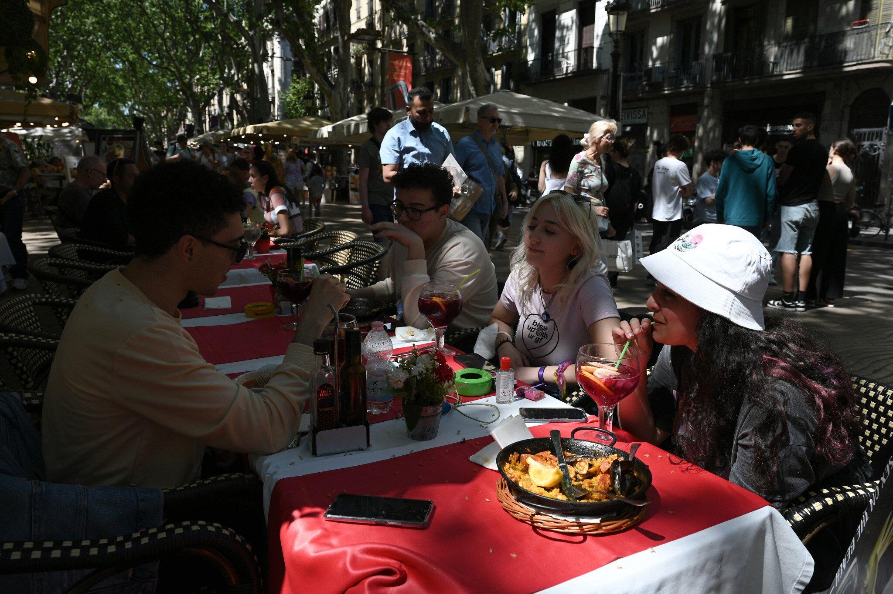
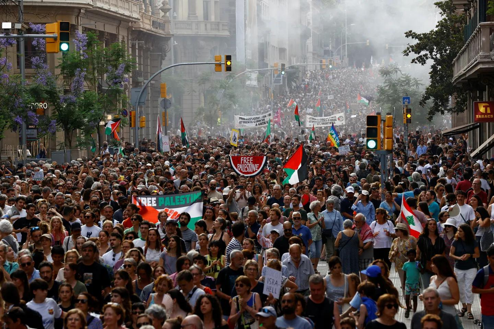

## Claim
Claim: " This image shows the President of FC Barcelona with Israel Embassy Representatives in September 2024 during the ongoing Gaza war."

## Actions
```
web_search("FC Barcelona President Israel Embassy Gaza war")
reverse_search()
```

## Evidence
### Evidence from `web_search`
The Jerusalem Post reported that FC Barcelona's president, Joan Laporta, invited Israeli embassy representatives to a soccer match on February 16, 2023, and included a photo of them holding an Israeli flag (). The Times of Israel reported that Barcelona's city council voted to cut ties with the Israeli government, citing the ongoing Gaza war, which started on October 7, 2023 (, , ). TRT Global reported on August 27, 2025, about Barcelona's Mayor's plan to enhance cooperation with Gaza and other Palestinian cities ().

The sources are: [https://www.timesofisrael.com/barcelona-ends-friendship-agreement-with-tel-aviv-over-gaza-war/](https://www.timesofisrael.com/barcelona-ends-friendship-agreement-with-tel-aviv-over-gaza-war/), [https://www.jpost.com/international/article-731893](https://www.jpost.com/international/article-731893), and [https://trt.global/world/article/67eb8f92839b](https://trt.global/world/article/67eb8f92839b).


### Evidence from `reverse_search`
The image () shows FC Barcelona President Joan Laporta with representatives from the Israeli embassy. According to an article from Ynet, published on February 17, 2023, Laporta showed support for Israel by inviting the representatives to a football match.

The Jerusalem Post published an article on January 15, 2025, stating that the image was taken on February 16, 2023, when Israeli diplomats presented the FC Barcelona president with an Israeli flag.
*   [https://www.ynet.co.il/news/article/skqpubp6s](https://www.ynet.co.il/news/article/skqpubp6s)
*   [https://www.jpost.com/spanish/noticias-del-mundo/article-837650](https://www.jpost.com/spanish/noticias-del-mundo/article-837650)

## Elaboration
The claim states the image was taken in September 2024 during the Gaza war. However, the reverse image search and web search results indicate the image was taken on February 16, 2023. The Gaza war started on October 7, 2023. Therefore, the claim is inaccurate regarding the date.


## Final Judgement
The image was taken on February 16, 2023, before the Gaza war started on October 7, 2023. The claim is therefore inaccurate regarding the date. `false`

### Verdict: FALSE

### Justification
The image depicts FC Barcelona's president with Israeli embassy representatives, taken on February 16, 2023, as reported by the [Jerusalem Post](https://www.jpost.com/spanish/noticias-del-mundo/article-837650) and Ynet. This predates the Gaza war, which began on October 7, 2023, making the claim's date inaccurate.
