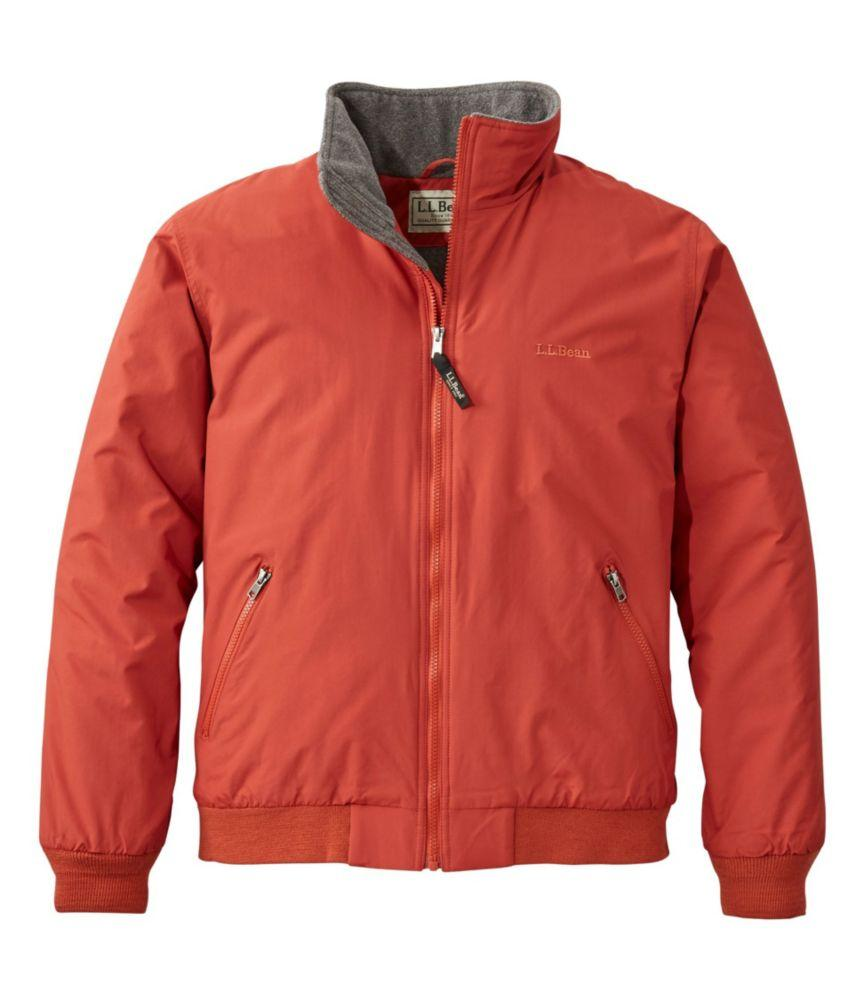
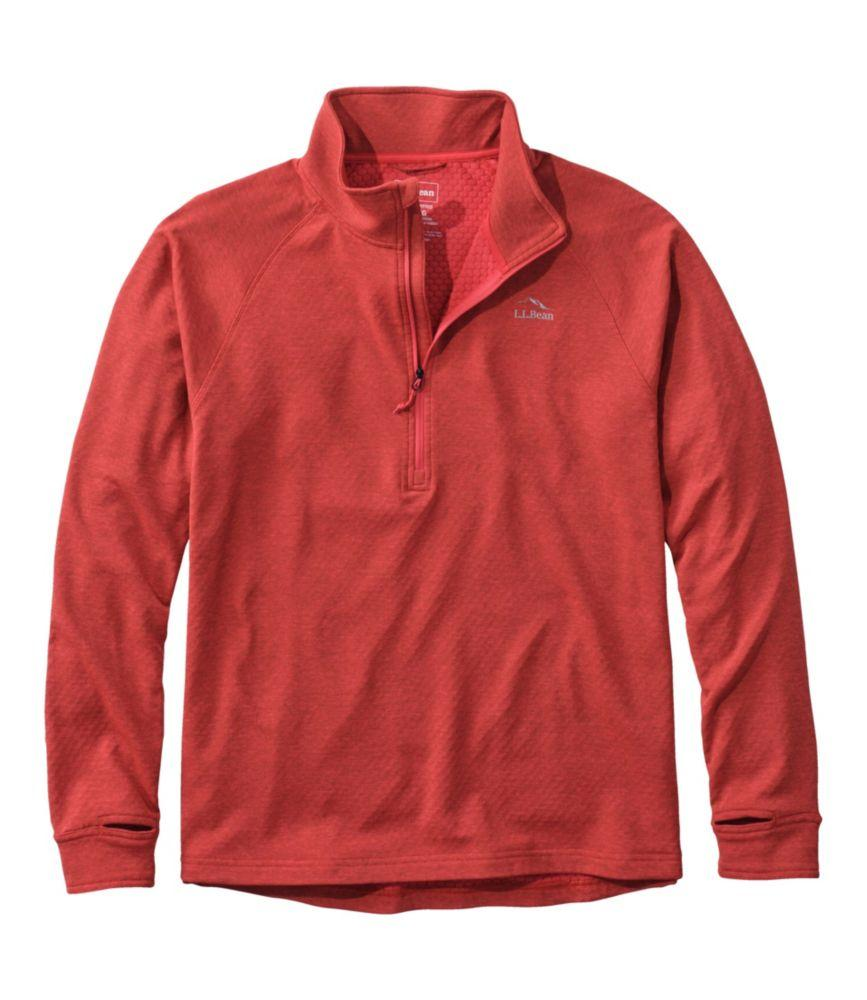
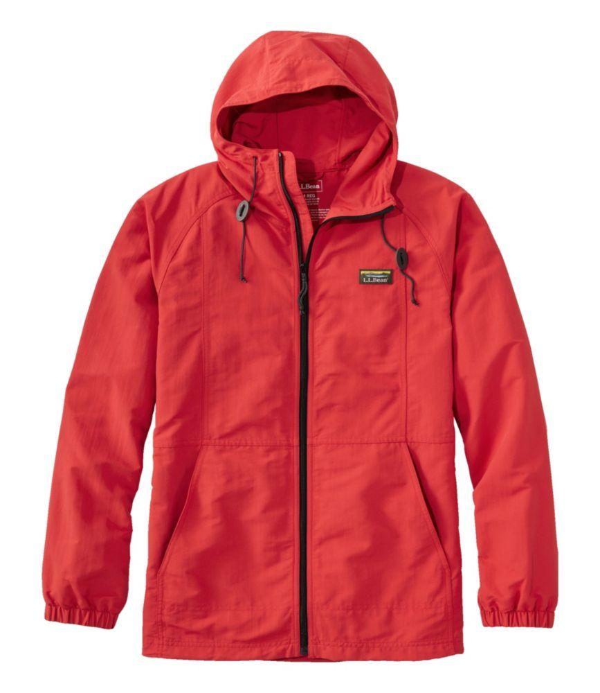
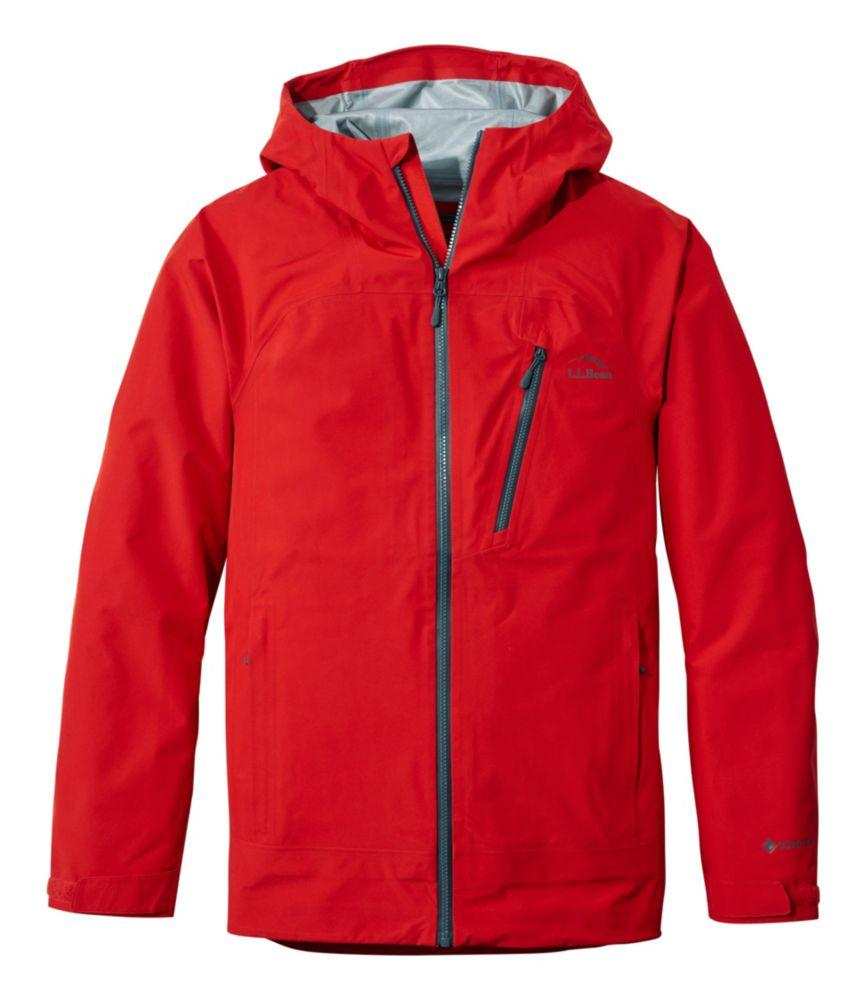
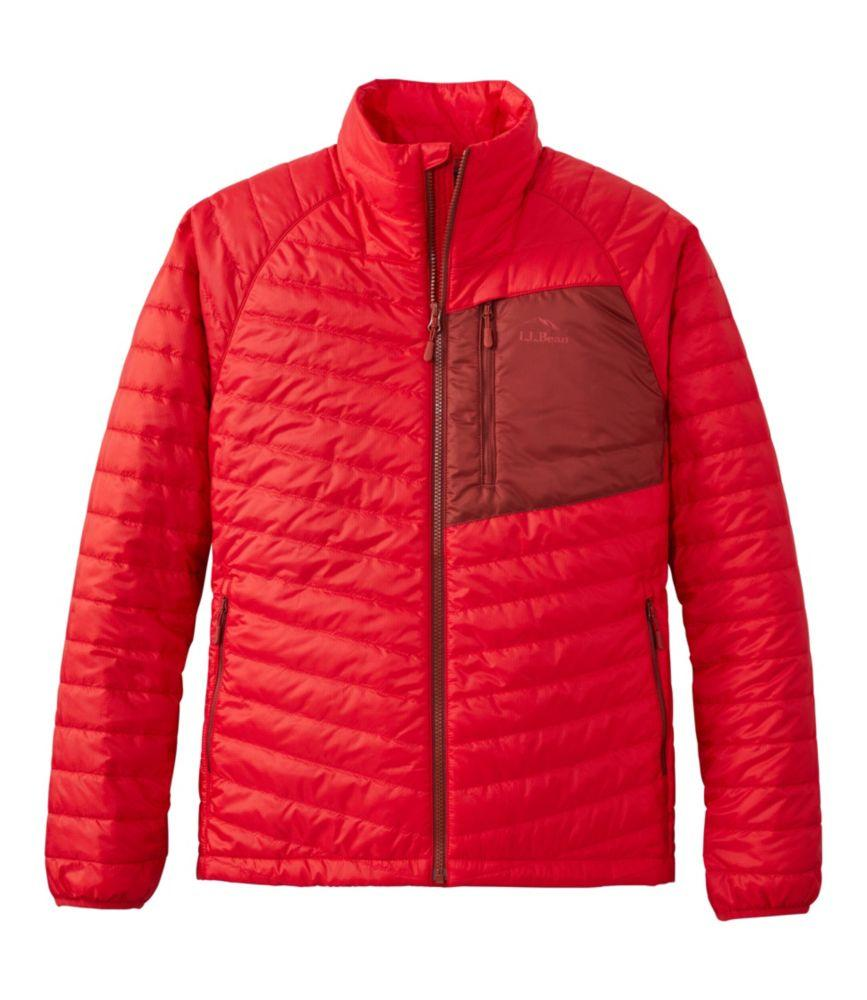
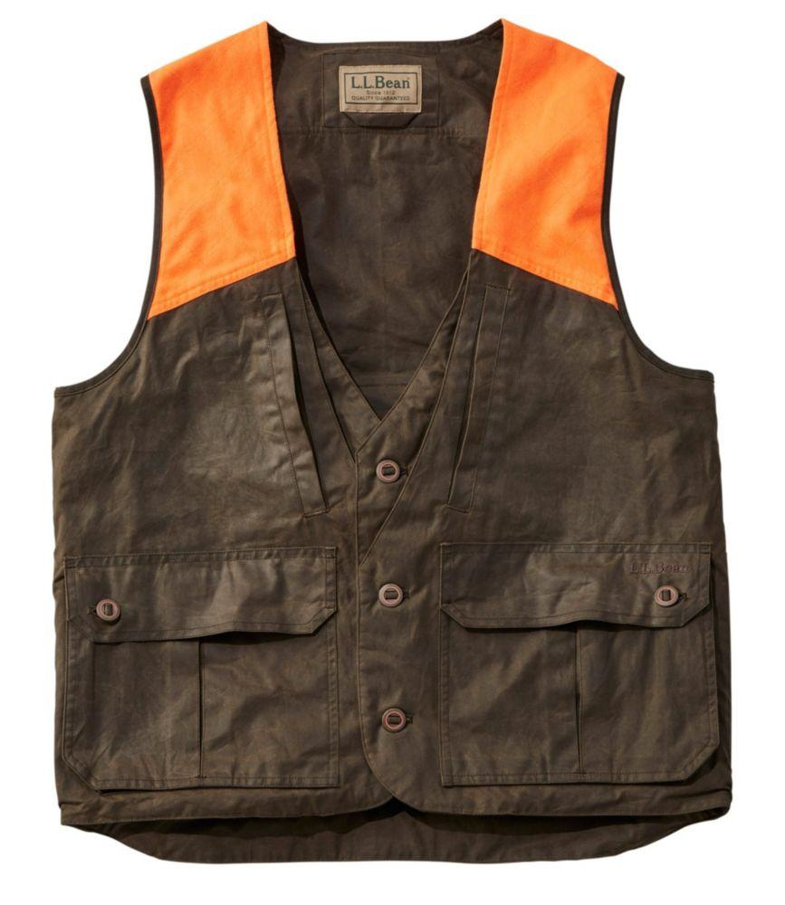
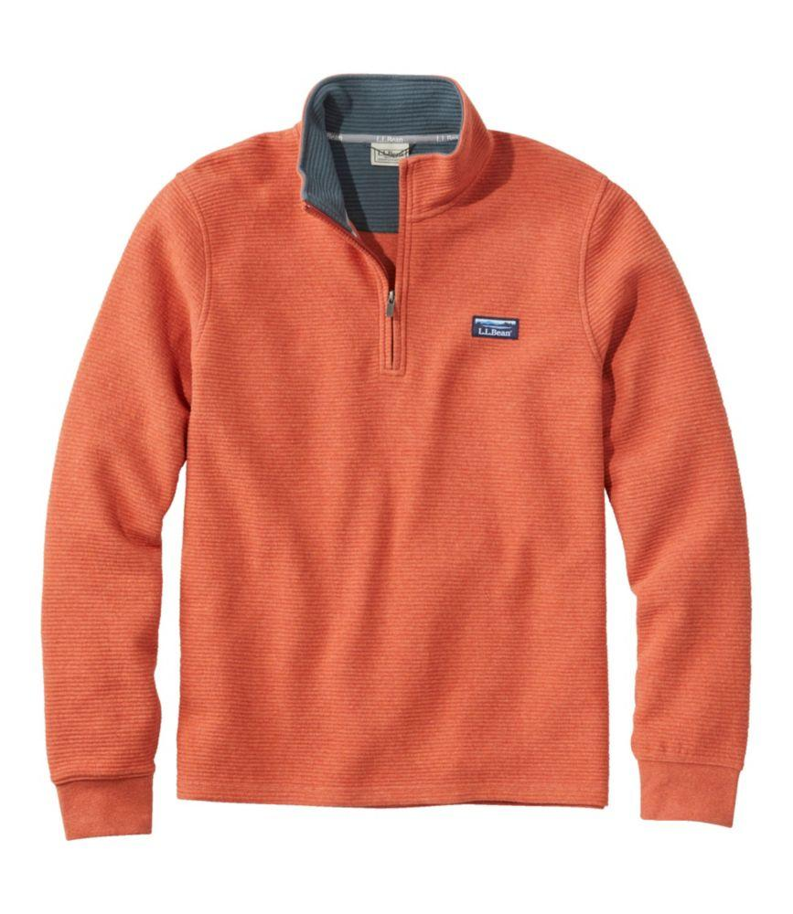
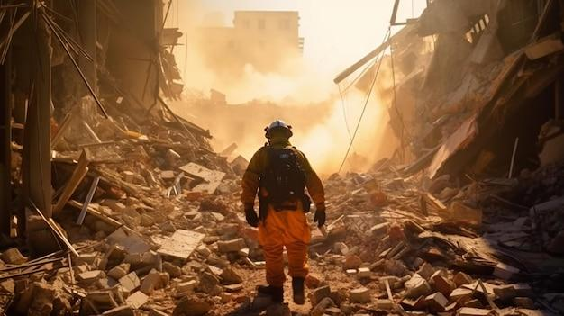

## Claim
Claim: " This image shows a man from Gaza holding the hand of his son killed in an Israeli bombing in July, 2024."

## Actions
```
web_search("man orange jacket rubble")
reverse_search()
```

## Evidence
### Evidence from `web_search`
The search results include a collection of men's orange jackets from LLBean.com, including rain jackets, hunting vests, and insulated options (, , , , , , , , , , , , , , , , , , ). The jackets are described as versatile and suitable for various outdoor activities.

Additionally, Freepik provides an AI-generated image of a man in an orange and black jacket walking through rubble ().
*   [https://www.llbean.com/buy/mens-orange-jackets](https://www.llbean.com/buy/mens-orange-jackets)
*   [https://www.patagonia.com/shop/mens/jackets-vests/orange](https://www.patagonia.com/shop/mens/jackets-vests/orange)
*   [https://www.freepik.com/premium-ai-image/arafed-man-orange-black-jacket-walking-through-rubble-generative-ai\_47607490.htm](https://www.freepik.com/premium-ai-image/arafed-man-orange-black-jacket-walking-through-rubble-generative-ai_47607490.htm)


### Evidence from `reverse_search`
The image () shows Mesut Hancer holding the hand of his deceased daughter, Irmak, who died in an earthquake in Kahramanmaras, Turkey. The event occurred in February 2023, not July 2024, and the location was Turkey, not Gaza.

The Guardian ([https://www.theguardian.com/world/2023/feb/07/turkey-earthquake-man-photo-dead-daughter-hand](https://www.theguardian.com/world/2023/feb/07/turkey-earthquake-man-photo-dead-daughter-hand)), BuzzFeed News ([https://www.buzzfeednews.com/article/davidmack/earthquake-turkey-syria-photo-father-daughter-hand](https://www.buzzfeednews.com/article/davidmack/earthquake-turkey-syria-photo-father-daughter-hand)), and CNN ([https://www.cnn.com/2023/02/13/middleeast/turkey-quake-man-daughter-hand-photo-intl](https://www.cnn.com/2023/02/13/middleeast/turkey-quake-man-daughter-hand-photo-intl)) all published articles about the image.


## Elaboration
The claim is false. The image depicts Mesut Hancer in Turkey holding the hand of his deceased daughter, Irmak, who died in an earthquake in February 2023. The event occurred in Turkey, not Gaza, and the date was February 2023, not July 2024.


## Final Judgement
The image shows a man in Turkey holding the hand of his deceased daughter after an earthquake in February 2023, not in Gaza in July 2024. The claim misrepresents the location, date, and context of the image. `false`

### Verdict: FALSE

### Justification
The claim is false. The image depicts Mesut Hancer in Turkey holding the hand of his deceased daughter, Irmak, who died in an earthquake in February 2023, not in Gaza in July 2024. The event occurred in Turkey, not Gaza, and the date was February 2023, not July 2024. The image has been widely reported by news outlets such as The Guardian ([https://www.theguardian.com/world/2023/feb/07/turkey-earthquake-man-photo-dead-daughter-hand](https://www.theguardian.com/world/2023/feb/07/turkey-earthquake-man-photo-dead-daughter-hand)).
