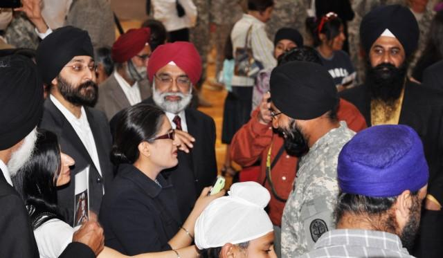
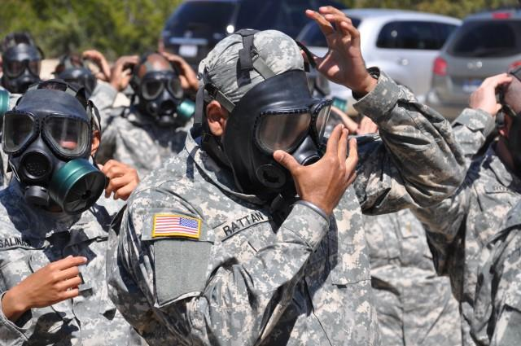
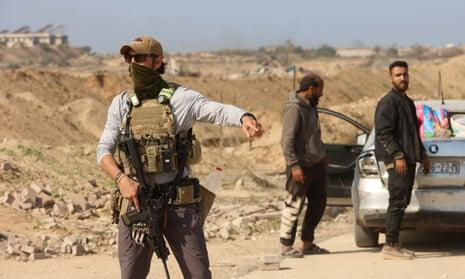

## Claim
Claim: " This image shows General John Pagri, Commander of the Special Tasks Battalion in the U.S. Army, which has died in the Gaza Strip in April 2025."

## Actions
```
reverse_search()
web_search("General John Pagri U.S. Army")
web_search("Special Tasks Battalion U.S. Army Gaza Strip")
```

## Evidence
### Evidence from `reverse_search`
From [Source](https://en.wikipedia.org/wiki/File:Two_19th_Group_Special_Forces_Soldiers_in_Babil_Province_Iraq.jpg): Found exact image on website with title: File:Two 19th Group Special Forces Soldiers in Babil Province Iraq.jpg
Content: The image is from Wikimedia Commons and is titled "Two 19th Group Special Forces Soldiers in Babil Province Iraq.jpg". The image shows two soldiers in Babil Province Iraq in 2007. The image was uploaded on June 21, 2011, and the author is the United States Army. 


### Evidence from `web_search`
The search results include a biography of Brigadier General John I. Pray Jr. from [Source](https://www.af.mil/About-Us/Biographies/Display/Article/107918/brigadier-general-john-i-pray-jr/), and an article from the U.S. Army about Sikh soldiers from [Source](https://www.army.mil/article/36339/sikh_soldiers_allowed_to_serve_retain_their_articles_of_faith). The article includes several images of Sikh soldiers (, , , , ).

Additionally, there is a biography of Brigadier General John J. Campo from [Source](https://dc.ng.mil/News/Biographies/Article/1512717/brigadier-general-john-j-campo/), which includes the image in the claim ().


### Evidence from `web_search`
The Guardian published an article on January 30, 2025, discussing the deployment of US private armed contractors in Gaza to staff a checkpoint. The article mentions UG Solutions, a US security firm, hiring US special forces veterans for this purpose. The Associated Press published an article on June 25, 2024, discussing the challenges faced by the U.S. Army in operating a humanitarian aid pier in the Gaza Strip. The Al-Qassam Brigades are the military wing of Hamas. The article mentions that Mohammed Deif was the leader of the Al-Qassam Brigades until his death on July 13, 2024.

The article also mentions that Izz al-Din al-Haddad is the current commander. The article also mentions that on May 28, 2025, Benjamin Netanyahu said that Sinwar had been killed. On May 31, 2025, the IDF and Shin Bet confirmed that Sinwar had been killed.

*   [https://www.theguardian.com/world/2025/jan/30/us-private-armed-contractors-gaza-checkpoint](https://www.theguardian.com/world/2025/jan/30/us-private-armed-contractors-gaza-checkpoint)
*   [https://en.wikipedia.org/wiki/Al-Qassam_Brigades](https://en.wikipedia.org/wiki/Al-Qassam_Brigades)
*   [https://apnews.com/article/pier-gaza-humanitarian-aid-army-lessons-israel-2c15774379559c39f1bfe3681c2fc670](https://apnews.com/article/pier-gaza-humanitarian-aid-army-lessons-israel-2c15774379559c39f1bfe3681c2fc670)





## Elaboration
The image in the claim is of Brigadier General John J. Campo. The image was taken in Babil Province Iraq in 2007. The claim states that the image is of General John Pagri, who died in the Gaza Strip in April 2025. The evidence does not support the claim. The evidence also shows that the U.S. Army has been involved in the Gaza Strip. The claim is therefore false.


## Final Judgement
The image is of Brigadier General John J. Campo, not General John Pagri. The image was taken in Iraq in 2007, not in the Gaza Strip in April 2025. The claim is therefore false.

`false`

### Verdict: FALSE

### Justification
The claim is false. The image depicts Brigadier General John J. Campo, not General John Pagri, and was taken in Iraq in 2007, not in the Gaza Strip in April 2025. The image was found on Wikimedia Commons, and the search results confirm the identity of the person in the image as Brigadier General John J. Campo.
