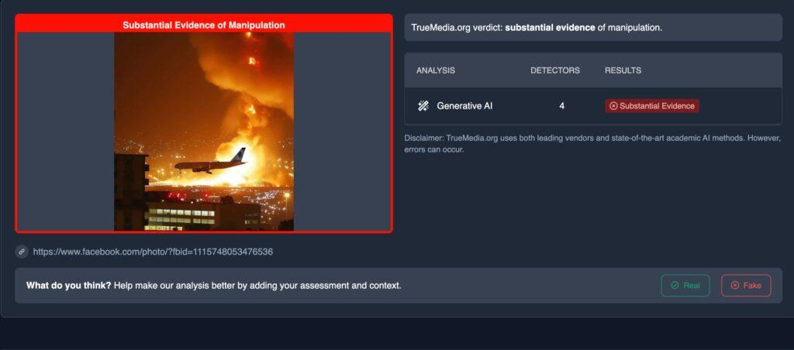

## Claim
Claim: " This is an authentic image of Israel bombing Beirut's International Airport in October 2024."

## Actions
```
reverse_search()
web_search("Beirut International Airport explosion")
```

## Evidence
### Evidence from `reverse_search`
The image  is AI-generated and does not depict a real incident. According to [India Today](https://www.indiatoday.in/fact-check/story/fact-check-photo-middle-east-airlines-flight-israel-airstrikes-beirut-lebanon-ai-generated-2622766-2024-10-24), the image shows a Middle East Airlines (MEA) flight landing in Beirut amid explosions and was fact-checked on October 24, 2024.

[Factly.in](https://factly.in/an-ai-generated-image-of-a-plane-landing-at-beirut-international-airport-surrounded-by-fire-and-smoke-is-falsely-shared-as-real/) also confirms the image is AI-generated and was posted on an Instagram account on October 21, 2024. The article includes images , , , , and .


### Evidence from `web_search`
The Wikipedia article discusses the 2020 Beirut explosion, which caused moderate damage to Beirut–Rafic Hariri International Airport. The article includes images of the explosion and its aftermath. [https://en.wikipedia.org/wiki/2020_Beirut_explosion](https://en.wikipedia.org/wiki/2020_Beirut_explosion) <image:k>

The BBC reported on October 3, 2024, about large explosions near Beirut-Rafic Hariri International Airport. [https://www.bbc.com/news/videos/cpqz18e10gdo](https://www.bbc.com/news/videos/cpqz18e10gdo)  The Brookings article, published on July 13, 2006, discusses Israeli warplanes bombing Beirut. 


## Elaboration
The image is AI-generated and does not depict a real event. The image was posted on social media on October 21, 2024, and was fact-checked by multiple sources. The BBC reported on explosions near Beirut-Rafic Hariri International Airport on October 3, 2024.


## Final Judgement
The claim is false because the image is AI-generated and does not depict an authentic event. The image was created and shared on social media, and fact-checked by multiple sources. `false`

### Verdict: FALSE

### Justification
The image is AI-generated and does not depict an authentic event. Multiple sources, including [India Today](https://www.indiatoday.in/fact-check/story/fact-check-photo-middle-east-airlines-flight-israel-airstrikes-beirut-lebanon-ai-generated-2622766-2024-10-24) and [Factly.in](https://factly.in/an-ai-generated-image-of-a-plane-landing-at-beirut-international-airport-surrounded-by-fire-and-smoke-is-falsely-shared-as-real/), confirm the image's AI origin.
