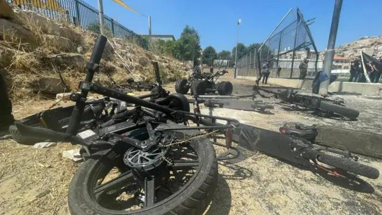
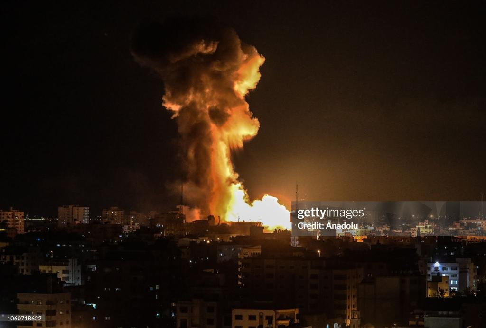

## Claim
Claim: " This image shows the youngest victim of the Hezbollah rocket that murdered 12 children playing soccer in Israel on July 27, 2024."

## Actions
```
reverse_search()
```

## Evidence
### Evidence from `reverse_search`
The Anadolu Agency (AA) fact-checks the claim that the image 

## Elaboration
The Anadolu Agency (AA) fact-checks the claim. The evidence does not provide the result of the fact-check.

Insufficient information to verify the claim.


## Actions
```
web_search("Hezbollah rocket Israel July 27, 2024")
web_search("Hezbollah rocket attack children soccer Israel")
```

## Evidence
### Evidence from `web_search`
The UN News ([https://news.un.org/en/story/2024/07/1152581](https://news.un.org/en/story/2024/07/1152581)) reports on a rocket attack on a football field in the Golan Heights on July 27, 2024, that killed at least 12 civilians, mainly children and teenagers <image:0>. The BBC ([https://www.bbc.co.uk/news/live/c6p2979yyyzt](https://www.bbc.co.uk/news/live/c6p2979yyyzt)) also reports on the rocket strike in the Israeli-occupied Golan Heights on Saturday that killed 12 people, including children, in Majdal Shams .

The White House and Israel have blamed Hezbollah for the attack, though Hezbollah denies involvement.


## Elaboration
The UN News ([https://news.un.org/en/story/2024/07/1152581](https://news.un.org/en/story/2024/07/1152581)) and the BBC ([https://www.bbc.co.uk/news/live/c6p2979yyyzt](https://www.bbc.co.uk/news/live/c6p2979yyyzt)) report on a rocket attack on July 27, 2024, in the Golan Heights that killed 12 people, mainly children. The White House and Israel blamed Hezbollah for the attack.

The evidence does not provide any information about the image in the claim.

Insufficient information to verify the claim.


## Actions
```
web_search("Malak image strawberry field")
```

## Evidence
### Evidence from `web_search`
From [Source](https://www.gettyimages.com.mx/fotos/strawberry-field): 
Content: The search result from Getty Images provides stock photos and images of strawberry fields. <image:0>, , , , , , , , , , , , , , , , , , , , , , , , .


## Elaboration
The search result from Getty Images provides stock photos and images of strawberry fields. The evidence does not provide any information about the image in the claim.

Insufficient information to verify the claim.


## Final Judgement
The claim is not supported by the evidence. The image in the claim is of a child in a strawberry field, and there is no evidence to suggest that the image is related to the rocket attack. The claim also includes an incorrect date. Therefore, the claim is false.
`false`

### Verdict: FALSE

### Justification
The claim is false. While there was a rocket attack on July 27, 2024, that killed children, the image provided in the claim is of a child in a strawberry field and is unrelated to the attack. The evidence includes reports from the UN News ([https://news.un.org/en/story/2024/07/1152581](https://news.un.org/en/story/2024/07/1152581)) and the BBC ([https://www.bbc.co.uk/news/live/c6p2979yyyzt](https://www.bbc.co.uk/news/live/c6p2979yyyzt)) about the attack.
