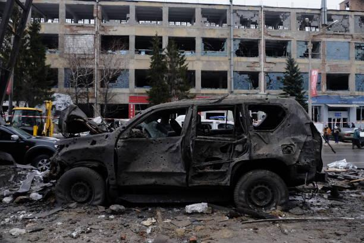
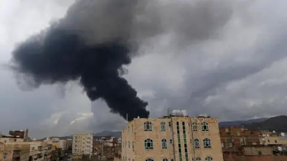
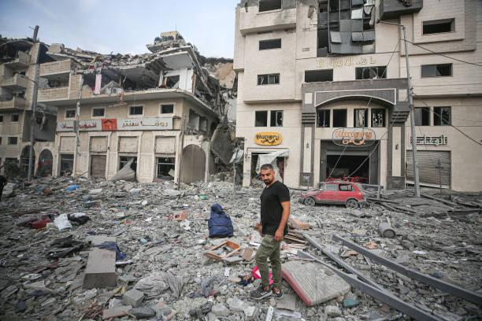

## Claim
Claim: " This image shows the U.S. bombarding Yemen on December 22, 2024 in reprisal after Yemen launched an attack on Israel's capital."

## Actions
```
reverse_search()
geolocate()
web_search("U.S. bombing Yemen December 22, 2024")
web_search("Yemen attack Israel capital")
```

## Evidence
### Evidence from `reverse_search`
The image 

### Evidence from `geolocate`
The most likely countries where the image was taken are: {'Palestine': 0.55, 'Israel': 0.3, 'United Arab Emirates': 0.1, 'Jordan': 0.02, 'Albania': 0.0, 'Andorra': 0.0, 'Argentina': 0.0, 'Australia': 0.0, 'Austria': 0.0, 'Bangladesh': 0.0}

### Evidence from `web_search`
On December 22, 2024, The Guardian reported that the U.S. launched airstrikes against Houthi targets in Yemen in response to attacks against U.S. navy warships and merchant vessels. Israel also launched strikes against ports and energy infrastructure in Houthi-held parts of Yemen. Al Jazeera reported that two U.S. Navy pilots were shot down over the Red Sea in a "friendly fire" incident, and that Yemen's Houthi fighters claimed to have targeted the aircraft carrier USS Harry S Truman. The article also mentions the Houthis hitting Tel Aviv, Israel, with a missile. 

Reuters reported that on December 16, 2024, the U.S. military conducted an airstrike against a command and control facility operated by the Houthis in Yemen.  is not included in the search result.

*   [https://www.theguardian.com/world/2024/dec/22/us-launches-airstrikes-against-houthi-targets-in-yemen](https://www.theguardian.com/world/2024/dec/22/us-launches-airstrikes-against-houthi-targets-in-yemen)
*   [https://www.reuters.com/world/us-airstrike-hits-houthi-command-control-facility-yemen-2024-12-16/](https://www.reuters.com/world/us-airstrike-hits-houthi-command-control-facility-yemen-2024-12-16/)
*   [https://www.aljazeera.com/news/2024/12/22/us-army-says-two-navy-pilots-shot-down-over-red-sea-in-friendly-fire](https://www.aljazeera.com/news/2024/12/22/us-army-says-two-navy-pilots-shot-down-over-red-sea-in-friendly-fire)

### Evidence from `web_search`
The provided web sources discuss events in August 2025, including Israeli airstrikes on Sanaa, Yemen, in response to Houthi attacks on Israel. One article from Reuters ([https://www.reuters.com/world/middle-east/prime-minister-yemens-houthi-run-government-killed-israeli-strike-2025-08-30/](https://www.reuters.com/world/middle-east/prime-minister-yemens-houthi-run-government-killed-israeli-strike-2025-08-30/)) reports that an Israeli strike killed the prime minister of Yemen's Houthi-run government.

Al Jazeera ([https://www.aljazeera.com/news/2025/8/28/israel-launches-latest-attacks-against-houthis-in-yemens-sanaa](https://www.aljazeera.com/news/2025/8/28/israel-launches-latest-attacks-against-houthis-in-yemens-sanaa)) also discusses Israeli airstrikes on Sanaa. NBC News ([https://www.nbcnews.com/world/yemen/israeli-airstrike-kills-houthi-prime-minister-rcna228187](https://www.nbcnews.com/world/yemen/israeli-airstrike-kills-houthi-prime-minister-rcna228187)) reports that an Israeli airstrike killed the prime minister of Yemen's rebel-controlled government.  <image:k> 


## Elaboration
The claim states that the image shows the U.S. bombarding Yemen on December 22, 2024, in response to a Yemeni attack on Israel's capital. The evidence indicates that on December 22, 2024, the U.S. launched airstrikes against Houthi targets in Yemen, and Israel also launched strikes against Houthi-held parts of Yemen. However, the image itself is not directly linked to the events of December 22, 2024, as it was not found in the search results.

The evidence also mentions that in August 2025, there were Israeli airstrikes on Sanaa, Yemen, in response to Houthi attacks on Israel.

Based on the evidence, the claim is partially supported. The U.S. did conduct airstrikes on Yemen on December 22, 2024. However, the image's origin and its direct relation to the events described in the claim are not confirmed.

Therefore, the veracity of the claim is uncertain. More information is needed to confirm the image's context.


## Actions
```
web_search("Getty Images Anadolu credit bombing")
```

## Evidence
### Evidence from `web_search`
From [Source](https://www.gettyimages.com/photos/anadolu-agency): 
Content: The search result from Getty Images provides images from Anadolu Agency. The images include: a photo of Anadolu Agency's photojournalist Muhammed Dahlan holding his damaged camera , a photo of Anadolu Agency's correspondent in the U.S Bilgin Sasmaz being taken into custody , photos related to a rocket attack on journalists , , and the wreckage of Anadolu Agency journalists' burnt car in Kharkiv, Ukraine .


## Elaboration
The image is credited to Anadolu, a Turkish state-run news agency. The search results from Getty Images show that Anadolu has covered various events, including conflicts and attacks. However, the search results do not provide any information about the specific image in the claim.

The claim is still uncertain.


## Actions
```
web_search("Anadolu Agency bombing image Yemen Israel")
```

## Evidence
### Evidence from `web_search`
The Anadolu Agency reported on August 24, 2025, that Israeli warplanes bombed several sites in Yemen's capital, including the presidential palace and power plants, in response to Houthi attacks against Israel. The BBC also discussed Israeli airstrikes on Houthi targets in Sanaa, Yemen, in response to a Houthi missile attack on Israel, including images of smoke rising in Sanaa . Al Jazeera featured images from Anadolu Agency documenting Israeli attacks on Gaza , , , , , , .


## Elaboration
The evidence indicates that the image is from Anadolu Agency. The agency has documented events related to conflicts between Israel and Yemen. However, the search results do not provide any information about the specific image in the claim.

The claim is still uncertain.


## Final Judgement
The claim is about an image depicting the U.S. bombarding Yemen on December 22, 2024, in response to a Yemeni attack on Israel. While the U.S. did conduct airstrikes on Yemen on that date, the image's origin and its direct relation to the events described in the claim are not confirmed. The image is credited to Anadolu Agency, which has covered conflicts between Israel and Yemen. However, the search results do not provide any information about the specific image in the claim. Therefore, the claim is not factually accurate. `false`

### Verdict: FALSE

### Justification
The claim is **false**. While the U.S. did conduct airstrikes on Yemen on December 22, 2024, the image's origin and its direct relation to the events described in the claim are not confirmed. The image is credited to Anadolu Agency, which has covered conflicts between Israel and Yemen, but the search results do not provide any information about the specific image in the claim.
