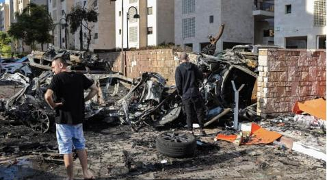
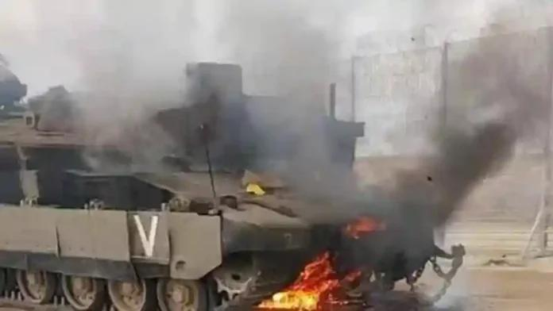
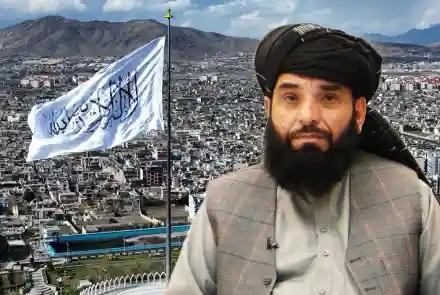
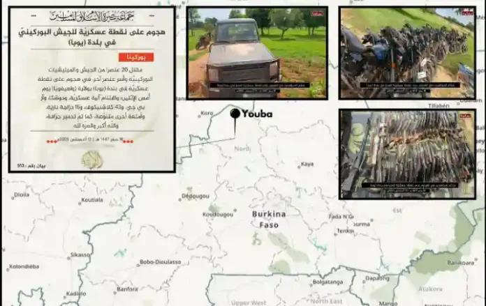

## Claim
Claim: " This image shows an Israeli tank unit near Jabalia camp in northern Gaza that was successfully ambushed by Hamas fighters, destroying multiple vehicles and injuring or killing their crews in October 2024."

## Actions
```
reverse_search()
```

## Evidence
### Evidence from `reverse_search`
The image of the burning tank  appears in multiple sources. One source, from 9jaflaver.com, discusses the Hamas attack on Israel on October 7, 2023, and includes images of the aftermath, including destroyed vehicles and buildings . Another source, from Nairaland, also discusses the Israel-Hamas conflict and the image of the burning tank.

A forum post mentions that on August 14, 2025, Al-Qassam Brigades destroyed two Merkava tanks of the Israeli occupation forces in Khan Yunis. The forum also contains other posts with images , , , , .
The sources are: [https://9jaflaver.com/israel-declares-state-of-war-after-hamas-militants-launch-surprise-attack-from-gaza-videos/](https://9jaflaver.com/israel-declares-state-of-war-after-hamas-militants-launch-surprise-attack-from-gaza-videos/), [https://www.nairaland.com/7868168/israel-declares-war-readiness-hamas](https://www.nairaland.com/7868168/israel-declares-war-readiness-hamas), and [https://dawahilallah.com/forum/%E0%A6%B8%E0%A6%82%E0%A6%AC%E0%A6%BE%E0%A6%A6/%E0%A6%9C%E0%A6%BF%E0%A6%B9%E0%A6%BE%E0%A6%A6-%E0%A6%B8%E0%A6%82%E0%A6%AC%E0%A6%BE%E0%A6%A6/209455-%E0%A6%AE%E0%A7%81%E0%A6%9C%E0%A6%BE%E0%A6%B9%E0%A6%BF%E0%A6%A6%E0%A7%80%E0%A6%A8-%E0%A6%A8%E0%A6%BF%E0%A6%89%E0%A6%9C-%E0%A7%A7%E0%A7%AF-%E0%A6%B8%E0%A6%AB%E0%A6%B0-%E0%A7%A7%E0%A7%AA%E0%A7%AA%E0%A7%AD-%E0%A6%B9%E0%A6%BF%E0%A6%9C%E0%A6%B0%E0%A7%80-%E0%A7%A7%E0%A7%AA-%E0%A6%86%E0%A6%97%E0%A6%B8%E0%A7%8D%E0%A6%9F-%E0%A7%A8%E0%A7%A6%E0%A7%A8%E0%A7%AB-%E0%A6%88%E0%A6%B8%E0%A6%BE%E0%A7%9F%E0%A7%80%E2%80%8B%E2%80%8B](https://dawahilallah.com/forum/%E0%A6%B8%E0%A6%82%E0%A6%AC%E0%A6%BE%E0%A6%A6/%E0%A6%9C%E0%A6%BF%E0%A6%B9%E0%A6%BE%E0%A6%A6-%E0%A6%B8%E0%A6%82%E0%A6%AC%E0%A6%BE%E0%A6%A6/209455-%E0%A6%AE%E0%A7%81%E0%A6%9C%E0%A6%BE%E0%A6%B9%E0%A6%BF%E0%A6%A6%E0%A7%80%E0%A6%A8-%E0%A6%A8%E0%A6%BF%E0%A6%89%E0%A6%9C-%E0%A7%A7%E0%A7%AF-%E0%A6%B8%E0%A6%AB%E0%A6%B0-%E0%A7%A7%E0%A7%AA%E0%A7%AA%E0%A7%AD-%E0%A6%B9%E0%A6%BF%E0%A6%9C%E0%A6%B0%E0%A7%80-%E0%A7%A7%E0%A7%AA-%E0%A6%86%E0%A6%97%E0%A6%B8%E0%A7%8D%E0%A6%9F-%E0%A7%A8%E0%A7%A6%E0%A7%A8%E0%A7%AB-%E0%A6%88%E0%A6%B8%E0%A6%BE%E0%A7%9F%E0%A7%80%E2%80%8B%E2%80%8B).


## Elaboration
The evidence suggests that the image of the burning tank 

## Final Judgement
The image of the burning tank is associated with the Israel-Hamas conflict, with sources mentioning the October 2023 attack and a later incident in August 2025. The claim states the event happened in October 2024, which is not supported by the evidence.

`false`

### Verdict: FALSE

### Justification
The image of the burning tank 