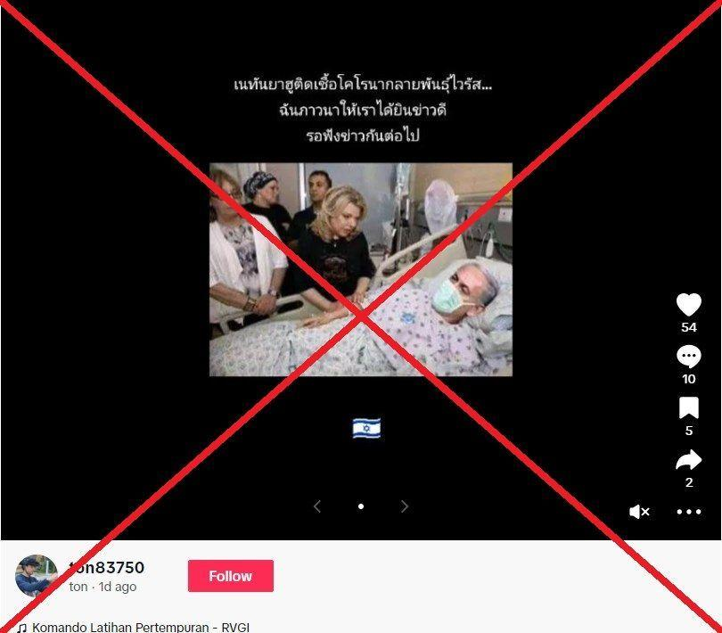
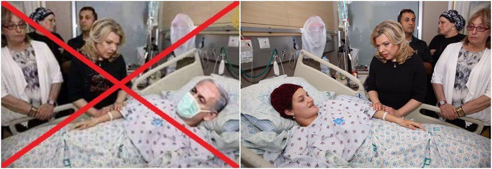

## Claim
Claim: " This is an authentic image of Benjamin Netanyahu being hospitalized in Tel Aviv in November 2024 due to a serious health issue."

## Actions
```
reverse_search()
web_search("Benjamin Netanyahu hospitalized November 2024")
```

## Evidence
### Evidence from `reverse_search`
The image 

### Evidence from `web_search`
The University at Buffalo ([https://www.buffalo.edu/ai-data-science/news-events/news.host.html/content/shared/engineering/home/articles/media-mentions/2024-media-coverage/ai-generated-image-used-to-falsely-claim-netanyahu-hospitalized.detail.html](https://www.buffalo.edu/ai-data-science/news-events/news.host.html/content/shared/engineering/home/articles/media-mentions/2024-media-coverage/ai-generated-image-used-to-falsely-claim-netanyahu-hospitalized.detail.html)) reports on an AI-generated image falsely claiming Netanyahu was hospitalized in November 2024. The Times of Israel ([https://www.timesofisrael.com/netanyahu-awake-recovering-after-successful-prostate-removal-surgery-pms-office/](https://www.timesofisrael.com/netanyahu-awake-recovering-after-successful-prostate-removal-surgery-pms-office/)) states that Netanyahu had prostate removal surgery in December 2024 and was in the Knesset in November 2024.

AFP ([https://cedmohub.eu/doctored-photo-does-not-show-israeli-pm-netanyahu-hospitalised-with-covid/](https://cedmohub.eu/doctored-photo-does-not-show-israeli-pm-netanyahu-hospitalised-with-covid/)) debunked a digitally altered photo from October 2015, falsely claiming Netanyahu was hospitalized with a mutated strain of coronavirus. , , , 


## Elaboration
The claim is false. The University at Buffalo states that the image is AI-generated and was used to falsely claim Netanyahu was hospitalized in November 2024. The Times of Israel reports that Netanyahu was in the Knesset in November 2024 and had prostate surgery in December 2024.


## Final Judgement
The image is AI-generated and falsely claims Netanyahu was hospitalized in November 2024. Netanyahu was in the Knesset in November 2024 and had prostate surgery in December 2024.

`false`

### Verdict: FALSE

### Justification
The claim is false. The image is AI-generated and falsely claims Netanyahu was hospitalized in November 2024, as reported by the [University at Buffalo](https://www.buffalo.edu/ai-data-science/news-events/news.host.html/content/shared/engineering/home/articles/media-mentions/2024-media-coverage/ai-generated-image-used-to-falsely-claim-netanyahu-hospitalized.detail.html). Furthermore, Netanyahu was in the Knesset in November 2024 and had prostate surgery in December 2024, according to the [Times of Israel](https://www.timesofisrael.com/netanyahu-awake-recovering-after-successful-prostate-removal-surgery-pms-office/).
