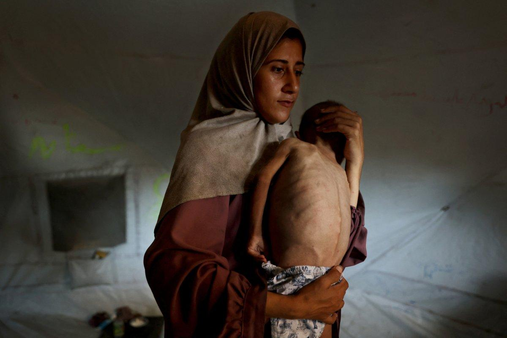
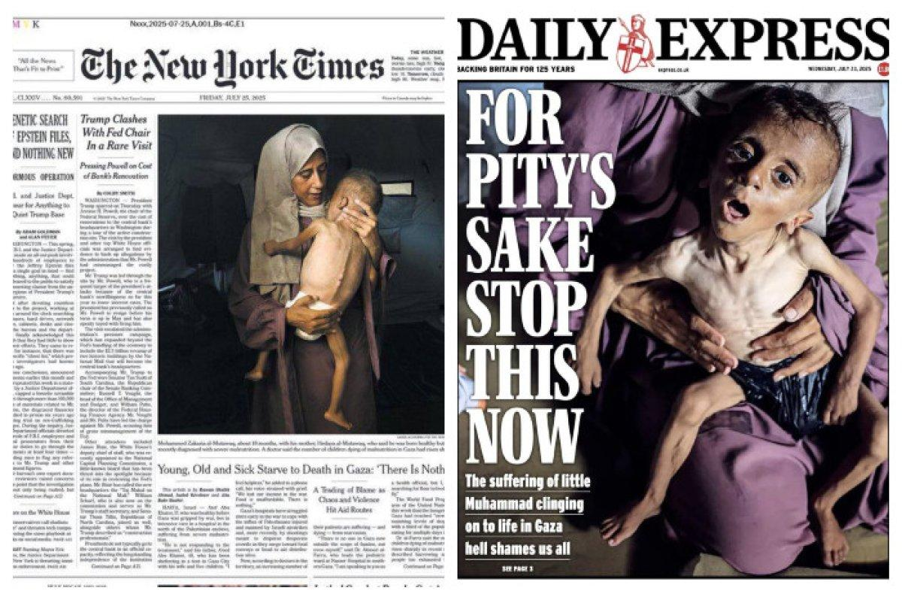
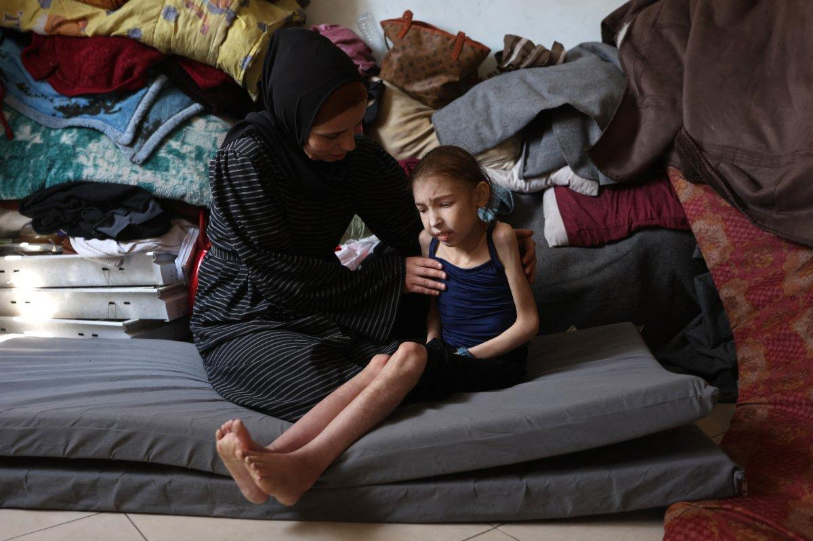
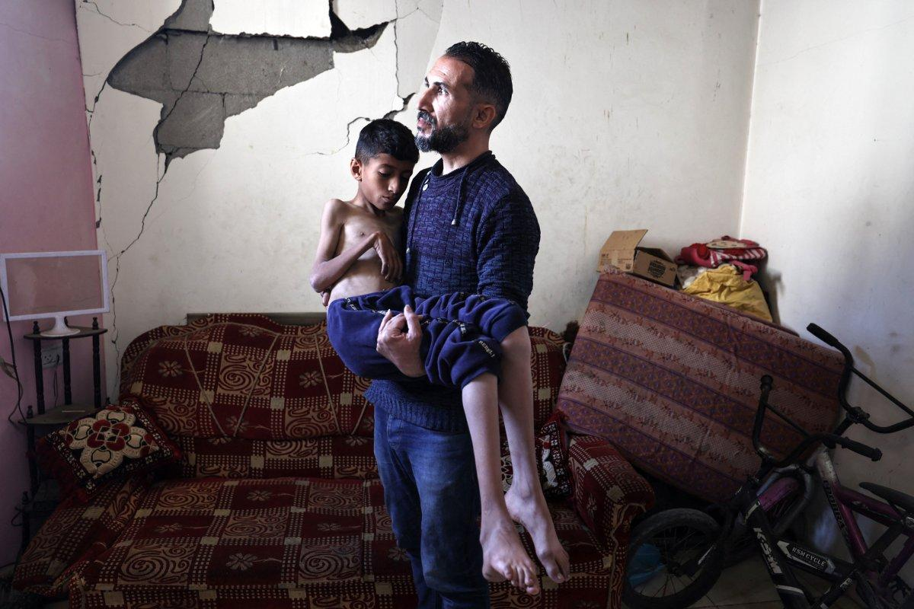
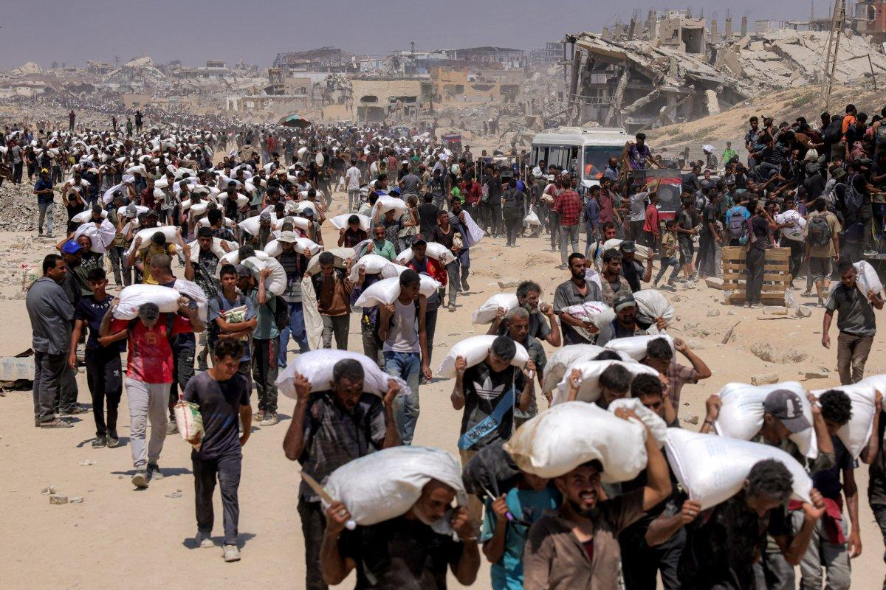
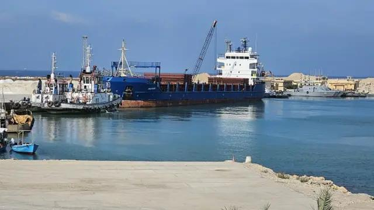
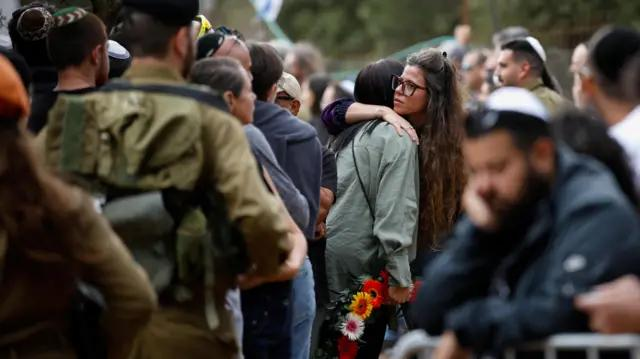

## Claim
Claim: " This image shows a Palestinian woman using an Israeli tank to dry clothes in Gaza in July 2024."

## Actions
```
reverse_search()
geolocate()
```

## Evidence
### Evidence from `geolocate`
The most likely countries where the image was taken are: {'Palestine': 0.29, 'Tunisia': 0.26, 'Jordan': 0.19, 'United Arab Emirates': 0.09, 'Israel': 0.07, 'Pakistan': 0.04, 'China': 0.01, 'Albania': 0.0, 'Andorra': 0.0, 'Argentina': 0.0}

## Elaboration
The evidence suggests the image was most likely taken in Palestine. The claim states the image was taken in Gaza, which is part of Palestine. The evidence does not provide information about the tank being Israeli or the date of the image.

Insufficient information is available to verify the claim.


## Actions
```
web_search("Israeli tank drying clothes Gaza")
web_search("tank drying clothes Palestine")
```

## Evidence
### Evidence from `web_search`
Reuters published an article on March 28, 2024, discussing Israeli soldiers posting photos and videos of themselves with lingerie found in Palestinian homes in Gaza. ([https://www.reuters.com/world/middle-east/israeli-soldiers-play-with-gaza-womens-underwear-online-posts-2024-03-28/](https://www.reuters.com/world/middle-east/israeli-soldiers-play-with-gaza-womens-underwear-online-posts-2024-03-28/))  The New Indian Express published an article on August 18, 2024, discussing the lack of clothing in Gaza due to the ongoing war. ([https://www.newindianexpress.com/world/2024/Aug/18/besieged-gazans-share-shoes-wear-same-clothes-for-months](https://www.newindianexpress.com/world/2024/Aug/18/besieged-gazans-share-shoes-wear-same-clothes-for-months)) 

A CNN article, published on October 30, 2024, discusses an incident in Jabalya, Gaza, where Israeli soldiers allegedly forced Palestinian men to remove their clothes during an evacuation. ([https://www.cnn.com/2024/10/29/middleeast/gaza-jabalya-palestinians-strip-photo-intl](https://www.cnn.com/2024/10/29/middleeast/gaza-jabalya-palestinians-strip-photo-intl)) 


### Evidence from `web_search`
From [Source](https://menabeast.com/products/tank-top-palestine-calligraphy-grey): 
Content: The search result is a product page for a tank top with Palestine calligraphy. The product is available for delivery in Palestine and Jordan. The product description mentions the design is a visual symbol of resilience. The product page includes images of the tank top. , , .


## Elaboration
The evidence provides context about the conflict in Gaza, including reports of Israeli soldiers' actions and the lack of clothing. However, it does not confirm the claim's specifics about the image, such as the tank's origin, the woman's identity, or the date. The search results do not provide any information about the image.

Insufficient information is available to verify the claim.


## Actions
```
web_search("tank drying clothes Gaza image origin")
web_search("Palestinian woman Israeli tank drying clothes")
```

## Evidence
### Evidence from `web_search`
The search results discuss the humanitarian crisis in Gaza, including images of a malnourished child and the ongoing conflict between Israel and Hamas. The BBC News report includes images of the aftermath of the conflict and Israeli soldiers. The Sapiens.org article discusses the use of images by Israeli soldiers in the war on Gaza. None of the sources provide information about the image of the tank drying clothes. (, , , , , , , , , )


### Evidence from `web_search`
A Getty Images photo from November 25, 2023, shows a Palestinian woman hanging clothes to dry in Deir al Balah, Gaza, taken by Ali Jadallah/Anadolu. ([https://www.gettyimages.co.uk/detail/news-photo/palestinian-woman-hangs-clothes-on-a-rope-to-dry-as-naci-news-photo/1801161675](https://www.gettyimages.co.uk/detail/news-photo/palestinian-woman-hangs-clothes-on-a-rope-to-dry-as-naci-news-photo/1801161675)) 
Human Rights Watch published a report on December 19, 2024, detailing how Israeli authorities have deliberately obstructed Palestinians' access to water in Gaza since October 2023. ([https://www.hrw.org/report/2024/12/19/extermination-and-acts-genocide/israel-deliberately-depriving-palestinians-gaza](https://www.hrw.org/report/2024/12/19/extermination-and-acts-genocide/israel-deliberately-depriving-palestinians-gaza)) 


## Elaboration
The evidence confirms that a Palestinian woman was photographed hanging clothes to dry in Gaza. However, the evidence does not confirm the claim's specifics about the image, such as the tank's origin or the date.

Insufficient information is available to verify the claim.


## Final Judgement
The search results provide context about the conflict in Gaza and the challenges faced by Palestinians, including the lack of resources. However, the search results do not provide any information about the image of the tank drying clothes. Therefore, the claim cannot be verified. `false`

### Verdict: FALSE

### Justification
The claim cannot be verified. While there is evidence of Palestinians hanging clothes to dry in Gaza, and the conflict has caused a lack of resources, the provided search results do not contain any information about the specific image of a tank being used to dry clothes, nor do they confirm the tank's origin or the date the image was taken.
