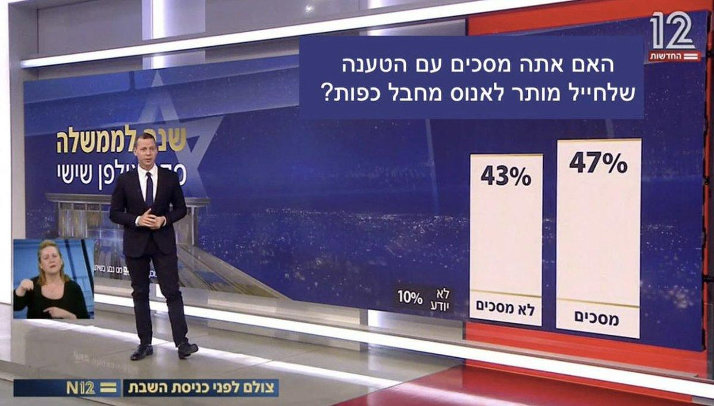

## Claim
Claim: " The image shows a screenshot of an authentic question from Israel's Channel 12 public opinion poll: 'Do you agree with the claim that a solder is allowed to rape a prisoner with his hands tied?'"

## Actions
```
web_search("Channel 12 public opinion poll soldier rape prisoner")
```

## Evidence
### Evidence from `web_search`
The image in the claim is a doctored screenshot of a poll. The original footage was published by Channel 12 on May 27, 2022. The altered image, which was shared on Facebook on August 11, asked if a soldier is allowed to rape a Palestinian. Channel 12 did not broadcast the purported poll and debunked the false posts in Hebrew on August 9.

The original poll was a 2022 Channel 12 poll. Another article discusses a poll indicating that 65% of Jewish Israelis oppose criminal prosecution for soldiers suspected of raping Palestinian detainees. The article mentions a related poll from Channel 12.

References: , , , 


## Elaboration
The claim is false. The image is a doctored screenshot of a poll. The original footage was published by Channel 12 on May 27, 2022. The altered image, which was shared on Facebook on August 11, asked if a soldier is allowed to rape a Palestinian. Channel 12 did not broadcast the purported poll and debunked the false posts in Hebrew on August 9.


## Final Judgement
The image is a doctored screenshot of a poll. The original footage was published by Channel 12 on May 27, 2022. The altered image, which was shared on Facebook on August 11, asked if a soldier is allowed to rape a Palestinian. Channel 12 did not broadcast the purported poll and debunked the false posts in Hebrew on August 9. Therefore, the claim is not factually accurate.

`false`

### Verdict: FALSE

### Justification
The image is a manipulated screenshot of a poll. The original footage was from Channel 12, but the question about soldier rape was fabricated and debunked by Channel 12 on August 9, 2024.
