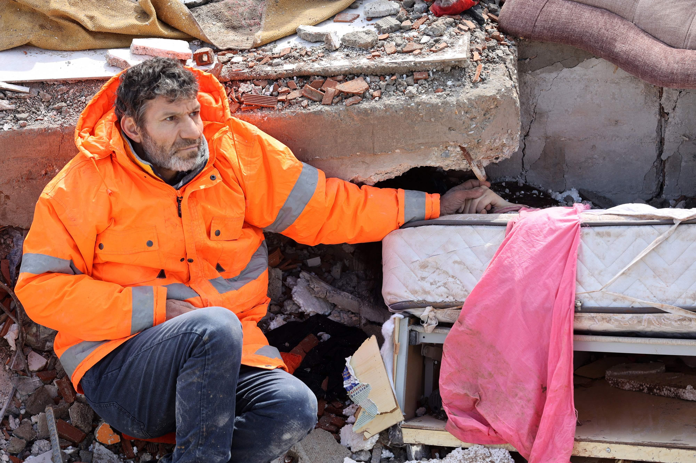

## Claim
Claim: " This image shows a man from Gaza holding the hand of his son killed in an Israeli bombing in July, 2024."

## Actions
```
reverse_search()
```

## Evidence
### Evidence from `reverse_search`
The image () shows Mesut Hancer holding the hand of his 15-year-old daughter, Irmak, who died in an earthquake in Kahramanmaras, Turkey. The earthquake occurred on February 6 or 7, 2023.

The Independent published an article with the image (, ), and SBS published an article with the image (). CNN also published an article with the image.


## Elaboration
The claim is false. The image shows Mesut Hancer holding the hand of his deceased daughter, Irmak, who died in an earthquake in Turkey in February 2023, not in Gaza due to an Israeli bombing in July 2024.


## Final Judgement
The image depicts a man in Turkey holding the hand of his deceased daughter after an earthquake in February 2023, not a man from Gaza holding the hand of his son killed in an Israeli bombing in July 2024. The claim misrepresents the origin and context of the image.

`false`

### Verdict: FALSE

### Justification
The image depicts Mesut Hancer in Turkey holding the hand of his deceased daughter, Irmak, who died in an earthquake in February 2023, not a man from Gaza holding the hand of his son killed in an Israeli bombing in July 2024, as evidenced by multiple news sources like [The Independent](https://www.independent.co.uk/news/world/europe/turkey-earthquake-latest-news-death-toll-b2279788.html).
