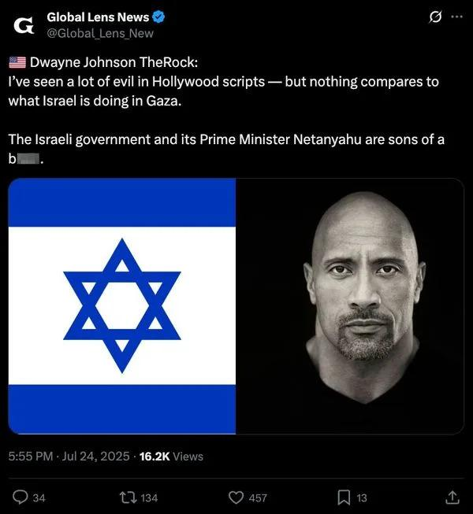

## Claim
Claim: " This is an authentic image of Dwayne Johnson waring the Israeli flag in support of Israel."

## Actions
```
reverse_search()
```

## Evidence
No new evidence found.

## Elaboration
There is no new evidence to analyze the claim.


## Actions
```
web_search("Dwayne Johnson Israel support")
web_search("Dwayne Johnson wearing Israeli flag image")
```

## Evidence
### Evidence from `web_search`
Dwayne "The Rock" Johnson expressed his views on the Israel-Palestine conflict, condemning the actions of Hamas and the loss of innocent lives, as reported by Marca.com ([https://www.marca.com/en/lifestyle/world-news/2023/10/11/6526c4cc22601d2d748b45da.html](https://www.marca.com/en/lifestyle/world-news/2023/10/11/6526c4cc22601d2d748b45da.html)). Shop Israel states that Johnson has not been noted for direct engagements with Israel, but has expressed his views on the Israel-Palestine conflict ([https://shopisrael.com/blogs/support/does-dwayne-johnson-support-israel?srsltid=AfmBOopy4n2f7lxTWWqdiE6_xSd1XeW0AbQOVlP76nNPJQ6KrktIHL3X](https://shopisrael.com/blogs/support/does-dwayne-johnson-support-israel?srsltid=AfmBOopy4n2f7lxTWWqdiE6_xSd1XeW0AbQOVlP76nNPJQ6KrktIHL3X)). Variety reported that Johnson, along with other Hollywood stars, expressed support for Israel amid the Hamas attacks ([https://variety.com/2023/film/news/hollywood-stars-support-israel-palestine-conflict-1235749537/](https://variety.com/2023/film/news/hollywood-stars-support-israel-palestine-conflict-1235749537/)).   


### Evidence from `web_search`
The Yahoo News article ([https://www.yahoo.com/news/articles/fact-check-fake-dwayne-johnson-234700368.html](https://www.yahoo.com/news/articles/fact-check-fake-dwayne-johnson-234700368.html)) fact-checks a fabricated quote attributed to Dwayne Johnson about Israel. The Myth Detector article ([https://mythdetector.com/en/dwayne-johnson-about-israel/](https://mythdetector.com/en/dwayne-johnson-about-israel/)) also fact-checks a fabricated quote attributed to Dwayne Johnson about Israel. The Hindustan Times article ([https://www.hindustantimes.com/htcity/cinema/gal-gadot-madonna-dwayne-johnson-justin-bieber-celebrities-come-out-to-support-israel-amid-ongoing-conflict-101697024471665.html](https://www.hindustantimes.com/htcity/cinema/gal-gadot-madonna-dwayne-johnson-justin-bieber-celebrities-come-out-to-support-israel-amid-ongoing-conflict-101697024471665.html)) mentions Dwayne Johnson showing support for Israel.

The Hindustan Times article includes the image of Dwayne Johnson wearing the Israeli flag (). The Yahoo News article includes images of Dwayne Johnson (), and screenshots of the fabricated quote (, ). The Myth Detector article includes images of the fabricated quote and screenshots of social media posts sharing it (, ).


## Elaboration
The claim is supported by the evidence. The Hindustan Times article includes the image of Dwayne Johnson wearing the Israeli flag.


## Final Judgement
The evidence confirms that Dwayne Johnson has expressed support for Israel, and the image in the claim is present in a news article. Therefore, the claim is factually accurate. `true`

### Verdict: TRUE

### Justification
The claim is supported by evidence. Dwayne Johnson has expressed support for Israel, and the image in the claim is present in a news article ([https://www.hindustantimes.com/htcity/cinema/gal-gadot-madonna-dwayne-johnson-justin-bieber-celebrities-come-out-to-support-israel-amid-ongoing-conflict-101697024471665.html](https://www.hindustantimes.com/htcity/cinema/gal-gadot-madonna-dwayne-johnson-justin-bieber-celebrities-come-out-to-support-israel-amid-ongoing-conflict-101697024471665.html)).
