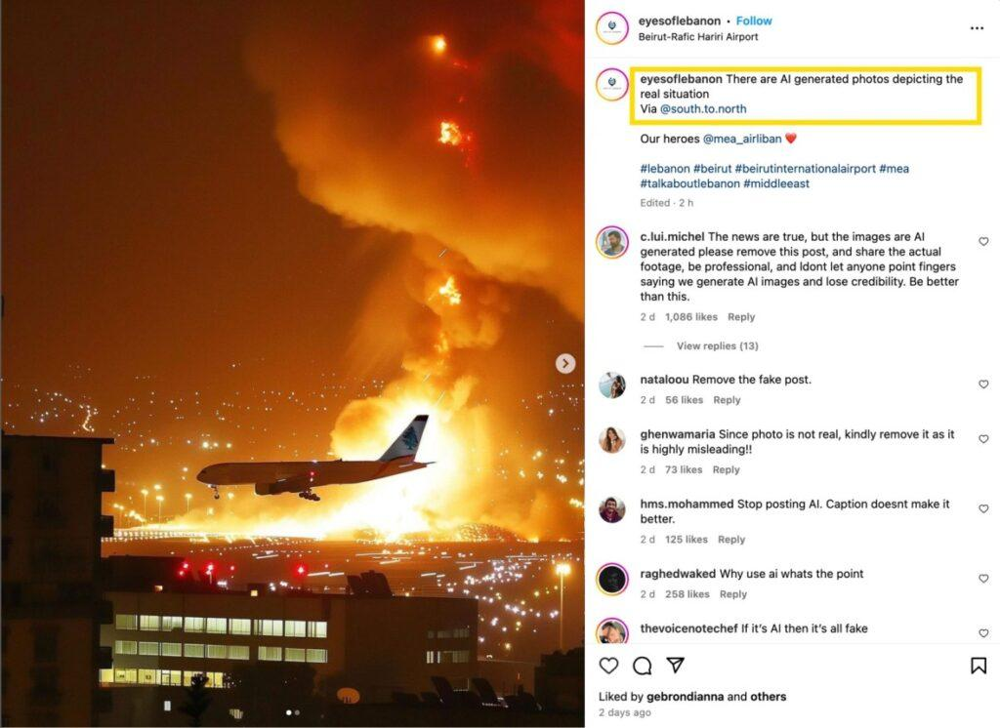

## Claim
Claim: " This is an authentic image of Israel bombing Beirut's International Airport in October 2024."

## Actions
```
reverse_search()
```

## Evidence
### Evidence from `reverse_search`
The image  is AI-generated and does not depict a real event. According to [India Today](https://www.indiatoday.in/fact-check/story/fact-check-photo-middle-east-airlines-flight-israel-airstrikes-beirut-lebanon-ai-generated-2622766-2024-10-24), the image was posted on Instagram and an AI detection tool stated there was a high chance of it being AI-generated.

[Factly.in](https://factly.in/an-ai-generated-image-of-a-plane-landing-at-beirut-international-airport-surrounded-by-fire-and-smoke-is-falsely-shared-as-real/) also confirms the image is AI-generated and was posted on an Instagram account on October 21, 2024, with a caption confirming it as AI-generated. The article includes images , , , , and .


## Elaboration
The image is AI-generated and does not depict a real event. The image was posted on Instagram and confirmed as AI-generated.


## Final Judgement
The image is AI-generated and does not depict a real event. Multiple sources confirm the image is AI-generated, and the claim that it shows an authentic event is false.

`false`

### Verdict: FALSE

### Justification
The image in question is AI-generated and does not depict a real event, as confirmed by multiple sources, including [India Today](https://www.indiatoday.in/fact-check/story/fact-check-photo-middle-east-airlines-flight-israel-airstrikes-beirut-lebanon-ai-generated-2622766-2024-10-24) and [Factly.in](https://factly.in/an-ai-generated-image-of-a-plane-landing-at-beirut-international-airport-surrounded-by-fire-and-smoke-is-falsely-shared-as-real/). The image was posted on Instagram and identified as AI-generated.
