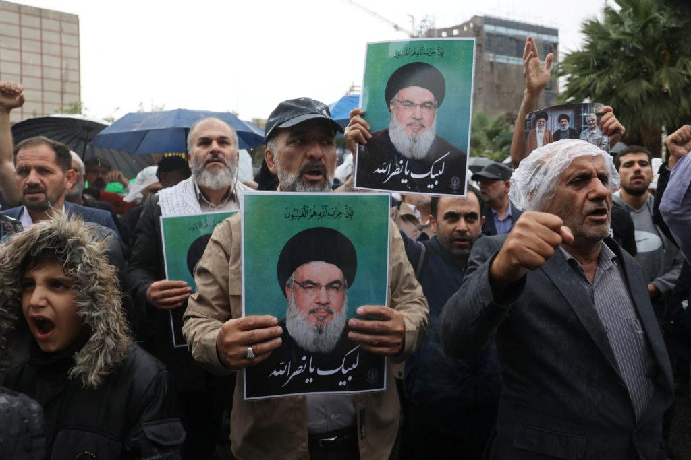

## Claim
Claim: " This image shows the remains of Nasrallah's ring after being killed in an Israeli airstrike in Beirut on September 28, 2024."

## Actions
```
web_search("Nasrallah ring airstrike Beirut September 28 2024")
reverse_search()
```

## Evidence
### Evidence from `web_search`
Multiple sources confirm that Hassan Nasrallah, the leader of Hezbollah, was killed in an Israeli airstrike in Beirut on September 28, 2024. NPR ([https://www.npr.org/2024/09/28/g-s1-25279/israels-military-says-it-killed-hezbollah-leader](https://www.npr.org/2024/09/28/g-s1-25279/israels-military-says-it-killed-hezbollah-leader)) and The Conversation ([https://theconversation.com/does-hezbollah-represent-lebanon-and-what-impact-will-the-death-of-longtime-leader-hassan-nasrallah-have-240062](https://theconversation.com/does-hezbollah-represent-lebanon-and-what-impact-will-the-death-of-longtime-leader-hassan-nasrallah-have-240062)) both report on the event. PBS News ([https://www.pbs.org/newshour/world/hezbollah-confirms-its-leader-hassan-nasrallah-was-killed-by-an-israeli-airstrike-in-beirut](https://www.pbs.org/newshour/world/hezbollah-confirms-its-leader-hassan-nasrallah-was-killed-by-an-israeli-airstrike-in-beirut)) also confirms the news.

The Conversation article also mentions that Iran’s Supreme Leader Khamenei threatened Israel and vowed more support to Hezbollah in Lebanon. The NPR article includes images of Nasrallah (), airstrikes (), and the aftermath (). The Conversation article also includes an image of smoke rising from the site of an Israeli airstrike ().


### Evidence from `reverse_search`
The image () shows the remains of a ring and some fragments. According to the sources, the ring belonged to General Mohammad Reza Zahedi, who was killed in an Israeli airstrike in Damascus. The ring was a gift from Imam Reza (AS).

The image was published on April 1 and 2, 2024, on different websites, including [Khabar Online](https://www.khabaronline.ir/news/1890386/%D8%B9%DA%A9%D8%B3%DB%8C-%D8%AA%D9%84%D8%AE-%D8%A7%D8%B2-%D8%A7%D9%86%DA%AF%D8%B4%D8%AA%D8%B1-%D8%A8%D8%B1%D8%AC%D8%A7%DB%8C-%D9%85%D8%A7%D9%86%D8%AF%D9%87-%D8%A7%D8%B2-%D8%B3%D8%B1%D8%AF%D8%A7%D8%B1-%D8%B2%D8%A7%D9%87%D8%AF%DB%8C-%D8%A8%D8%B9%D8%AF-%D8%A7%D8%B2-%D8%B4%D9%87%D8%A7%D8%AF%D8%AA-%D9%87%D8%AF%DB%8C%D9%87), [Etemad Online](https://www.etemadonline.com/%D8%A8%D8%AE%D8%B4-%D8%B3%DB%8C%D8%A7%D8%B3%DB%8C-9/655901-%D8%A7%D9%86%DA%AF%D8%B4%D8%AA%D8%B1-%D8%A7%D9%87%D8%AF%D8%A7%DB%8C%DB%8C-%D8%B4%D9%87%DB%8C%D8%AF%D8%B2%D8%A7%D9%87%D8%AF%DB%8C-%D8%AD%D9%85%D9%84%D9%87-%D8%A7%D8%B3%D8%B1%D8%A7%D8%A6%DB%8C%D9%84) and [598.ir](https://www.598.ir/fa/news/535490/%D8%AA%D8%B5%D9%88%DB%8C%D8%B1%DB%8C-%D8%A7%D8%B2-%D8%A7%D9%86%DA%AF%D8%B4%D8%AA%D8%B1-%D8%B4%D9%87%DB%8C%D8%AF-%D8%B2%D8%A7%D9%87%D8%AF%DB%8C).


## Elaboration
The claim is false. The image shows the remains of a ring belonging to General Mohammad Reza Zahedi, who was killed in an Israeli airstrike in Damascus, not Nasrallah's ring. The image was published on April 1 and 2, 2024, on various websites.


## Final Judgement
The image in the claim is of a ring belonging to General Mohammad Reza Zahedi, not Nasrallah. The image was taken out of context and misrepresented. `false`

### Verdict: FALSE

### Justification
The claim is false. The image depicts the remains of a ring belonging to General Mohammad Reza Zahedi, killed in an Israeli airstrike in Damascus, as reported by sources like [Khabar Online](https://www.khabaronline.ir/news/1890386/%D8%B9%DA%A9%D8%B3%DB%8C-%D8%AA%D9%84%D8%AE-%D8%A7%D8%B2-%D8%A7%D9%86%DA%AF%D8%B4%D8%AA%D8%B1-%D8%A8%D8%B1%D8%AC%D8%A7%DB%8C-%D9%85%D8%A7%D9%86%D8%AF%D9%87-%D8%A7%D8%B2-%D8%B3%D8%B1%D8%AF%D8%A7%D8%B1-%D8%B2%D8%A7%D9%87%D8%AF%DB%8C-%D8%A8%D8%B9%D8%AF-%D8%A7%D8%B2-%D8%B4%D9%87%D8%A7%D8%AF%D8%AA-%D9%87%D8%AF%DB%8C%D9%87), [Etemad Online](https://www.etemadonline.com/%D8%A8%D8%AE%D8%B4-%D8%B3%DB%8C%D8%A7%D8%B3%DB%8C-9/655901-%D8%A7%D9%86%DA%AF%D8%B4%D8%AA%D8%B1-%D8%A7%D9%87%D8%AF%D8%A7%DB%8C%DB%8C-%D8%B4%D9%87%DB%8C%D8%AF%D8%B2%D8%A7%D9%87%D8%AF%DB%8C-%D8%AD%D9%85%D9%84%D9%87-%D8%A7%D8%B3%D8%B1%D8%A7%D8%A6%DB%8C%D9%84) and [598.ir](https://www.598.ir/fa/news/535490/%D8%AA%D8%B5%D9%88%DB%8C%D8%B1%DB%8C-%D8%A7%D8%B2-%D8%A7%D9%86%DA%AF%D8%B4%D8%AA%D8%B1-%D8%B4%D9%87%DB%8C%D8%AF-%D8%B2%D8%A7%D9%87%D8%AF%DB%8C).
