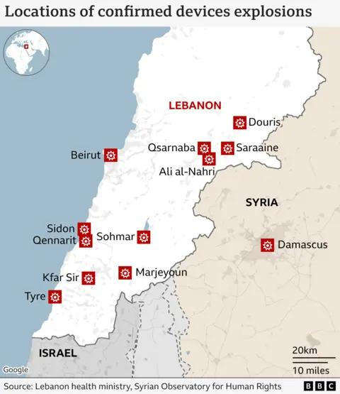

## Claim
Claim: " This image shows an Iphone that exploded during the pager attacks on Hezbollah devices in Lebanon in September 2024, blowing up random people."

## Actions
```
reverse_search()
web_search("Hezbollah devices Lebanon September 2024")
```

## Evidence
### Evidence from `reverse_search`
The image of the exploded iPhone () is featured in multiple articles discussing explosions in Lebanon. One article from DW.com ([https://www.dw.com/en/fact-check-no-iphones-solar-panels-laptops-exploded-in-lebanon/a-70281061](https://www.dw.com/en/fact-check-no-iphones-solar-panels-laptops-exploded-in-lebanon/a-70281061)) states that the image is not related to the current attacks and dates back to March 2021.

Other sources, such as ITC.ua ([https://itc.ua/en/news/not-just-pagers-iphones-laptops-electronic-locks-and-other-devices-exploded-in-lebanon-today/](https://itc.ua/en/news/not-just-pagers-iphones-laptops-electronic-locks-and-other-devices-exploded-in-lebanon-today/)) and The China Academy ([https://thechinaacademy.org/israels-pager-attack-has-cooked-western-led-globalization/](https://thechinaacademy.org/israels-pager-attack-has-cooked-western-led-globalization/)), also use the image. The ITC.ua article reports on explosions targeting Hezbollah members, while The China Academy article discusses a "pager attack" and mentions at least 32 deaths and thousands of injuries. The ITC.ua article also includes another image ().


### Evidence from `web_search`
The BBC reported on explosions in Lebanon on September 20, 2024, involving communication devices, some used by Hezbollah, resulting in at least 32 deaths and thousands injured. The explosions occurred near a crowd gathered for funerals and were caused by walkie-talkies and pagers. ([https://www.bbc.com/news/articles/cz04m913m49o](https://www.bbc.com/news/articles/cz04m913m49o)) , 

The Lieber Institute of West Point discusses the explosive pagers attack on Hezbollah operatives in Lebanon and Syria on September 17, 2024, suggesting Israel's responsibility. ([https://lieber.westpoint.edu/well-it-depends-explosive-pagers-attack-revisited/](https://lieber.westpoint.edu/well-it-depends-explosive-pagers-attack-revisited/)) The Wikipedia article discusses the 2024 Lebanon electronic device attacks, also known as Operation Grim Beeper, which occurred on September 17-18, 2024, targeting Hezbollah members using pagers and walkie-talkies, resulting in 42 deaths and over 3,500 injuries. ([https://en.wikipedia.org/wiki/2024_Lebanon_electronic_device_attacks](https://en.wikipedia.org/wiki/2024_Lebanon_electronic_device_attacks)) 


## Elaboration
The claim is partially accurate. The image (

## Final Judgement
The image of the exploded iPhone is not directly related to the September 2024 attacks in Lebanon, as it dates back to March 2021. However, there were indeed explosions in Lebanon in September 2024 targeting Hezbollah members, caused by communication devices like pagers, resulting in casualties.

The claim is partially false because the image is not related to the September 2024 attacks. `false`

### Verdict: FALSE

### Justification
The claim is partially false. While there were explosions in Lebanon in September 2024 targeting Hezbollah members, the image of the exploded iPhone (