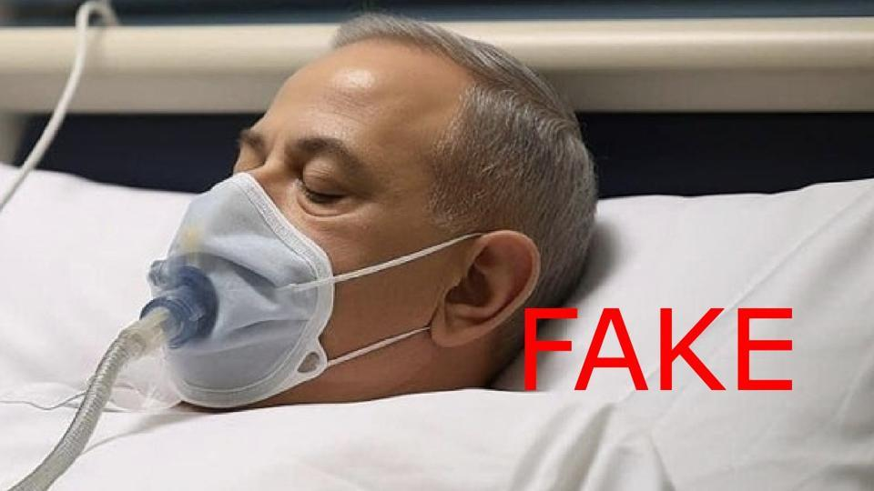

## Claim
Claim: " This is an authentic image of Benjamin Netanyahu being hospitalized in Tel Aviv in November 2024 due to a serious health issue."

## Actions
```
reverse_search()
web_search("Benjamin Netanyahu hospitalized")
```

## Evidence
### Evidence from `reverse_search`
The Forbes article from November 8, 2023, states that the image  is fake and likely AI-generated, circulating on TikTok, and that there is no evidence to support the claim that Netanyahu is hospitalized. The Yemen News Agency (SABA) published an article on December 29, 2024, stating that Benjamin Netanyahu was diagnosed with prostate cancer and includes the image .

Webangah News Hub, published on December 30, 2024, discusses Benjamin Netanyahu's prostate surgery and his transfer to an underground ward, including the image .


### Evidence from `web_search`
Benjamin Netanyahu underwent prostate removal surgery on December 29, 2024, and was discharged from the hospital on January 2, 2025, according to The Times of Israel ([https://www.timesofisrael.com/netanyahu-released-from-hospital-four-days-after-prostate-removal-surgery/](https://www.timesofisrael.com/netanyahu-released-from-hospital-four-days-after-prostate-removal-surgery/)). CNN reports that he left the hospital on December 31, 2024, to pass a budget law ([https://www.cnn.com/2024/12/31/middleeast/netanyahu-hospital-prostate-budget-bill-intl-latam](https://www.cnn.com/2024/12/31/middleeast/netanyahu-hospital-prostate-budget-bill-intl-latam)). VOA News also reported on the surgery ([https://www.voanews.com/a/israeli-hospital-says-netanyahu-has-undergone-successful-prostate-surgery/7917792.html](https://www.voanews.com/a/israeli-hospital-says-netanyahu-has-undergone-successful-prostate-surgery/7917792.html)).

The sources mention previous health issues, including a hernia surgery in March 2024 and a pacemaker installation in 2023. The image  is from the Times of Israel, <image:i> is from CNN, and  is from VOA News.


## Elaboration
The claim is partially accurate. The image is associated with Benjamin Netanyahu's hospitalization. However, the evidence indicates that the hospitalization occurred in December 2024, not November 2024, due to prostate surgery. The image has been used in articles discussing his surgery.


## Final Judgement
The claim is partially accurate. While the image is associated with Benjamin Netanyahu's hospitalization, the timing is incorrect. The hospitalization occurred in December 2024, not November 2024, due to prostate surgery.

`false`

### Verdict: FALSE

### Justification
The image depicts Benjamin Netanyahu in a hospital setting, which is accurate, but the claim's timeline is incorrect. Netanyahu was hospitalized in December 2024 for prostate surgery, as reported by sources like The Times of Israel ([https://www.timesofisrael.com/netanyahu-released-from-hospital-four-days-after-prostate-removal-surgery/](https://www.timesofisrael.com/netanyahu-released-from-hospital-four-days-after-prostate-removal-surgery/)) and CNN ([https://www.cnn.com/2024/12/31/middleeast/netanyahu-hospital-prostate-budget-bill-intl-latam](https://www.cnn.com/2024/12/31/middleeast/netanyahu-hospital-prostate-budget-bill-intl-latam)).
