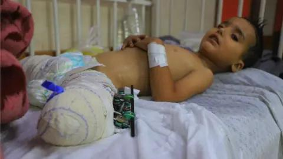
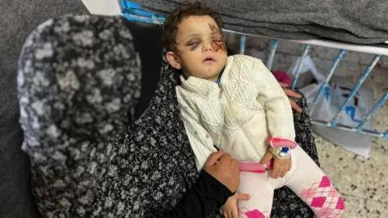

## Claim
Claim: " This image shows two children in Gaza in April 2025 found dead under the rubble of their home two months after an Israeli airstrike destroyed it."

## Actions
```
reverse_search()
web_search("children found under rubble Gaza")
```

## Evidence
### Evidence from `reverse_search`
From [Source](https://kashif.ps/en/index.php/2025/04/14/image-of-two-mummified-children-in-a-bolivian-museum-goes-viral-as-from-gaza/): Found exact image on website with title: Image of two mummified children in a Bolivian museum goes viral as ...
Content: The image in the claim shows two mummified children from a Bolivian museum, not children found in Gaza. The image was posted on Instagram with the caption "Two children were found two months later under the rubble of their home." The image was originally posted on Flickr in 2006 and shows mummified children from the 19th century at the Mint Museum in Potosi, Bolivia. , , . The article was published on April 14, 2025, by Nadeen.


### Evidence from `web_search`
Reliefweb ([https://reliefweb.int/report/occupied-palestinian-territory/gazas-missing-children-over-20000-children-estimated-be-lost-disappeared-detained-buried-under-rubble-or-mass-graves-0](https://reliefweb.int/report/occupied-palestinian-territory/gazas-missing-children-over-20000-children-estimated-be-lost-disappeared-detained-buried-under-rubble-or-mass-graves-0)) reports that approximately 4,000 children are likely missing under the rubble in Gaza, and over 14,000 children have been killed since October 7, 2024. Save the Children ([https://www.savethechildren.net/gaza-missing-children](https://www.savethechildren.net/gaza-missing-children)) states that at least 10,000 people are reported missing under the rubble in Gaza, with children making up 43% of total casualties. The organization estimates that at least 5,160 children are dead under the rubble. <image:k> shows people searching the rubble in Gaza.

The BBC News article ([https://www.bbc.com/news/world-middle-east-67614139](https://www.bbc.com/news/world-middle-east-67614139)) discusses the plight of children in Gaza who have lost their families due to the conflict. The article includes images of injured children. , , .


## Elaboration
The claim is false. The image in the claim depicts mummified children from a Bolivian museum, not children found in Gaza. The image was originally posted on Flickr in 2006 and shows mummified children from the 19th century at the Mint Museum in Potosi, Bolivia.


## Final Judgement
The image in the claim is misrepresented. The image shows mummified children from a Bolivian museum, not children found in Gaza.

`false`

### Verdict: FALSE

### Justification
The image in the claim is misattributed. Reverse image search reveals that the image depicts mummified children from a Bolivian museum, not children found in Gaza as claimed, as reported by [Kashif.ps](https://kashif.ps/en/index.php/2025/04/14/image-of-two-mummified-children-in-a-bolivian-museum-goes-viral-as-from-gaza/).
