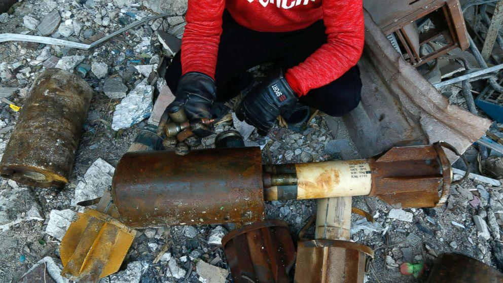

## Claim
Claim: " This image shows a Palestinian girl in the Gaza war in July 2024. She was holding her sister's oxygen mask inside the ambulance. She had already passed away, yet her hand remained on the mask firmly."

## Actions
```
reverse_search()
web_search("Gaza war children oxygen mask")
```

## Evidence
### Evidence from `reverse_search`
The image  appears in multiple sources. One source is a VOA News article from January 24, 2018, titled "Syria, Russia Accuse US of Lying About Chemical Weapons Attacks" ([https://www.voanews.com/a/syria-russia-us-chemical-attacks/4221637.html](https://www.voanews.com/a/syria-russia-us-chemical-attacks/4221637.html)). The image  is of a Syrian girl holding an oxygen mask over an infant following a reported gas attack in Douma, Syria, on January 22, 2018.

Another source is a report from the Center for Strategic and International Studies (CSIS) published on October 16, 2024, titled "Emerging Trends in Chemical Weapons Usage in the Middle East" ([https://www.csis.org/analysis/emerging-trends-chemical-weapons-usage-middle-east](https://www.csis.org/analysis/emerging-trends-chemical-weapons-usage-middle-east)). The report includes the image  and discusses chemical weapons usage in the Middle East. An ABC News article from January 23, 2018, titled "Russia 'ultimately bears responsibility' for chemical attacks in Syria" ([https://abcnews.go.com/International/tillerson-russia-ultimately-bears-responsibility-chemical-attacks-syria/story?id=52554201](https://abcnews.go.com/International/tillerson-russia-ultimately-bears-responsibility-chemical-attacks-syria/story?id=52554201)) also contains the image  and discusses the U.S. response to chemical attacks in Syria.


### Evidence from `web_search`
The NPR article discusses the death of a baby girl in Gaza who was given an oxygen mask after her mother was killed in an Israeli airstrike. The article was published on April 26, 2024. [Source](https://www.npr.org/2024/04/26/1247453317/gaza-baby-girl-mother-killed-israel-airstrike) The Human Rights Watch report discusses the impact of the war on children in Gaza, including those with disabilities, and mentions the killing of over 16,750 children as of mid-September 2024. The report mentions a girl named Layan who was evacuated for treatment in July 2024. [Source](https://www.hrw.org/report/2024/09/30/they-destroyed-what-was-inside-us/children-disabilities-amid-israels-attacks-gaza)

The Doctors Without Borders (MSF) article discusses a survey of MSF staff and their families in Gaza, which found that almost half of those killed in the war were children. The article mentions a photo of an MSF surgeon helping his son put on an oxygen mask in Al-Shifa Hospital after being injured in an airstrike in Gaza city in 2025. <image:k> [Source](https://www.doctorswithoutborders.org/latest/msf-survey-staff-and-their-families-gaza-shows-almost-half-those-killed-war-were-children)


## Elaboration
The image is not from the Gaza war in July 2024. Reverse image search results indicate that the image is from Syria and dates back to January 2018. The image is associated with a reported gas attack in Douma, Syria.


## Final Judgement
The claim is demonstrably false. The image is from Syria, not Gaza, and dates back to 2018, not July 2024. The image is associated with a reported gas attack in Douma, Syria. `false`

### Verdict: FALSE

### Justification
The image in the claim is not from the Gaza war in July 2024. Reverse image searches reveal that the image is from Syria and dates back to January 2018, associated with a reported gas attack in Douma, Syria ([https://www.voanews.com/a/syria-russia-us-chemical-attacks/4221637.html](https://www.voanews.com/a/syria-russia-us-chemical-attacks/4221637.html)).
