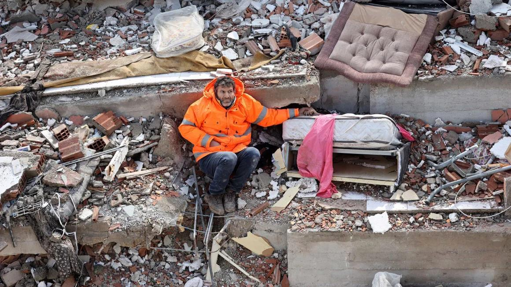
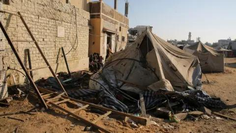
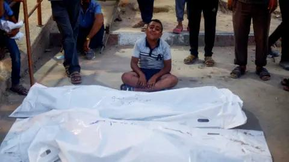
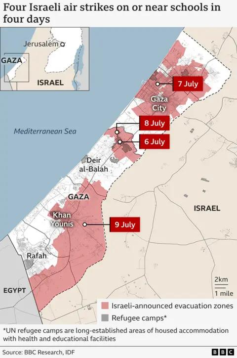

## Claim
Claim: " This image shows a man from Gaza holding the hand of his son killed in an Israeli bombing in July, 2024."

## Actions
```
reverse_search()
web_search("Gaza bombing July 2024")
```

## Evidence
### Evidence from `reverse_search`
The image shows Mesut Hancer holding the hand of his 15-year-old daughter, Irmak, who died in an earthquake in Kahramanmaras, Turkey. The earthquake occurred in February 2023. The image was published by The Independent ([https://www.independent.co.uk/news/world/middle-east/turkey-earthquake-father-daughter-hold-hands-b2277655.html](https://www.independent.co.uk/news/world/middle-east/turkey-earthquake-father-daughter-hold-hands-b2277655.html)), SBS News ([https://www.sbs.com.au/news/article/the-story-behind-this-turkey-earthquake-photo-that-many-will-never-forget/2ijedstvo](https://www.sbs.com.au/news/article/the-story-behind-this-turkey-earthquake-photo-that-many-will-never-forget/2ijedstvo)), and CNN ([https://www.cnn.com/2023/02/13/middleeast/turkey-quake-man-daughter-hand-photo-intl](https://www.cnn.com/2023/02/13/middleeast/turkey-quake-man-daughter-hand-photo-intl)). 


### Evidence from `web_search`
The Wikipedia article discusses the 13 July 2024 al-Mawasi attack, part of the Gaza war, which resulted in at least 90 Palestinian deaths and over 300 injuries. Israel claimed the strike targeted Hamas leaders. The CNN article from July 27, 2024, reports on an Israeli airstrike on a school in Deir-al Balah, central Gaza, which killed at least 30 people. The BBC article from July 10, 2024, reports on an Israeli air strike on a tent camp for displaced people in Gaza, which resulted in at least 29 deaths.

The CNN article does not include the image . The BBC article includes images , , and .


## Elaboration
The claim is false. The image shows Mesut Hancer holding the hand of his deceased daughter, Irmak, who died in an earthquake in Turkey in February 2023, not in Gaza in July 2024. The evidence from the reverse image search confirms this.


## Final Judgement
The image is from an earthquake in Turkey in February 2023, not from Gaza in July 2024. The claim misrepresents the origin and context of the image. `false`

### Verdict: FALSE

### Justification
The image depicts Mesut Hancer holding the hand of his daughter, who died in the February 2023 earthquake in Turkey, as confirmed by reverse image searches and sources like The Independent ([https://www.independent.co.uk/news/world/middle-east/turkey-earthquake-father-daughter-hold-hands-b2277655.html](https://www.independent.co.uk/news/world/middle-east/turkey-earthquake-father-daughter-hold-hands-b2277655.html)). The claim incorrectly associates the image with events in Gaza in July 2024.
