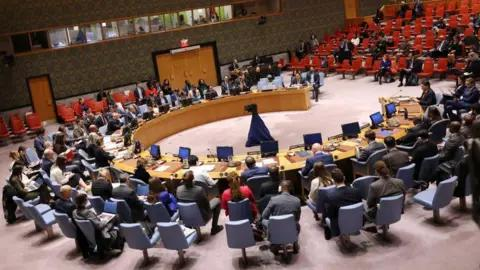

## Claim
Claim: "The US reinstituted draft in 2024 for the Israel-Hamas war."

## Actions
```
web_search("US draft 2024 Israel-Hamas war")
```

## Evidence
### Evidence from `web_search`
The provided search results discuss the United States' support for Israel in the Gaza war, including military aid, meetings between officials, and vetoes of UN resolutions (<image:k>, <image:i>, <image:j>). Another source discusses a draft resolution on the war in Gaza, with the US expected to vote on it. None of the sources mention the reinstitution of the draft in the US.

*   [United States support for Israel in the Gaza war](https://en.wikipedia.org/wiki/United_States_support_for_Israel_in_the_Gaza_war)
*   [Vote on a draft resolution on the war in Gaza](https://www.securitycouncilreport.org/whatsinblue/2024/11/vote-on-a-draft-resolution-on-the-war-in-gaza.php)
*   [The return of the military draft](https://www.rand.org/pubs/commentary/2024/07/the-return-of-the-military-draft.html)


## Elaboration
The search results do not mention the reinstitution of the draft in the US. The evidence focuses on the US's support for Israel and a draft resolution on the war in Gaza. One source discusses the return of the military draft, but it does not specify that it was reinstituted in 2024.

Insufficient information is available to verify the claim.


## Actions
```
web_search("US military draft 2024")
```

## Evidence
### Evidence from `web_search`
The search results discuss conscription in the United States, including its history and the Selective Service Act, but do not mention the reinstitution of the draft in 2024. One article discusses the possibility of a military draft in the US, without mentioning the Israel-Hamas war.

*   [Conscription in the United States](https://en.wikipedia.org/wiki/Conscription_in_the_United_States)
*   [Preparing for the Possibility of a Draft Without Panic](https://warontherocks.com/2024/08/preparing-for-the-possibility-of-a-draft-without-panic/)


## Elaboration
The search results do not support the claim that the US reinstituted the draft in 2024 for the Israel-Hamas war. The evidence discusses conscription in the US and the possibility of a draft, but it does not mention the Israel-Hamas war.

Insufficient information is available to verify the claim.


## Actions
```
web_search("US draft Israel-Hamas war")
```

## Evidence
### Evidence from `web_search`
The search results discuss the US's involvement in the Israel-Hamas war, including vetoing UN resolutions demanding a ceasefire in Gaza (<image:k>, ). One source mentions a US proposal for a 60-day cease-fire (, ). None of the sources mention the reinstitution of the draft in the US.

*   [https://news.un.org/en/story/2025/06/1164056](https://news.un.org/en/story/2025/06/1164056)
*   [https://www.pbs.org/newshour/show/how-israel-is-responding-to-latest-u-s-proposals-to-pause-war-in-gaza](https://www.pbs.org/newshour/show/how-israel-is-responding-to-latest-u-s-proposals-to-pause-war-in-gaza)
*   [https://www.bbc.com/news/articles/cjr4p9rg8zlo](https://www.bbc.com/news/articles/cjr4p9rg8zlo)


## Elaboration
The search results consistently fail to support the claim. The evidence focuses on the US's involvement in the Israel-Hamas war, including diplomatic efforts and military aid, but does not mention the reinstitution of the draft.

Insufficient information is available to verify the claim.


## Final Judgement
The search results do not provide any evidence to support the claim that the US reinstituted the draft in 2024 for the Israel-Hamas war. The evidence focuses on the US's involvement in the war, including military aid and diplomatic efforts, but does not mention the reinstitution of the draft.

The claim is not supported by the available evidence. `false`


### Verdict: FALSE

### Justification
The fact-check, based on multiple web searches, found no evidence to support the claim that the US reinstituted the draft in 2024 for the Israel-Hamas war. The search results focused on the US's involvement in the conflict, including military aid and diplomatic efforts, but did not mention the reinstitution of the draft. Therefore, the claim is unsupported.
