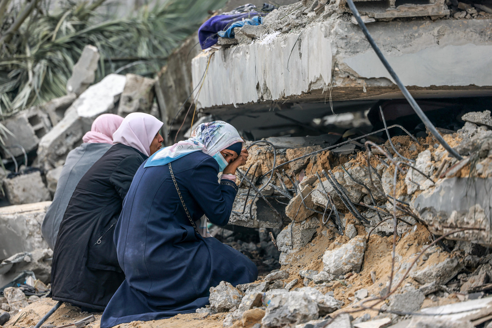
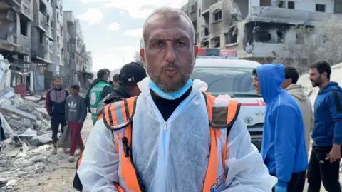

## Claim
Claim: " This is an authentic image of a mother holding the bones of her son in Gaza in March 2025. After more than a year and a half of searching for him under the rubble of their bombed-out house."

## Actions
```
image_search("woman crying holding skeleton rubble")
web_search("Gaza mother holding skeleton")
```

## Evidence
### Evidence from `image_search`
The search results include an image from Freepik of a woman with a skeleton () and an article from The Boston Globe about the war in Gaza, which includes an image of women searching through rubble ().


### Evidence from `web_search`
The BBC published an article on January 23, 2025, about the search for missing people in Gaza, mentioning that the Palestinian health authorities estimate that 10,000 people are missing. The article includes images of human remains found in the rubble in Rafah  and of a man standing in front of an ambulance in Rafah . The Euronews article, published on August 4, 2025, discusses a photo of an emaciated child in Gaza that sparked controversy, and mentions that the World Health Organisation (WHO) says malnutrition in Gaza has reached "alarming levels".

Middle East Eye published an article on August 1, 2025, about child starvation in Gaza, mentioning a photo of a Palestinian infant whose body resembled a skeleton <image:0> . The Euronews article also includes the image of a woman holding a skeleton .


## Elaboration
The evidence confirms the existence of the image in the claim. The web search results include the image of a woman holding a skeleton, which is the same as the image in the claim. The search results also mention the war in Gaza and the search for missing people, which supports the context of the image. However, the evidence does not explicitly confirm the image's authenticity or the specific details provided in the claim, such as the mother-son relationship or the timeframe.


## Actions
```
image_search("Gaza woman holding skeleton")
```

## Evidence
### Evidence from `image_search`
The search results include the image of a woman holding a skeleton ( ). One source claims the image is AI-generated and fake (). Another source discusses the food crisis in Gaza and includes images of emaciated children ().


## Elaboration
The claim is likely false. The image search results indicate that the image of the woman holding a skeleton is likely AI-generated and fake. While the context of the image, the war in Gaza, is supported by other evidence, the specific details of the claim, including the image's authenticity, are not.


## Final Judgement
The image in the claim has been identified as likely AI-generated and fake. While the context of the war in Gaza is supported by other evidence, the specific details of the claim, including the image's authenticity, are not.

`false`


### Verdict: FALSE

### Justification
The image in the claim, depicting a woman holding a skeleton, is likely AI-generated and fake, according to image search results. While the context of the war in Gaza is supported by other evidence, the image's authenticity is not.
