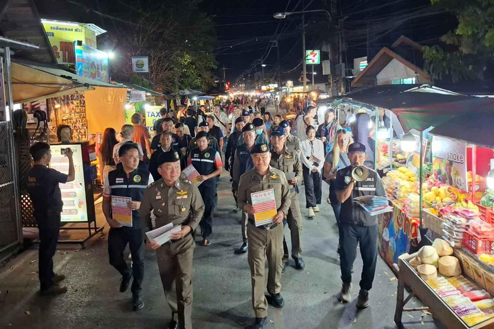
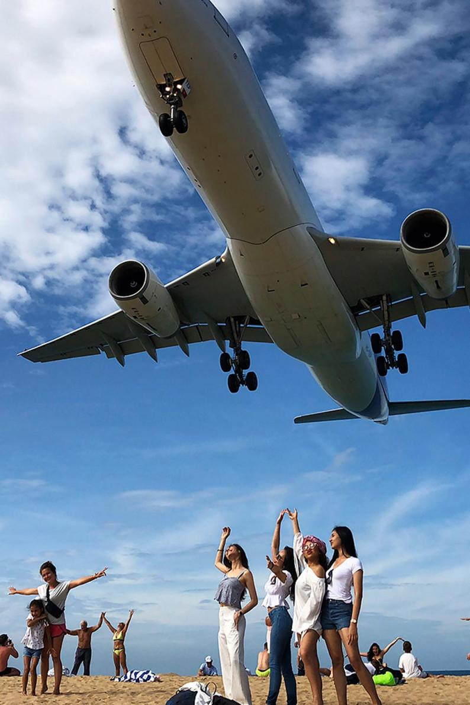
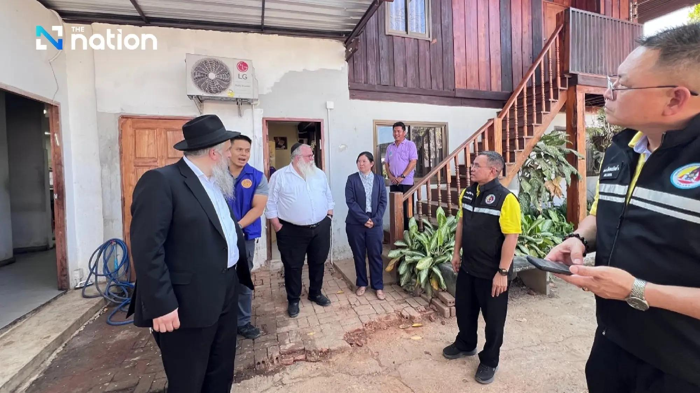

## Claim
Claim: " This image shows Israelis who have stopped fighting the wars in Gaza and Lebanon and moved to become 'settlers' in Pai District, Mae Hong Son Province, Thailand, in February 2025."

## Actions
```
web_search("Israelis settlers Pai District Mae Hong Son Thailand")
geolocate()
```

## Evidence
### Evidence from `web_search`
The Bangkok Post published an article on February 23, 2025, stating that police in Pai district, Mae Hong Son, Thailand, found no Israeli influence, settlements, or business dominance, and that 4,573 Israelis visited Pai as of the date of the article. ([Source](https://www.bangkokpost.com/thailand/general/2966381/no-israeli-settlement-or-business-dominance-found-in-northern-thailands-pai)) The Nation published an article on February 18, 2025, refuting social media claims about an Israeli "promised land" in Pai district, Mae Hong Son. ([Source](https://www.nationthailand.com/news/tourism/40046434))

The article from Khaosod English, published on February 23, 2025, discusses fears among some Thais that Israelis are turning Pai District, Mae Hong Son Province, Thailand, into an occupied land, and mentions that the Prime Minister assured the public that these fears are unsubstantiated. ([Source](https://www.khaosodenglish.com/featured/2025/02/23/why-some-thais-fear-israelis-turning-pai-into-an-occupied-land/)) The article also mentions Mr. Menachem Mendel Zajac, the Jewish religious leader and caretaker of the Chabad House in Pai, and that there are only about 40 to 50 Jewish families residing in Pai. , , , , , , , 


### Evidence from `geolocate`
The most likely countries where the image was taken are: {'Israel': 0.88, 'Jordan': 0.05, 'Palestine': 0.02, 'Argentina': 0.01, 'Guatemala': 0.01, 'Turkey': 0.01, 'Albania': 0.0, 'Andorra': 0.0, 'Australia': 0.0, 'Austria': 0.0}

## Elaboration
The evidence indicates that the image was likely taken in Israel, not in Pai District, Mae Hong Son Province, Thailand. The search results from February 2025 discuss concerns about Israeli influence in Pai, but the image's geolocation suggests a different location. The evidence also mentions that the Prime Minister assured the public that fears of Israelis turning Pai into an occupied land are unsubstantiated.


## Final Judgement
The claim is demonstrably false. The image's geolocation suggests it was taken in Israel, not Thailand. Additionally, the search results from February 2025 discuss concerns about Israeli influence in Pai, but the image's location is not in Thailand. `false`

### Verdict: FALSE

### Justification
The claim is false. The image's geolocation suggests it was taken in Israel, not Thailand. While there were discussions about Israeli presence in Pai District, Mae Hong Son Province, Thailand, in February 2025, the image's location is inconsistent with the claim. The Bangkok Post ([Source](https://www.bangkokpost.com/thailand/general/2966381/no-israeli-settlement-or-business-dominance-found-in-northern-thailands-pai)) and The Nation ([Source](https://www.nationthailand.com/news/tourism/40046434)) reported on the situation in Pai, but the image's location is not in Thailand.
