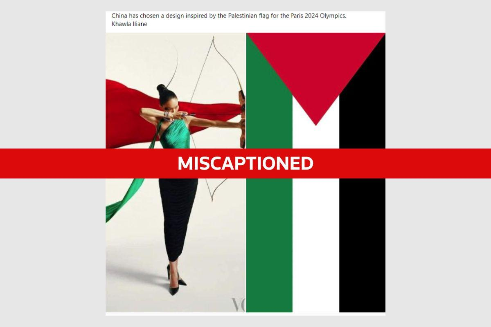
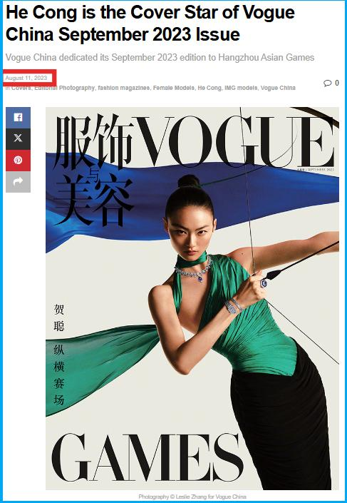
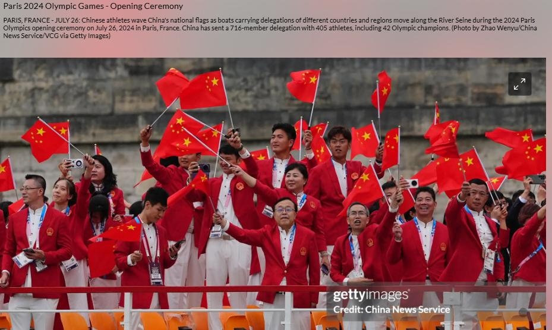

## Claim
Claim: " This image shows an athlete of China which has chosen a design of the Palestinian flag for the Paris 2024 Olympics."

## Actions
```
web_search("China design Palestinian flag Paris 2024 Olympics")
```

## Evidence
### Evidence from `web_search`
The image in the claim is from the September 2023 issue of Vogue China Magazine and was taken for the promotion of the Hangzhou Asian Games, not the Paris 2024 Olympics. The articles from Fact Crescendo ([Source](https://srilanka.factcrescendo.com/english/china-has-not-chosen-a-design-inspired-by-the-palestinian-flag-for-the-paris-olympics-2024/)) and Factly.in ([Source](https://factly.in/an-old-photo-from-vogue-china-magazine-is-being-falsely-shared-as-showing-chinese-athletes-wearing-the-colours-of-the-palestinian-flag/)) both state that the image is miscaptioned. China's uniform for the Paris Olympics features red and white colors. , , , , , , , , 


## Elaboration
The claim is false. The image is from Vogue China Magazine and was taken for the promotion of the Hangzhou Asian Games, not the Paris 2024 Olympics. The colors in the image are similar to the Palestinian flag, but the image is miscaptioned. China's uniform for the Paris Olympics features red and white colors.


## Final Judgement
The claim is demonstrably false. The image is from Vogue China Magazine and was taken for the promotion of the Hangzhou Asian Games, not the Paris 2024 Olympics. The colors in the image are similar to the Palestinian flag, but the image is miscaptioned.

`false`

### Verdict: FALSE

### Justification
The claim is false. The image originates from the September 2023 issue of Vogue China Magazine and was created to promote the Hangzhou Asian Games, not the Paris 2024 Olympics. Fact-checkers at Fact Crescendo ([Source](https://srilanka.factcrescendo.com/english/china-has-not-chosen-a-design-inspired-by-the-palestinian-flag-for-the-paris-olympics-2024/)) and Factly.in ([Source](https://factly.in/an-old-photo-from-vogue-china-magazine-is-being-falsely-shared-as-showing-chinese-athletes-wearing-the-colours-of-the-palestinian-flag/)) have confirmed the image is miscaptioned.
