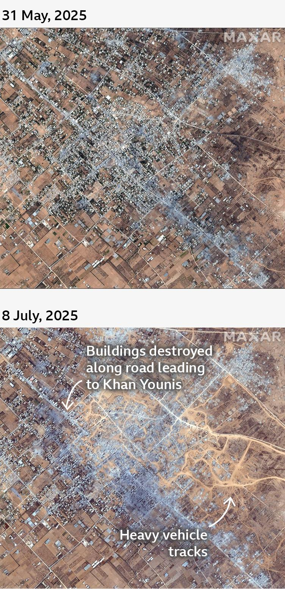
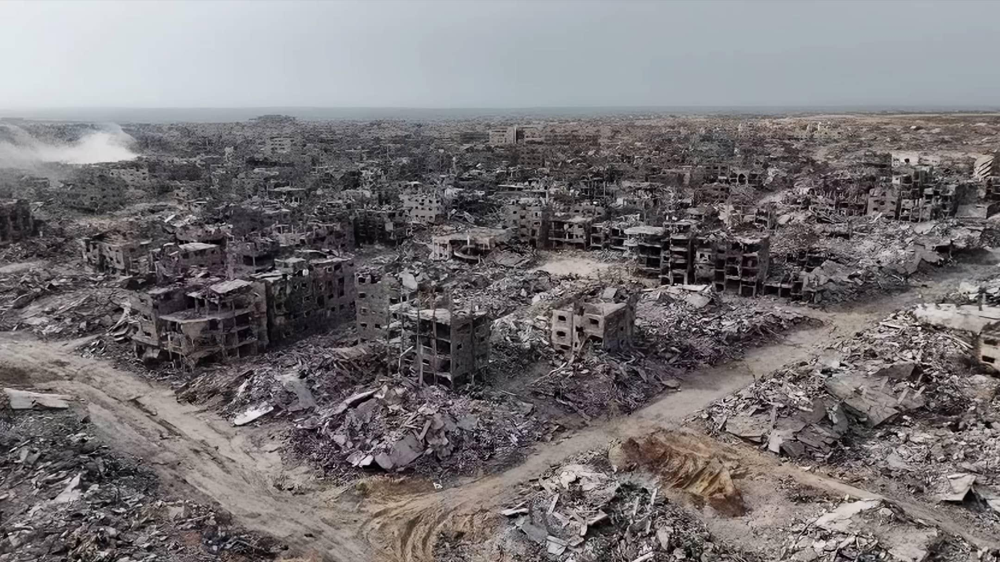
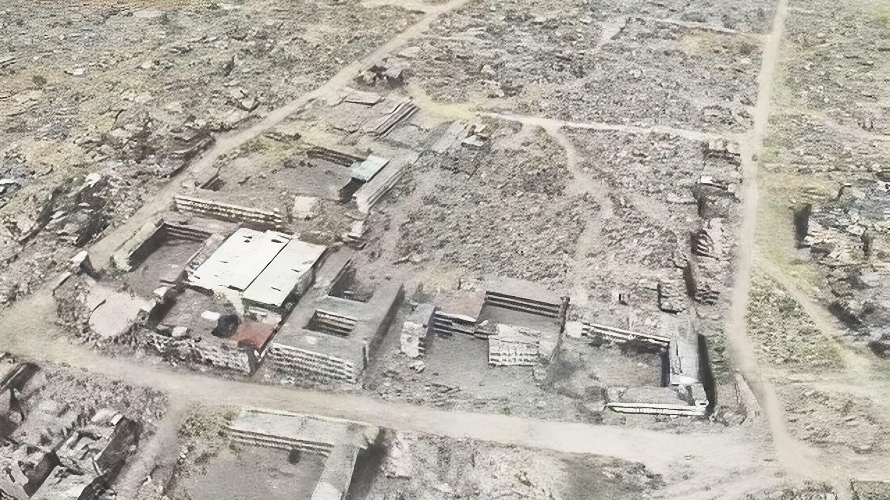

## Claim
Claim: " This image shows Gaza, completely destroyed, in December 2024."

## Actions
```
geolocate()
web_search("destroyed buildings Gaza")
```

## Evidence
### Evidence from `geolocate`
The most likely countries where the image was taken are: {'Jordan': 0.59, 'Palestine': 0.15, 'United Arab Emirates': 0.07, 'Pakistan': 0.05, 'Tunisia': 0.02, 'Israel': 0.01, 'Malta': 0.01, 'Russia': 0.01, 'Turkey': 0.01, 'Albania': 0.0}

### Evidence from `web_search`
Al Jazeera ([https://www.aljazeera.com/news/2025/8/24/israel-has-destroyed-more-than-1000-buildings-in-gaza-city-civil-defence](https://www.aljazeera.com/news/2025/8/24/israel-has-destroyed-more-than-1000-buildings-in-gaza-city-civil-defence)) reported on August 24, 2025, that Israel destroyed over 1,000 buildings in Gaza City <image:i>. The UN News ([https://news.un.org/en/story/2025/04/1162491](https://news.un.org/en/story/2025/04/1162491)) reported on April 22, 2025, that approximately 92% of residential buildings in Gaza have been damaged or destroyed <image:k>.

The BBC ([https://www.bbc.co.uk/news/resources/idt-33fccfbe-abcc-4af1-bdd2-632b2787cf59](https://www.bbc.co.uk/news/resources/idt-33fccfbe-abcc-4af1-bdd2-632b2787cf59)) published an article on July 18, 2025, discussing the destruction of buildings in Gaza, including satellite images from May 31, 2025, and July 8, 2025, and stating that Israel has demolished thousands of buildings across Gaza since March 2025 , , .


## Elaboration
The image's geolocation data suggests it could be in Palestine. The web search results confirm significant destruction in Gaza. The BBC article ([https://www.bbc.co.uk/news/resources/idt-33fccfbe-abcc-4af1-bdd2-632b2787cf59](https://www.bbc.co.uk/news/resources/idt-33fccfbe-abcc-4af1-bdd2-632b2787cf59)) provides satellite imagery and states that thousands of buildings have been demolished since March 2025.

The claim states the image was taken in December 2024. However, the provided evidence indicates that the destruction occurred in 2025.

Therefore, the claim is not supported by the evidence.


## Final Judgement
The image's geolocation data suggests it could be in Palestine. The web search results confirm significant destruction in Gaza. The BBC article provides satellite imagery and states that thousands of buildings have been demolished since March 2025. However, the claim states the image was taken in December 2024, while the evidence indicates the destruction occurred in 2025.

`false`

### Verdict: FALSE

### Justification
The claim is false. While the image likely depicts destruction in Gaza, the evidence indicates the destruction occurred in 2025, not December 2024, as stated in the claim. The BBC ([https://www.bbc.co.uk/news/resources/idt-33fccfbe-abcc-4af1-bdd2-632b2787cf59](https://www.bbc.co.uk/news/resources/idt-33fccfbe-abcc-4af1-bdd2-632b2787cf59)) reported on the destruction in Gaza, with satellite images from May and July 2025.
