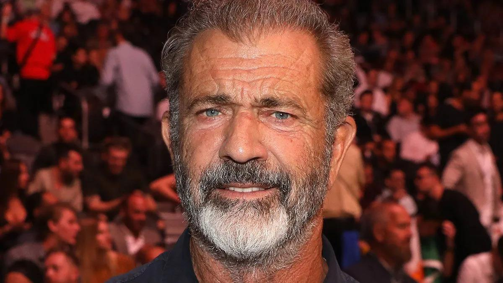
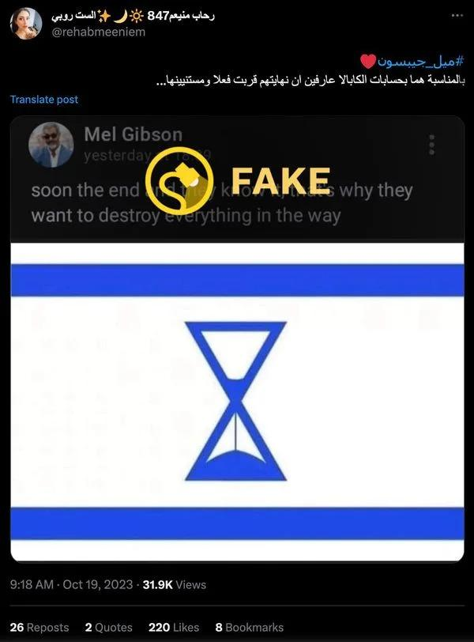
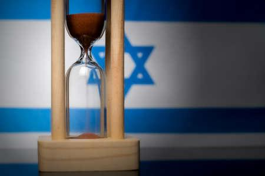

## Claim
Claim: " The image shows a screenshot of an authentic social media post from Mel Gibson saying that Israel will end soon and therefore destroy everything in its way together with a flag in the color of Israel that shows an hourglass."

## Actions
```
web_search("Mel Gibson Israel end destroy everything")
image_search("Israel flag hourglass")
```

## Evidence
### Evidence from `web_search`
The Associated Press ([Source](https://apnews.com/article/fact-check-mel-gibson-israel-post-342335121493)) and Yahoo ([Source](https://www.yahoo.com/entertainment/fact-check-mel-gibson-posted-200700554.html)) both report that the social media post attributed to Mel Gibson, which includes the text "soon the end and they know it, that's why they want to destroy everything in the way" and an altered Israeli flag with an hourglass, is fake. Gibson does not have any public social media accounts.

The Times of Israel ([Source](https://www.timesofisrael.com/mel-gibson-dropped-from-new-orleans-mardi-gras-amid-outcry-from-jewish-groups/)) mentions Gibson's history of antisemitic remarks. , , , 


### Evidence from `image_search`
The search results show images of an hourglass with the colors of the Israeli flag. One image shows a flag in the colors of Israel with an hourglass in the middle (), another shows an hourglass with the colors of the Israeli flag (), and a third shows an hourglass in front of an Israeli flag ().

The sources are: [https://www.flickr.com/photos/talporat/4728247932](https://www.flickr.com/photos/talporat/4728247932), [https://www.shutterstock.com/image-illustration/hourglass-colors-national-flag-concept-clip-2131517309](https://www.shutterstock.com/image-illustration/hourglass-colors-national-flag-concept-clip-2131517309), and [https://www.123rf.com/photo_152379279_hourglass-and-israel-flag-soft-focus-copy-space.html](https://www.123rf.com/photo_152379279_hourglass-and-israel-flag-soft-focus-copy-space.html).


## Elaboration
The claim is false. The evidence indicates that the social media post attributed to Mel Gibson is fake. Multiple sources, including the Associated Press ([Source](https://apnews.com/article/fact-check-mel-gibson-israel-post-342335121493)) and Yahoo ([Source](https://www.yahoo.com/entertainment/fact-check-mel-gibson-posted-200700554.html)), confirm the post's inauthenticity. Furthermore, Gibson does not have any public social media accounts.


## Final Judgement
The claim is demonstrably false. The evidence from multiple reliable sources confirms that the social media post attributed to Mel Gibson is fake. The post's content and the image of the altered Israeli flag are misrepresented.

`false`

### Verdict: FALSE

### Justification
The claim is false. The social media post attributed to Mel Gibson is fake, as confirmed by the Associated Press ([Source](https://apnews.com/article/fact-check-mel-gibson-israel-post-342335121493)) and Yahoo ([Source](https://www.yahoo.com/entertainment/fact-check-mel-gibson-posted-200700554.html)). Gibson does not have any public social media accounts.
