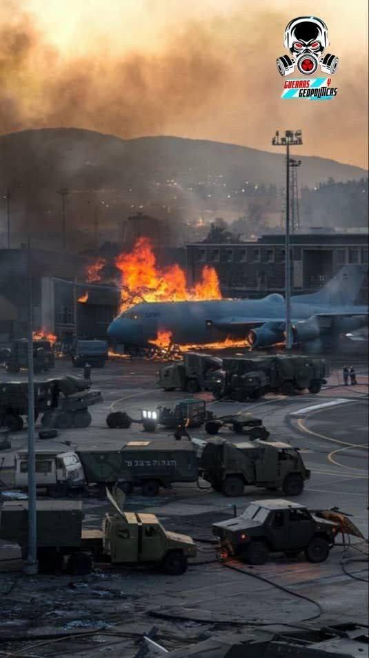
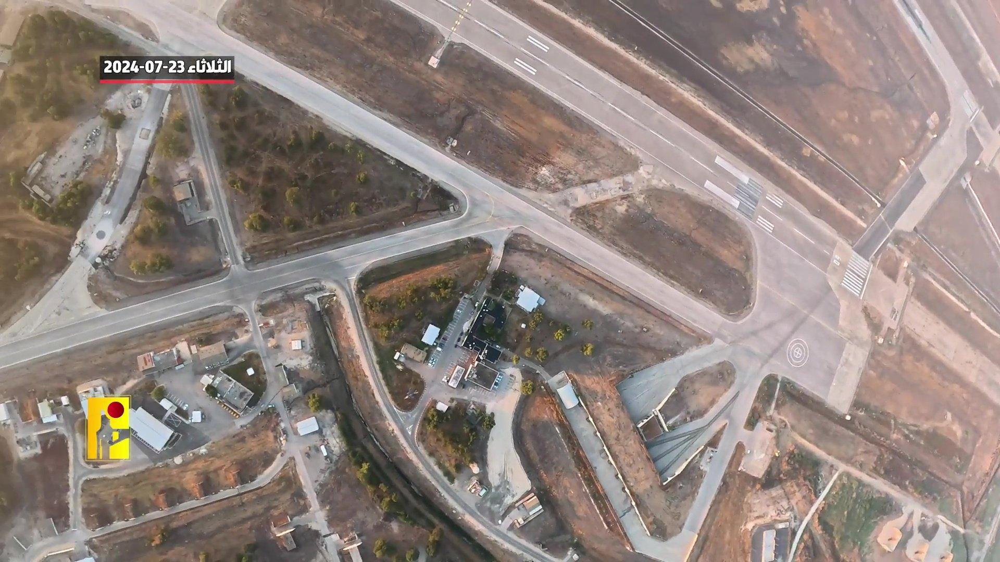
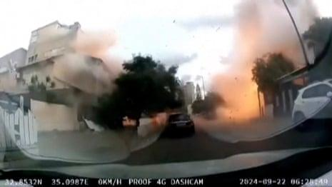
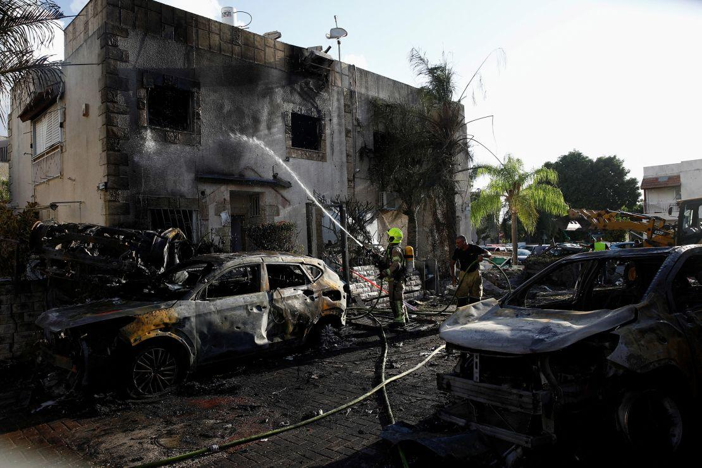
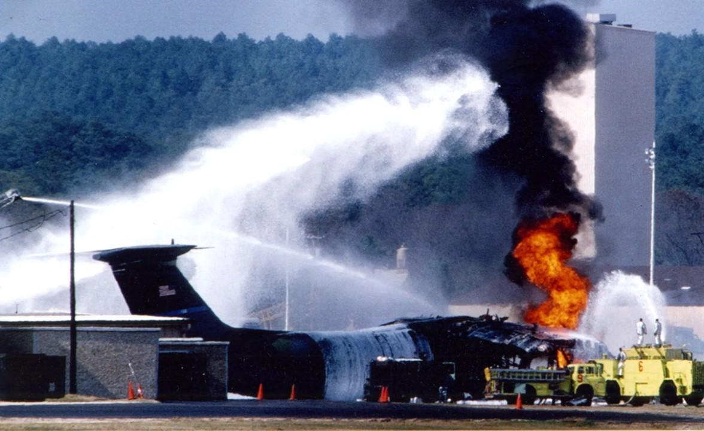
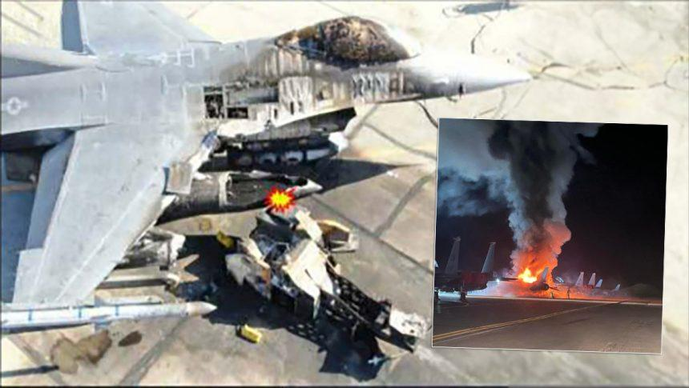

## Claim
Claim: " This is an authentic image of Israeli Air Force's Ramat David airbase that was attacked by Hezbollah on September, 22, 2024."

## Actions
```
image_search("Israeli Air Force Ramat David airbase attack")
web_search("Ramat David airbase Hezbollah attack September 22 2024")
```

## Evidence
### Evidence from `image_search`
From [Source](https://www.timesofisrael.com/hezbollah-publishes-drone-footage-of-ramat-david-airbase-in-north/): 
Content: The Times of Israel published drone footage of Ramat David airbase. 


### Evidence from `web_search`
Hezbollah launched rocket attacks on the Ramat David airbase in northern Israel on September 22, 2024, according to reports from Al Jazeera ([https://www.aljazeera.com/news/2024/9/21/hezbollah-claims-rocket-attack-deep-inside-northern-israel](https://www.aljazeera.com/news/2024/9/21/hezbollah-claims-rocket-attack-deep-inside-northern-israel)) and The Guardian ([https://www.theguardian.com/world/2024/sep/22/israel-strikes-lebanon-hezbollah-deepest-rocket-attacks-since-start-gaza-war](https://www.theguardian.com/world/2024/sep/22/israel-strikes-lebanon-hezbollah-deepest-rocket-attacks-since-start-gaza-war)). Politico.eu also reported on the attack, mentioning it occurred on Sunday, September 22, 2024 ([https://www.politico.eu/article/hezbollah-launches-revenge-rocket-attack-against-israeli-base/](https://www.politico.eu/article/hezbollah-launches-revenge-rocket-attack-against-israeli-base/)).

The attacks were in response to Israeli actions, and the strikes were the deepest claimed by Hezbollah since the start of the Gaza war. Al Jazeera included images of the aftermath of the attack (, ), and The Guardian included a dashcam video of the attack ().


## Elaboration
The evidence confirms that Hezbollah launched rocket attacks on the Ramat David airbase on September 22, 2024. However, the provided evidence does not include the image in the claim. Therefore, the authenticity of the image cannot be verified.

The Times of Israel published drone footage of Ramat David airbase, but it does not match the image in the claim. Al Jazeera and The Guardian included images and a dashcam video of the attack, but none of them match the image in the claim either.

To verify the claim, an image of the attack aftermath is needed.


## Actions
```
image_search("Ramat David airbase attack aftermath")
```

## Evidence
### Evidence from `image_search`
From [Source](https://www.cnn.com/2024/09/22/middleeast/israel-strikes-hezbollah-weakened-analysis-intl): 
Content: CNN published an image of the aftermath of the attack. 


## Elaboration
The evidence confirms that Hezbollah attacked the Ramat David airbase on September 22, 2024. However, the image in the claim does not appear in any of the provided sources. The CNN published an image of the aftermath of the attack, but it does not match the image in the claim.

Therefore, the authenticity of the image in the claim cannot be verified.


## Actions
```
image_search("burning plane military base")
```

## Evidence
### Evidence from `image_search`
The U.S. Army published an article about the 1994 tragedy at Pope Air Force Base, including an image of a burning plane (). The Aviationist published an image of a burning plane ().


## Elaboration
The claim is not supported by the evidence. While the evidence confirms that Hezbollah attacked the Ramat David airbase on September 22, 2024, the image in the claim does not appear in any of the provided sources. The image search for "burning plane military base" revealed images of burning planes, but none of them match the image in the claim. Therefore, the authenticity of the image in the claim cannot be verified.


## Final Judgement
The claim states that the image depicts the aftermath of the Hezbollah attack on the Ramat David airbase on September 22, 2024. While the attack did occur, and multiple sources confirm it, the image in the claim is not found in any of the provided sources. Additional image searches for the aftermath of the attack and burning planes on military bases did not yield the image in the claim.

`false`

### Verdict: FALSE

### Justification
The claim that the image depicts the aftermath of the Hezbollah attack on the Ramat David airbase on September 22, 2024, is not supported by the evidence. While the attack did occur, as confirmed by sources like [Al Jazeera](https://www.aljazeera.com/news/2024/9/21/hezbollah-claims-rocket-attack-deep-inside-northern-israel) and [The Guardian](https://www.theguardian.com/world/2024/sep/22/israel-strikes-lebanon-hezbollah-deepest-rocket-attacks-since-start-gaza-war), the image in the claim does not appear in any of the provided sources, including those detailing the attack's aftermath.
