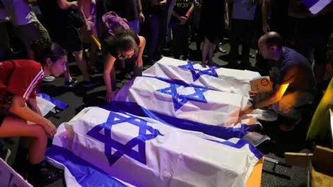

## Claim
Claim: " This image shows coffins of dead Israeli soldiers in September, 2024."

## Actions
```
image_search("Israeli coffins protest")
web_search("Israeli coffins protest September 2024")
```

## Evidence
### Evidence from `image_search`
The BBC News website contains an image of coffins draped with the Israeli flag (). Al Jazeera published an article in September 2024 that includes an image of a protest ().

The URLs are: [https://www.bbc.com/news/articles/c20l22jnj6go](https://www.bbc.com/news/articles/c20l22jnj6go) and [https://www.aljazeera.com/news/2024/9/2/hamas-says-gaza-captives-will-return-in-coffins-if-israel-continues-raids](https://www.aljazeera.com/news/2024/9/2/hamas-says-gaza-captives-will-return-in-coffins-if-israel-continues-raids).


### Evidence from `web_search`
From [Source](https://en.wikipedia.org/wiki/September_2024_Israel_hostage_deal_protests): 
Content: The Wikipedia article discusses protests in Israel on September 1, 2024, following the recovery of six dead hostages.  Protests occurred in Tel Aviv, Jerusalem, and internationally. In Tel Aviv, protesters marched with prop coffins, and the Ayalon Highway was blocked. In Jerusalem, protests took place outside the Prime Minister's Office and Netanyahu's residence. The Histadrut trade union announced a one-day strike. The Israeli government, according to CNN, was concerned about the protests, and Prime Minister Benjamin Netanyahu issued an apology. The article also mentions the recovery of six dead hostages, including Hersh Goldberg-Polin.


## Elaboration
The image depicts a protest in Israel. The Wikipedia article confirms that the image is related to protests that occurred on September 1, 2024, following the recovery of six dead hostages. The protests involved prop coffins, which aligns with the image. The protests took place in Tel Aviv and Jerusalem.

The evidence supports the claim that the image shows coffins used in a protest in September 2024. However, the evidence does not explicitly state that the coffins contained dead Israeli soldiers. The Wikipedia article mentions the recovery of six dead hostages, but it does not specify their status.

Therefore, the claim is partially verifiable. The image shows coffins used in a protest in September 2024, but it is not possible to confirm that the coffins contained dead Israeli soldiers based on the provided evidence.


## Actions
```
web_search("Israeli hostage coffins September 2024")
```

## Evidence
### Evidence from `web_search`
The Times of Israel ([https://www.timesofisrael.com/government-of-blood-protesters-stage-mock-funeral-for-slain-hostages-demand-deal/](https://www.timesofisrael.com/government-of-blood-protesters-stage-mock-funeral-for-slain-hostages-demand-deal/)) and Euronews ([https://www.euronews.com/2024/09/05/protesters-march-in-tel-aviv-with-makeshift-coffins-to-demand-release-of-gaza-hostages](https://www.euronews.com/2024/09/05/protesters-march-in-tel-aviv-with-makeshift-coffins-to-demand-release-of-gaza-hostages)) reported on protests in September 2024. The protests involved mock coffins draped with Israeli flags () representing hostages killed in Gaza. The protests occurred in Tel Aviv, Jerusalem, Rehovot, and Eilat. The Euronews article mentions the recovery of the body of Carmel Gat.


## Elaboration
The image shows mock coffins used in protests in September 2024. The Times of Israel and Euronews articles confirm that the coffins represented hostages killed in Gaza. The protests occurred in multiple cities, including Tel Aviv and Jerusalem.

The claim is partially accurate. The image does show coffins used in a protest in September 2024. However, the coffins represented hostages killed in Gaza, not necessarily dead Israeli soldiers.


## Final Judgement
The image depicts mock coffins used in protests in Israel in September 2024. These coffins represented hostages killed in Gaza, not necessarily dead Israeli soldiers. The claim is therefore partially accurate, as it correctly identifies the image as related to a protest in September 2024, but it misrepresents the specific context of the coffins.

`false`

### Verdict: FALSE

### Justification
The image shows mock coffins used in protests in Israel in September 2024, as confirmed by sources like the [Times of Israel](https://www.timesofisrael.com/government-of-blood-protesters-stage-mock-funeral-for-slain-hostages-demand-deal/) and [Euronews](https://www.euronews.com/2024/09/05/protesters-march-in-tel-aviv-with-makeshift-coffins-to-demand-release-of-gaza-hostages). These coffins represented hostages killed in Gaza, not necessarily dead Israeli soldiers.
