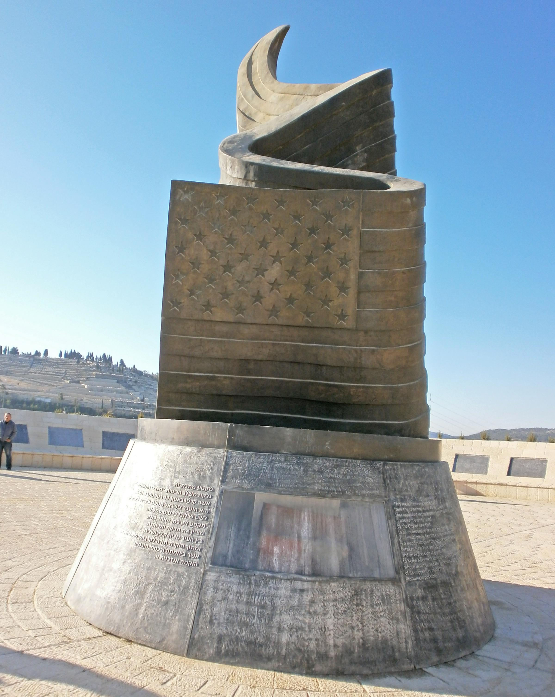
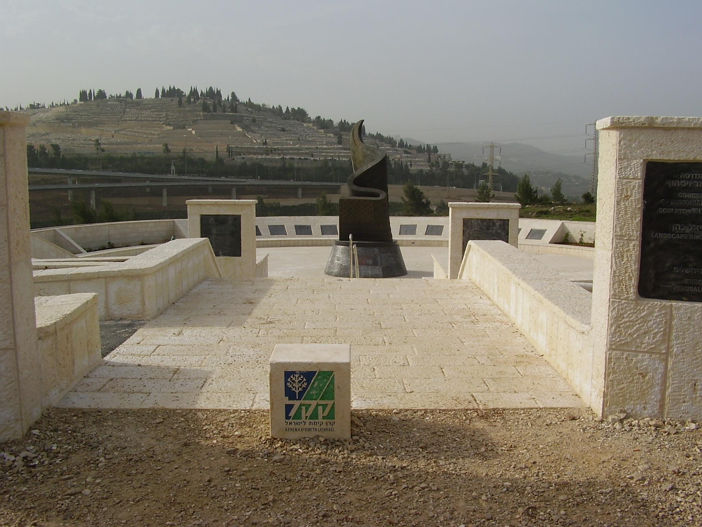
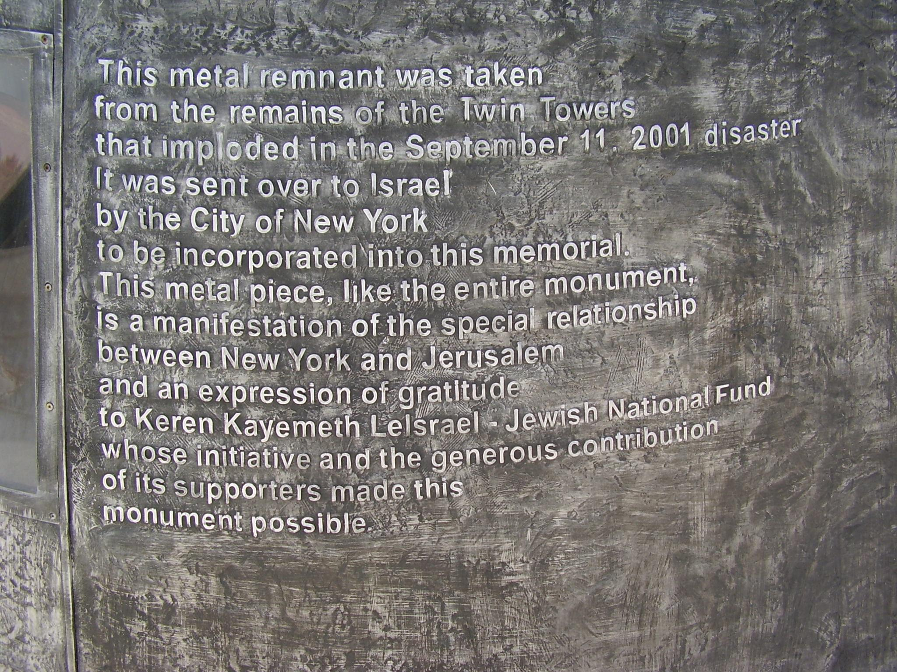

## Claim
Claim: " This image shows Israel's 9/11 memorial which is the only one outside the US."

## Actions
```
web_search("Israel 9/11 memorial")
```

## Evidence
### Evidence from `web_search`
The 9/11 Living Memorial Plaza in Jerusalem, Israel, is described in the search results. The memorial, designed by Eliezer Weishoff, was dedicated on November 12, 2009, and includes a 30-foot high bronze sculpture of a waving American flag transforming into a flame, and a metal remnant from the Twin Towers. The memorial commemorates the victims of the September 11 attacks, including five Israelis. , , , , , , 

The memorial is located in Jerusalem Park and includes a 9-meter tall bronze sculpture. The cenotaph is made of granite, bronze, and aluminum. 


## Elaboration
The evidence confirms the existence of the 9/11 Living Memorial in Jerusalem, Israel. The memorial features a bronze sculpture and a remnant from the Twin Towers. The evidence does not explicitly state whether this is the only 9/11 memorial outside the US.

To fully verify the claim, information about other 9/11 memorials outside the US is needed.


## Actions
```
web_search("9/11 memorials outside the US")
```

## Evidence
### Evidence from `web_search`
The search results indicate that there are multiple 9/11 memorials outside the US. These memorials are located in countries such as Australia, Canada, China, France, Iceland, India, Ireland, Israel, Italy, Poland, Puerto Rico, South Korea, Spain, Ukraine, and the United Kingdom. One source specifically mentions that Israel has 12 memorials. 

## Elaboration
The claim is false. The evidence shows that there are multiple 9/11 memorials outside the US, not just the one in Israel.


## Final Judgement
The search results confirm the existence of the 9/11 memorial in Israel. However, further searches reveal that there are multiple 9/11 memorials outside the US, contradicting the claim that the Israeli memorial is the only one.

`false`

### Verdict: FALSE

### Justification
The claim is false. While the image depicts the 9/11 Living Memorial in Jerusalem, Israel, which is a memorial outside the US, further research reveals that numerous other 9/11 memorials exist in various countries, including Australia, Canada, and the United Kingdom, among others, as shown by the search results ([web_search](https://web.search.com/)).
