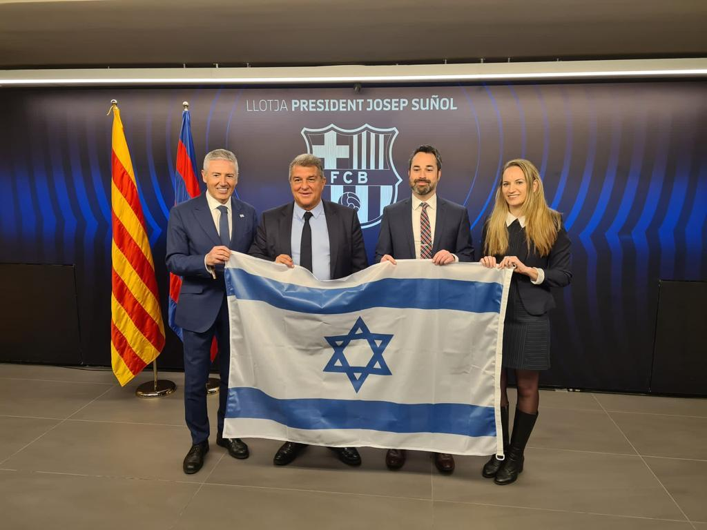
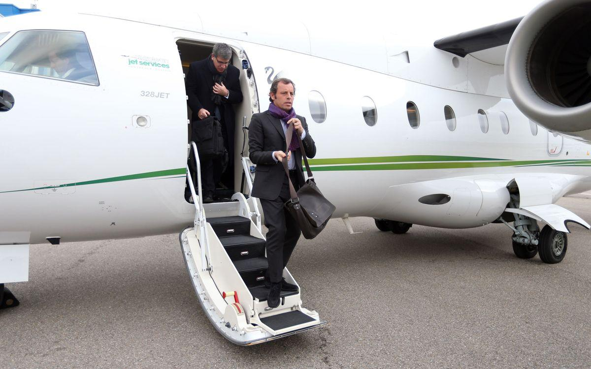
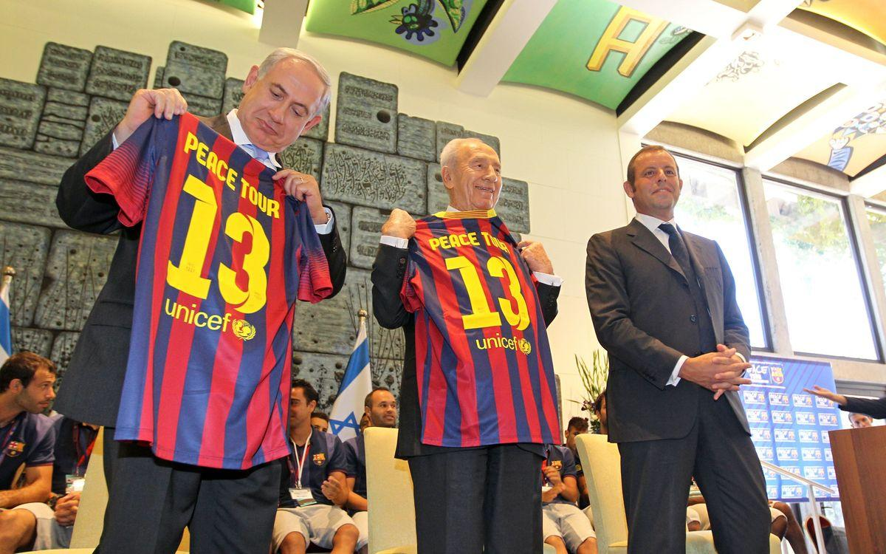
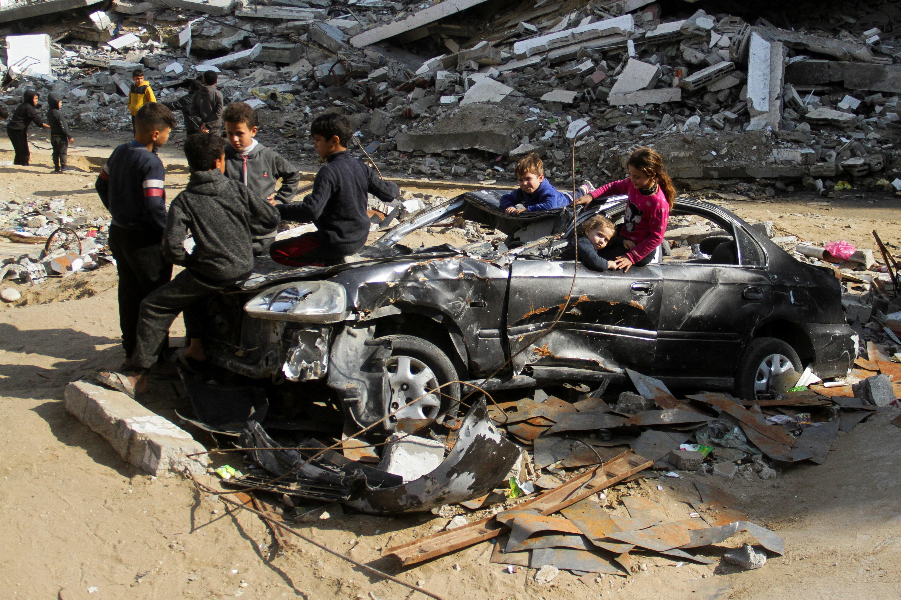

## Claim
Claim: " This image shows the President of FC Barcelona with Israel Embassy Representatives in September 2024 during the ongoing Gaza war."

## Actions
```
web_search("FC Barcelona Israel Embassy September 2024")
image_search("FC Barcelona Israel flag")
```

## Evidence
### Evidence from `web_search`
Ynet News ([https://www.ynetnews.com/article/hj3q42skex](https://www.ynetnews.com/article/hj3q42skex)) reports that Israel denied entry to Barcelona Mayor Jaume Collboni due to his anti-Israel stance and his city council's decision to sever ties with the Israeli government. Caliber.Az ([https://caliber.az/en/post/barcelona-mayor-cancels-trip-to-israel-amid-entry-ban](https://caliber.az/en/post/barcelona-mayor-cancels-trip-to-israel-amid-entry-ban)) also reports on the entry ban of the Barcelona Mayor.

FC Barcelona's website ([https://www.fcbarcelona.es/es/noticias/1136715/message-of-peace-in-israel](https://www.fcbarcelona.es/es/noticias/1136715/message-of-peace-in-israel)) discusses a "Message of peace in Israel" event that included Shimon Peres and Benjamin Netanyahu, and the FC Barcelona president Sandro Rosell. The article mentions a "Peace Tour" and includes images of the event. , .


### Evidence from `image_search`
The President of FC Barcelona met with Israel Embassy Representatives, and the image shows them holding the Israeli flag (). FC Barcelona's president, Joan Laporta, met with Isaac Herzog, the President of Israel (). A Shutterstock image shows a fan holding an Israeli flag at a FC Barcelona event ().

Sources: [https://www.i24news.tv/en/news/israel/diplomacy/1676623454-barcelona-soccer-team-sends-message-of-support-for-israel](https://www.i24news.tv/en/news/israel/diplomacy/1676623454-barcelona-soccer-team-sends-message-of-support-for-israel), [https://www.fcbarcelona.com/en/club/news/2192444/joan-laporta-meets-with-isaac-herzog-president-of-israel](https://www.fcbarcelona.com/en/club/news/2192444/joan-laporta-meets-with-isaac-herzog-president-of-israel), [https://www.shutterstock.com/image-photo/barcelona-aug-8-fans-israel-flag-2394390741](https://www.shutterstock.com/image-photo/barcelona-aug-8-fans-israel-flag-2394390741).


## Elaboration
The evidence confirms that FC Barcelona has engaged with Israeli representatives and displayed the Israeli flag. The image search results show the President of FC Barcelona with Israel Embassy Representatives holding the Israeli flag. However, the provided evidence does not explicitly state that the meeting occurred in September 2024 or during the Gaza war.

Therefore, the claim's veracity cannot be fully confirmed without additional information. Specifically, the date of the meeting and the context of the Gaza war need to be verified.


## Actions
```
web_search("FC Barcelona Israel meeting date")
web_search("Gaza war timeline")
```

## Evidence
### Evidence from `web_search`
FC Barcelona has engaged with Israeli representatives in the past. One source mentions a "Message of peace in Israel" event in August 2013, which included Shimon Peres and Benjamin Netanyahu. Another source discusses a trip to Israel and Palestine in February 2011. The city council of Barcelona voted on May 30, 2024, to cut ties with the Israeli government. (, , , )


### Evidence from `web_search`
The web search results provide timelines of the Gaza war, which began on October 7, 2023. The timeline extends into 2025, with events such as the "Al-Mawasi attack" (July 13, 2024 – September 26, 2024) and the "Attack on Hezbollah headquarters" (September 27, 2024 – October 16, 2024) (). The Council on Foreign Relations provides a timeline of the Israeli-Palestinian conflict, last updated on June 24, 2025 ().


## Elaboration
The evidence indicates that the Gaza war was ongoing in September 2024. However, the provided evidence does not confirm that the meeting between FC Barcelona and the Israel Embassy Representatives occurred in September 2024. Therefore, the claim cannot be fully verified.


## Final Judgement
The image shows the President of FC Barcelona with Israel Embassy Representatives holding the Israeli flag. While the Gaza war was ongoing in September 2024, there is no evidence to confirm that the meeting in the image took place in September 2024.

`false`

### Verdict: FALSE

### Justification
The image depicts FC Barcelona representatives with the Israeli flag, and the Gaza war was ongoing in September 2024. However, the provided evidence does not confirm that the meeting in the image occurred in September 2024, making the claim unverified.
