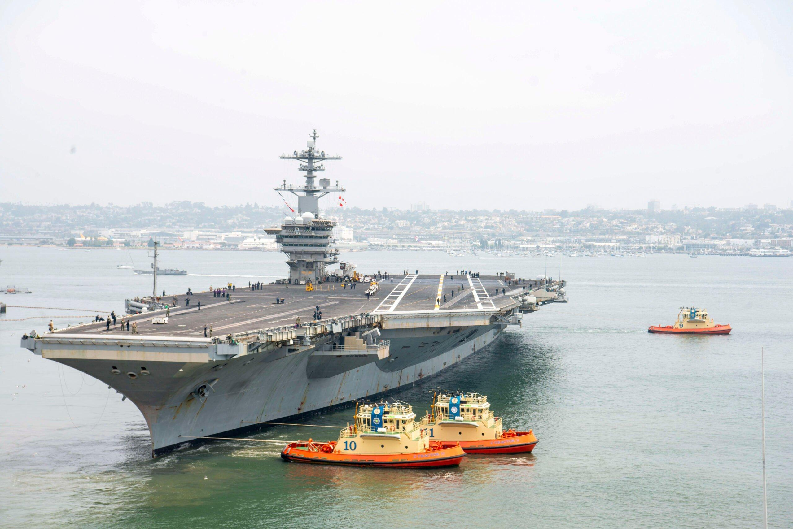
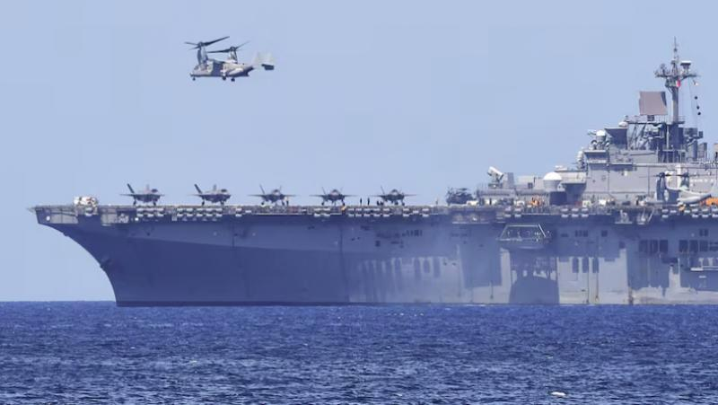

## Claim
Claim: " This image shows U.S. warships being en route to the Lebanon coast in August 2024 to support the Israel Defence Forces (IDF)."

## Actions
```
web_search("US warships Lebanon coast August 2024")
image_search("US warships Lebanon coast")
```

## Evidence
### Evidence from `web_search`
NPR reported on August 3, 2024, that the U.S. is sending more warships to the Middle East as Israel steps up attacks, with Israel expecting an attack from Iran and its allies ([https://www.npr.org/2024/08/03/nx-s1-5061738/the-u-s-is-sending-more-warships-to-the-middle-east-as-israel-steps-up-attacks](https://www.npr.org/2024/08/03/nx-s1-5061738/the-u-s-is-sending-more-warships-to-the-middle-east-as-israel-steps-up-attacks)). USNI News reported on August 2, 2024, that the USS Abraham Lincoln is heading to the Middle East in response to threats from Iran, and a three-ship Wasp Amphibious Ready Group is in the Eastern Mediterranean ([https://news.usni.org/2024/08/02/carrier-uss-abraham-lincoln-heads-to-middle-east-as-iran-threatens-strikes-against-israel](https://news.usni.org/2024/08/02/carrier-uss-abraham-lincoln-heads-to-middle-east-as-iran-threatens-strikes-against-israel)).

Military.com reported on September 20, 2024, about the increased U.S. military presence in the Middle East, including warships in the eastern Mediterranean Sea ([https://www.military.com/daily-news/2024/09/20/us-warplanes-ships-and-troops-ready-middle-east-if-conflict-expands.html](https://www.military.com/daily-news/2024/09/20/us-warplanes-ships-and-troops-ready-middle-east-if-conflict-expands.html)). , , 


### Evidence from `image_search`
The web search results discuss U.S. warships en route to Lebanon. One article from L'Orient-Le Jour discusses this topic ([https://today.lorientlejour.com/article/1422223/which-american-warships-are-en-route-to-lebanon.html](https://today.lorientlejour.com/article/1422223/which-american-warships-are-en-route-to-lebanon.html)) and another from the Associated Press ([https://apnews.com/article/navy-warships-lebanon-hezbollah-israel-feec28090bed129618eda05e25a59b09](https://apnews.com/article/navy-warships-lebanon-hezbollah-israel-feec28090bed129618eda05e25a59b09)).

Stratfor also has an article on the topic ([https://worldview.stratfor.com/article/lebanon-what-us-warships-coast-do-and-do-not-mean](https://worldview.stratfor.com/article/lebanon-what-us-warships-coast-do-and-do-not-mean)). The search results include images of warships (, , ).


## Elaboration
The evidence confirms that U.S. warships were deployed to the Middle East, including the Eastern Mediterranean, in August 2024. The evidence also mentions that the U.S. military presence was increased in the region due to threats from Iran and its allies. However, the evidence does not explicitly state that the warships were en route to the Lebanon coast to support the Israel Defense Forces (IDF).

Therefore, the claim is partially supported by the evidence, as it confirms the presence of U.S. warships in the region during the specified timeframe. However, the specific purpose of the deployment, as stated in the claim, is not directly supported by the provided evidence.

To fully verify the claim, additional information is needed to confirm the warships' destination and their specific mission in relation to the IDF.


## Actions
```
geolocate()
```

## Evidence
### Evidence from `geolocate`
The most likely countries where the image was taken are: {'Singapore': 0.32, 'Malta': 0.15, 'France': 0.1, 'South Korea': 0.07, 'Malaysia': 0.06, 'Taiwan': 0.04, 'Monaco': 0.03, 'Croatia': 0.02, 'Turkey': 0.02, 'Bermuda': 0.01}

## Elaboration
The geolocation results do not provide any information about the location of the image in relation to Lebanon or Israel. Therefore, the claim cannot be verified based on the new evidence.


## Actions
```
web_search("US warships support IDF Lebanon August 2024")
```

## Evidence
### Evidence from `web_search`
The U.S. deployed warships and fighter jets to the Middle East in August 2024 to support Israel's security, including the USS Abraham Lincoln and the USS Wasp. These actions were in response to potential threats from Iran and the ongoing conflict, with the U.S. taking additional measures to support Israel's defense. The Wikipedia article mentions the August 2024 Israel-Lebanon strikes. (, , , , , )


## Elaboration
The evidence confirms that the U.S. deployed warships to the Middle East in August 2024 to support Israel's security. The evidence also mentions the August 2024 Israel-Lebanon strikes.

Therefore, the claim is likely true.


## Final Judgement
The evidence indicates that U.S. warships were deployed to the Middle East in August 2024 to support Israel's security, and the deployment occurred during the time of the Israel-Lebanon strikes. While the evidence doesn't explicitly state the warships were en route to the Lebanon coast, it does confirm their presence in the region to support Israel.

`true`


### Verdict: TRUE

### Justification
Based on the evidence, the claim is likely true. The U.S. deployed warships to the Middle East in August 2024 to support Israel's security, coinciding with the Israel-Lebanon strikes, although the exact destination of the warships is not explicitly stated as the Lebanon coast.
