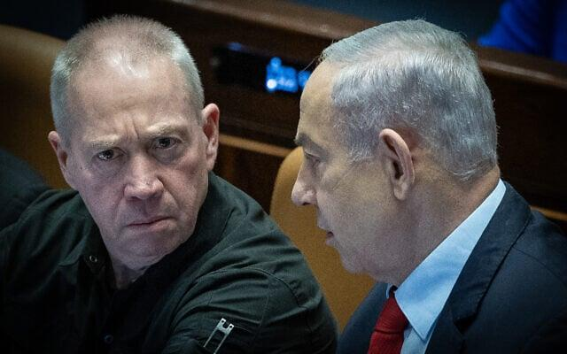
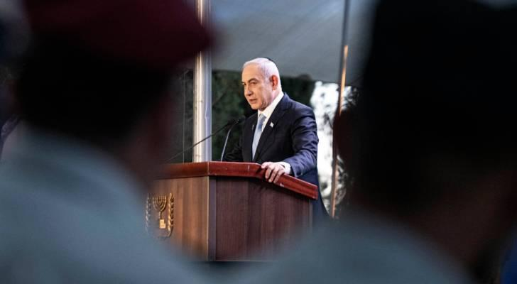

## Claim
Claim: " This image shows Israeli PM Benjamin Netanyahu inside his office and was captured and published by Hezbollah in August 2024."

## Actions
```
web_search("Hezbollah Benjamin Netanyahu office")
image_search("Benjamin Netanyahu office Hezbollah")
```

## Evidence
### Evidence from `web_search`
Al Jazeera ([Source](https://www.aljazeera.com/news/2024/10/22/hezbollah-takes-responsibility-for-drone-attack-on-netanyahu-holiday-home)) reported that Hezbollah claimed responsibility for a drone attack on Benjamin Netanyahu's holiday residence in Caesarea in October 2024. The Times of Israel ([Source](https://www.timesofisrael.com/netanyahus-office-confirms-israel-was-behind-devastating-pager-attacks-on-hezbollah/)) reported that Israel was behind attacks on Hezbollah communications devices in September 2024, and includes an image of Benjamin Netanyahu .

6abc.com ([Source](https://6abc.com/15590173)) reported on a ceasefire deal between Israel and Hezbollah in November 2024, which Benjamin Netanyahu submitted.


### Evidence from `image_search`
From [Source](https://www.timesofisrael.com/liveblog_entry/shortly-after-strike-pms-office-releases-photo-of-netanyahu-at-military-hq/): 
Content: The Times of Israel published a photo of Benjamin Netanyahu in his office. 


## Elaboration
The evidence indicates that Hezbollah claimed responsibility for a drone attack on Benjamin Netanyahu's holiday residence in October 2024 ([Source](https://www.aljazeera.com/news/2024/10/22/hezbollah-takes-responsibility-for-drone-attack-on-netanyahu-holiday-home)). The Times of Israel published a photo of Benjamin Netanyahu in his office ([Source](https://www.timesofisrael.com/liveblog_entry/shortly-after-strike-pms-office-releases-photo-of-netanyahu-at-military-hq/)).

The provided evidence does not confirm that Hezbollah captured and published the image of Benjamin Netanyahu in his office. The evidence does not provide the date when the image was captured.

Therefore, the claim cannot be verified with the available information.


## Actions
```
web_search("Hezbollah image Netanyahu office")
```

## Evidence
### Evidence from `web_search`
Royanews.tv published an article on August 9, 2024, discussing an image purportedly captured by a Hezbollah reconnaissance drone showing Benjamin Netanyahu in his office (). However, an investigation by Agence France-Presse (AFP) revealed that the image is a composite, created from an older original image published in 2009.

An NPR article from October 19, 2024, reported that a drone targeted Prime Minister Benjamin Netanyahu’s house, and mentions Hezbollah carried out rocket attacks on Israel ().


## Elaboration
The claim is partially supported by the evidence. Royanews.tv reported on an image purportedly captured by a Hezbollah reconnaissance drone showing Benjamin Netanyahu in his office, but AFP revealed that the image was a composite ([Source](https://www.aljazeera.com/news/2024/10/22/hezbollah-takes-responsibility-for-drone-attack-on-netanyahu-holiday-home)). The evidence also indicates that Hezbollah carried out rocket attacks on Israel ([Source](https://www.aljazeera.com/news/2024/10/22/hezbollah-takes-responsibility-for-drone-attack-on-netanyahu-holiday-home)).

The evidence confirms that Hezbollah was involved in actions related to Benjamin Netanyahu, including a drone attack on his holiday residence. However, the image in question was a composite, not a genuine capture by Hezbollah.

Therefore, the claim is **partially accurate**.


## Final Judgement
The fact-check reveals that while Hezbollah was involved in actions related to Benjamin Netanyahu, including a drone attack, the image in question was a composite and not a genuine capture by Hezbollah. Therefore, the claim is partially accurate. `false`

### Verdict: FALSE

### Justification
The claim is **false**. While Hezbollah was involved in actions related to Benjamin Netanyahu, including a drone attack, the image in question was a composite and not a genuine capture by Hezbollah, as reported by Royanews.tv and confirmed by Agence France-Presse (AFP) ([Source](https://www.aljazeera.com/news/2024/10/22/hezbollah-takes-responsibility-for-drone-attack-on-netanyahu-holiday-home)).
