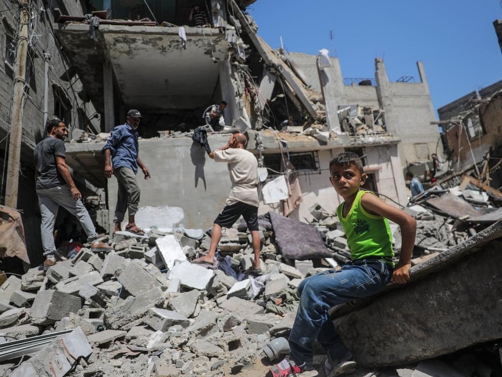
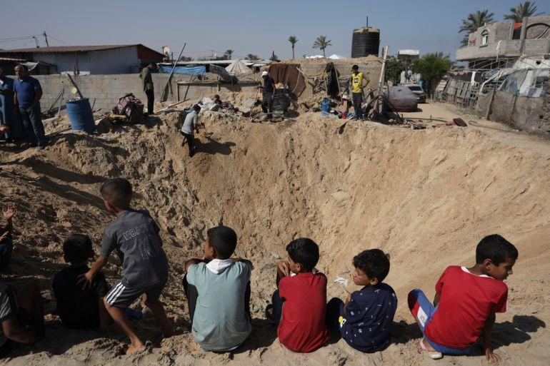

## Claim
Claim: " This image shows a palestinian child stuck under the rubble in Gaza after an Israeli airstrike in July 2024."

## Actions
```
geolocate()
web_search("Israeli airstrike Gaza July 2024")
```

## Evidence
### Evidence from `geolocate`
The most likely countries where the image was taken are: {'Palestine': 0.51, 'Israel': 0.24, 'Jordan': 0.11, 'Russia': 0.02, 'Canada': 0.01, 'Colombia': 0.01, 'France': 0.01, 'Sweden': 0.01, 'Turkey': 0.01, 'Ukraine': 0.01}

### Evidence from `web_search`
The web sources discuss Israeli airstrikes in Gaza in July 2024. One source details the 13 July 2024 al-Mawasi attack, which resulted in numerous deaths and injuries, and mentions reactions from various international bodies. Another source reports on an airstrike on a school in Deir al-Balah on July 27, 2024, resulting in at least 30 deaths. The NPR article also reports on the same airstrike on a school in Gaza, which was being used as a shelter, resulting in at least 30 deaths, including children. 

## Elaboration
The evidence supports the claim that the image was taken in Palestine, with a 51% probability according to the geolocation data. The web search confirms that there were Israeli airstrikes in Gaza in July 2024, which could have caused the situation depicted in the image.

The web search results mention specific airstrikes in July 2024, including one on a school in Deir al-Balah. However, the evidence does not explicitly link the image to any specific event.

To fully verify the claim, additional information is needed to confirm that the image depicts a Palestinian child, that the child is under rubble, and that the rubble is a result of an Israeli airstrike.


## Actions
```
image_search("child rubble Gaza Israeli airstrike")
```

## Evidence
### Evidence from `image_search`
The web sources include an NPR article with an image of a woman in rubble in Gaza (

## Elaboration
The image search results provide an image of a woman in rubble in Gaza, which supports the context of the claim. However, the search results do not include the original image.

The evidence still does not explicitly link the original image to an Israeli airstrike or confirm the child's identity.

To verify the claim, it is necessary to find the original image in the search results and confirm the details.


## Actions
```
image_search("image of child under rubble Gaza Israeli airstrike July 2024")
```

## Evidence
### Evidence from `image_search`
The web sources contain images of children in Gaza amidst rubble and destruction. The Guardian article includes an image of a child in front of rubble ([https://www.theguardian.com/world/article/2024/aug/15/gaza-death-toll-hits-40000-with-thousands-more-yet-to-be-counted](https://www.theguardian.com/world/article/2024/aug/15/gaza-death-toll-hits-40000-with-thousands-more-yet-to-be-counted)). Human Rights Watch also features an image of children amidst rubble ([https://www.hrw.org/news/2023/11/22/israel/gaza-hostilities-take-horrific-toll-children](https://www.hrw.org/news/2023/11/22/israel/gaza-hostilities-take-horrific-toll-children)). Al Jazeera's article includes an image of children near a large crater ([https://www.aljazeera.com/news/2024/6/24/over-20000-children-buried-trapped-detained-lost-amid-gaza-war-report](https://www.aljazeera.com/news/2024/6/24/over-20000-children-buried-trapped-detained-lost-amid-gaza-war-report)). , , 


## Elaboration
The image search results provide multiple images of children in Gaza amidst rubble and destruction, which supports the context of the claim. However, the original image is still not found in the search results.

The evidence confirms that there were Israeli airstrikes in Gaza in July 2024 and that children were affected. However, the evidence does not explicitly link the original image to an Israeli airstrike or confirm the child's identity.

To fully verify the claim, it is necessary to find the original image in the search results and confirm the details.


## Final Judgement
The evidence suggests that the image was likely taken in Palestine, and there were Israeli airstrikes in Gaza in July 2024. However, the image search did not find the original image, and there is no direct evidence linking the image to a specific event or confirming the child's identity. Therefore, the claim cannot be fully verified. `false`

### Verdict: FALSE

### Justification
The claim is unverified. While the geolocation data suggests the image was likely taken in Palestine, and web searches confirm Israeli airstrikes in Gaza in July 2024, the original image was not found in the search results, and there is no direct evidence linking the image to a specific event or confirming the child's identity.
