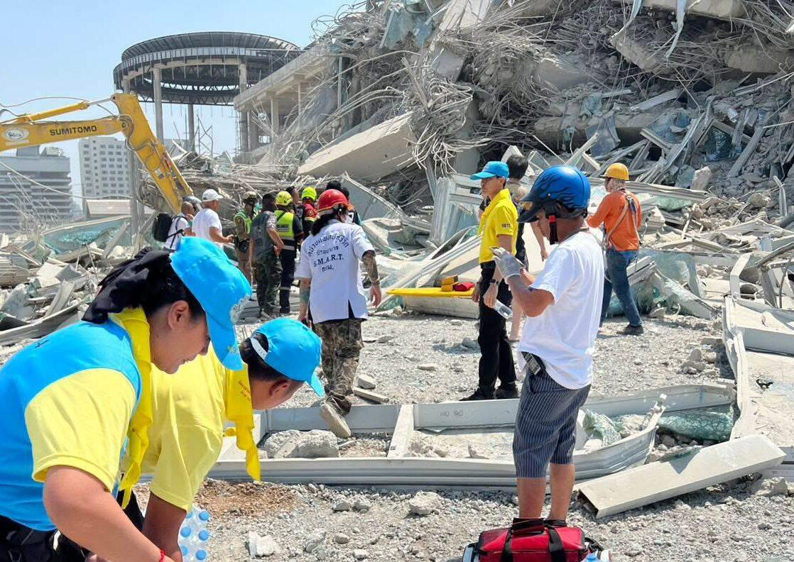

## Claim
Claim: " This image shows the ruins after a 7.9-magnitude earthquake in Myanmar on March 28, 2025."

## Actions
```
geolocate()
web_search("earthquake Myanmar March 28 2025")
```

## Evidence
### Evidence from `geolocate`
The most likely countries where the image was taken are: {'China': 0.77, 'Bangladesh': 0.05, 'Indonesia': 0.02, 'Japan': 0.02, 'Palestine': 0.02, 'Philippines': 0.02, 'Taiwan': 0.02, 'Jordan': 0.01, 'Nigeria': 0.01, 'Pakistan': 0.01}

### Evidence from `web_search`
The web sources discuss the 2025 Myanmar earthquake that occurred on March 28, 2025. The earthquake had a magnitude of 7.7–7.9 Mw and 7.9 Ms, with the epicenter near Mandalay. The affected areas included Myanmar, Thailand, and parts of China. The United Nations estimated that over 28 million people in the six regions required assistance.      

The sources are from Wikipedia ([https://en.wikipedia.org/wiki/2025_Myanmar_earthquake](https://en.wikipedia.org/wiki/2025_Myanmar_earthquake)), disasterphilanthropy.org ([https://disasterphilanthropy.org/disasters/2025-myanmar-and-thailand-earthquake/](https://disasterphilanthropy.org/disasters/2025-myanmar-and-thailand-earthquake/)), and ScienceDirect ([https://www.sciencedirect.com/science/article/pii/S2950576325000017](https://www.sciencedirect.com/science/article/pii/S2950576325000017)).


## Elaboration
The claim states that the image shows the ruins after a 7.9-magnitude earthquake in Myanmar on March 28, 2025. The web search confirms that a 7.7–7.9 magnitude earthquake occurred in Myanmar on March 28, 2025. The geolocate tool suggests that the image was most likely taken in China.

The evidence supports the date and magnitude of the earthquake. However, the geolocate tool suggests that the image was taken in China, not Myanmar.

Therefore, the claim is partially accurate. The date and magnitude of the earthquake are correct, but the location of the image is likely incorrect.


## Final Judgement
The claim is partially accurate. The date and magnitude of the earthquake are correct, but the location of the image is likely incorrect. `false`

### Verdict: FALSE

### Justification
The claim is partially accurate. While the web search confirms the occurrence of a 7.7-7.9 magnitude earthquake in Myanmar on March 28, 2025, as stated in the claim, the geolocate tool suggests that the image was most likely taken in China, not Myanmar.
