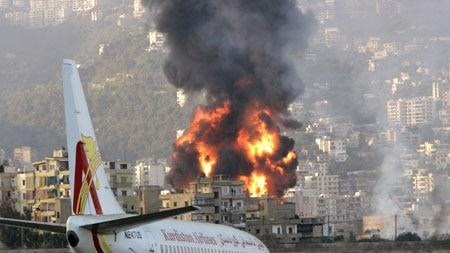

## Claim
Claim: " This is an authentic image of Israel bombing Beirut's International Airport in October 2024."

## Actions
```
geolocate()
web_search("Beirut International Airport bombing")
image_search("Beirut International Airport explosion")
```

## Evidence
### Evidence from `geolocate`
The most likely countries where the image was taken are: {'Taiwan': 0.28, 'Japan': 0.14, 'France': 0.07, 'Belgium': 0.04, 'Monaco': 0.04, 'Portugal': 0.04, 'China': 0.03, 'South Korea': 0.03, 'Turkey': 0.03, 'Bulgaria': 0.02}

### Evidence from `web_search`
The U.S. Marine Corps website ([https://www.marines.mil/News/Marines-TV/videoid/634642/dvpTag/Beirut/](https://www.marines.mil/News/Marines-TV/videoid/634642/dvpTag/Beirut/)) has a video about the 40th anniversary of the Beirut barracks bombing in 1983. The Defense Intelligence Agency (DIA) responded to the Marine barracks bombing in Beirut, Lebanon in 1983 ([https://www.dia.mil/News-Features/Articles/Article-View/Article/566917/they-came-in-peace/](https://www.dia.mil/News-Features/Articles/Article-View/Article/566917/they-came-in-peace/)).

An article from Brookings ([https://www.brookings.edu/articles/israeli-warplanes-bomb-beirut/](https://www.brookings.edu/articles/israeli-warplanes-bomb-beirut/)) discusses Israeli warplanes bombing Beirut. The DIA article mentions Israel pushing into southern Lebanon and laying siege on Beirut in 1981. 


### Evidence from `image_search`
ABC News reported on Israel bombing Beirut Airport on July 14, 2006. ([https://www.abc.net.au/news/2006-07-14/israel-planes-bomb-beirut-airport-for-fourth-time/1801960](https://www.abc.net.au/news/2006-07-14/israel-planes-bomb-beirut-airport-for-fourth-time/1801960)) 

Al Jazeera also reported on Israel bombing Beirut airport. ([https://www.aljazeera.com/news/2006/7/14/israel-bombs-beirut-airport-again](https://www.aljazeera.com/news/2006/7/14/israel-bombs-beirut-airport-again)) 


## Elaboration
The evidence indicates that Israel has bombed Beirut Airport in the past, specifically in 2006. However, the image geolocation data suggests the image was not taken in Lebanon. The claim also states the event occurred in October 2024, which is in the future.

Based on the evidence, the claim is not verifiable. The image's location is uncertain, and the event's date is in the future.


## Final Judgement
The evidence shows that Israel has bombed Beirut Airport in the past, but the image's geolocation data does not support the claim that it was taken in Lebanon. Furthermore, the claim specifies the event occurred in October 2024, which is in the future.

`false`

### Verdict: FALSE

### Justification
The claim is false. While Israel has bombed Beirut Airport in the past, the image's geolocation data does not support the claim that it was taken in Lebanon, and the specified date of October 2024 is in the future. News sources like [ABC News](https://www.abc.net.au/news/2006-07-14/israel-planes-bomb-beirut-airport-for-fourth-time/1801960) and [Al Jazeera](https://www.aljazeera.com/news/2006/7/14/israel-bombs-beirut-airport-again) reported on bombings in 2006, but the provided image's origin and the future date invalidate the claim.
