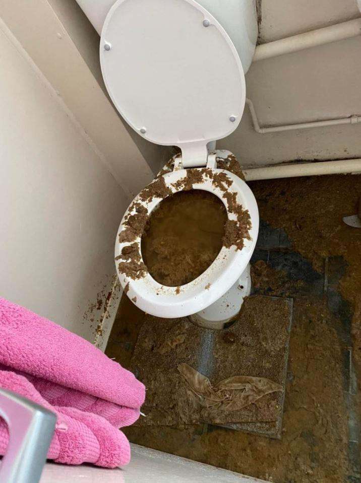

## Claim
Claim: " This image shows the aftermath of an explosion of a Hezbollah pager in Lebanon in September 2024."

## Actions
```
web_search("Hezbollah pager explosion Lebanon September 2024")
image_search("exploded toilet")
```

## Evidence
### Evidence from `web_search`
The web sources discuss the September 17, 2024, explosions of pagers in Lebanon, which were distributed by Hezbollah. One article, published on October 11, 2024, suggests Israel's responsibility for the attacks, which targeted walkie-talkies and pagers. Another article from Human Rights Watch, published on September 18, 2024, mentions at least 12 deaths and 2,800 injuries. Hezbollah blamed the Israeli government for the attacks. A PBS article, published on August 6, 2025, states that the pagers were remotely detonated by Israel.  shows the aftermath of an explosion.

Sources: [https://lieber.westpoint.edu/well-it-depends-explosive-pagers-attack-revisited/](https://lieber.westpoint.edu/well-it-depends-explosive-pagers-attack-revisited/), [https://www.hrw.org/news/2024/09/18/lebanon-exploding-pagers-harmed-hezbollah-civilians](https://www.hrw.org/news/2024/09/18/lebanon-exploding-pagers-harmed-hezbollah-civilians), [https://www.pbs.org/newshour/world/survivors-of-israels-pager-attack-on-hezbollah-last-year-struggle-to-recover](https://www.pbs.org/newshour/world/survivors-of-israels-pager-attack-on-hezbollah-last-year-struggle-to-recover).


### Evidence from `image_search`
The search results include articles about exploded toilets. One article from wbtw.com shows a picture of an exploded toilet (). Another article from Fox 5 San Diego also shows a picture of an exploded toilet (). The Sun published an article about a toilet explosion ().

*   [https://www.wbtw.com/nexstar-media-wire/mystery-of-exploding-toilet-at-texas-dental-office/](https://www.wbtw.com/nexstar-media-wire/mystery-of-exploding-toilet-at-texas-dental-office/)
*   [https://fox5sandiego.com/news/trending/lightning-blows-up-toilet-after-traveling-through-apartment-buildings-exhaust-vent/](https://fox5sandiego.com/news/trending/lightning-blows-up-toilet-after-traveling-through-apartment-buildings-exhaust-vent/)
*   [https://www.the-sun.com/news/4235913/mum-sons-forced-move-out-toilet-explosion/](https://www.the-sun.com/news/4235913/mum-sons-forced-move-out-toilet-explosion/)


## Elaboration
The evidence confirms that Hezbollah pagers exploded in Lebanon in September 2024. However, the image search results show pictures of exploded toilets, and there is no evidence to suggest that the image in the claim depicts the aftermath of a Hezbollah pager explosion.

Therefore, the claim is not supported by the evidence. The image could be of an exploded toilet, but there is no information to link it to the Hezbollah pager explosions.


## Final Judgement
The web search confirms the Hezbollah pager explosions in Lebanon in September 2024. However, the image search reveals pictures of exploded toilets, and there is no evidence to connect the image in the claim to the pager explosions.

The claim is `false`.

### Verdict: FALSE

### Justification
The claim is false. While there were Hezbollah pager explosions in Lebanon in September 2024, the image provided does not depict the aftermath of those explosions. The image search results show pictures of exploded toilets, but there is no evidence to link the image in the claim to the pager explosions.
