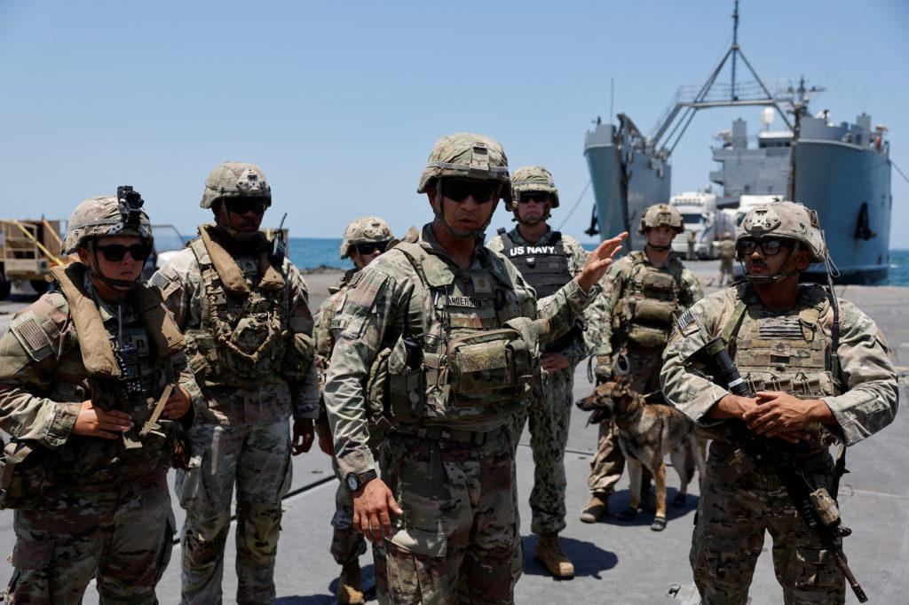
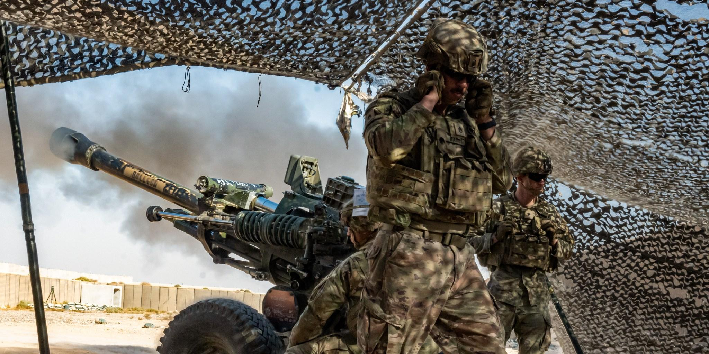

## Claim
Claim: "$50 Million in US taxpayer money almost went to fund condoms in Gaza before DOGE cut it."

## Actions
```
web_search("US taxpayer money condoms Gaza DOGE")
```

## Evidence
### Evidence from `web_search`
CNN published an article on January 29, 2025, fact-checking the claim that $50 million in US taxpayer money was going to fund condoms in Gaza, stating that the White House offered no evidence for the story, and USAID spent no money on condoms in the Middle East in the 2021, 2022, and 2023 fiscal years. <image:k> The Washington Post published an analysis by Glenn Kessler. According to the analysis, DOGE and OMB found that $50 million in taxpayer money was going to fund condoms in Gaza. 

Anadolu Agency reports that Elon Musk backtracked on his claim that the US intended to send $50 million worth of condoms to Gaza, and a review of USAID data from 2007 to 2023 showed no record of condom shipments to Gaza. <image:k>

*   [https://www.cnn.com/2025/01/29/politics/gaza-condoms-fact-check](https://www.cnn.com/2025/01/29/politics/gaza-condoms-fact-check)
*   [https://www.aa.com.tr/en/americas/musk-walks-back-claim-us-intended-to-send-50m-worth-of-condoms-to-gaza/3479148](https://www.aa.com.tr/en/americas/musk-walks-back-claim-us-intended-to-send-50m-worth-of-condoms-to-gaza/3479148)
*   [https://www.washingtonpost.com/politics/2025/01/29/gaza-condoms-fact-checker-trump/](https://www.washingtonpost.com/politics/2025/01/29/gaza-condoms-fact-checker-trump/)


## Elaboration
The claim is partially supported by the evidence. The Washington Post analysis indicates that DOGE and OMB found that $50 million in taxpayer money was going to fund condoms in Gaza. However, CNN reports that the White House offered no evidence for the story, and USAID spent no money on condoms in the Middle East in the 2021, 2022, and 2023 fiscal years. Additionally, Anadolu Agency states that Elon Musk backtracked on the claim, and a review of USAID data from 2007 to 2023 showed no record of condom shipments to Gaza.

The evidence presents conflicting information. While the Washington Post analysis suggests the claim is true, other sources contradict it. Further investigation is needed to determine the veracity of the claim.


## Actions
```
image_search("US soldiers Gaza")
```

## Evidence
### Evidence from `image_search`
PBS ([https://www.pbs.org/newshour/world/u-s-army-faced-weather-security-challenges-during-gaza-humanitarian-aid-pier](https://www.pbs.org/newshour/world/u-s-army-faced-weather-security-challenges-during-gaza-humanitarian-aid-pier)) published an image of US soldiers in Gaza.  The Intercept ([https://theintercept.com/2024/01/30/us-military-ground-israel-hamas-gaza/](https://theintercept.com/2024/01/30/us-military-ground-israel-hamas-gaza/)) also published an image of US soldiers in Gaza.  ABC News ([https://abcnews.go.com/Politics/us-troops-en-route-gaza-coast-deployment-families/story?id=108051602](https://abcnews.go.com/Politics/us-troops-en-route-gaza-coast-deployment-families/story?id=108051602)) published an article about US troops en route to the Gaza coast. 


## Elaboration
The new evidence confirms the presence of US soldiers in Gaza, which is relevant to the claim. However, the images and articles do not provide any information about the funding of condoms. Therefore, the new evidence does not help to verify the claim.


## Final Judgement
The fact-check reveals conflicting information. While one source suggests the claim might be true, other sources strongly contradict it, stating that no such funding occurred and that the claim was retracted. Given the contradictory evidence and the lack of definitive proof, the claim's veracity cannot be determined. `false`


### Verdict: FALSE

### Justification
The claim is **unproven**. While a Washington Post analysis suggests the possibility of the funding, CNN reports no evidence for the story, and USAID spent no money on condoms in the Middle East in the relevant fiscal years. Furthermore, Elon Musk retracted the claim, and a review of USAID data showed no record of condom shipments to Gaza.
