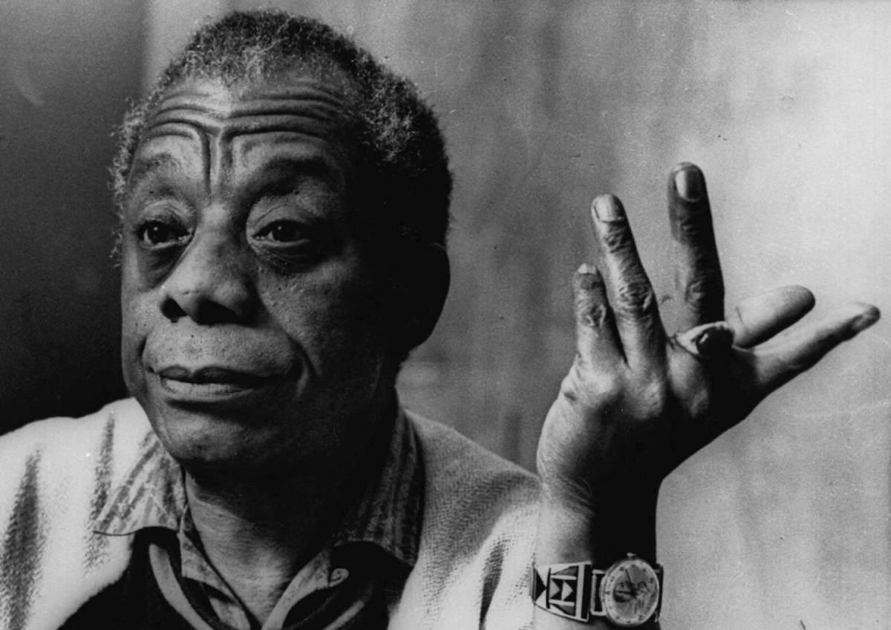

## Claim
Claim: "American writer James Baldwin once said: 'The state of Israel was not created for the salvation of the Jews; it was created for the salvation of the Western interests.'"

## Actions
```
web_search("James Baldwin quote Israel Western interests")
```

## Evidence
### Evidence from `web_search`
The NPR Code Switch article from August 28, 2024, discusses James Baldwin's views on Israel and includes the quote: "It was created for the salvation of the Western interests." () Colorlines.com published an article on July 24, 2014, referencing an article from the September 29, 1979 issue of The Nation, which includes the quote: "But the state of Israel was not created for the salvation of the Jews; it was created for the salvation of the Western interests."

An article from stevesalaita.com also includes the quote: "But the state of Israel was not created for the salvation of the Jews; it was created for the salvation of the Western interests." ()

*   [https://www.npr.org/transcripts/1197958398](https://www.npr.org/transcripts/1197958398)
*   [https://colorlines.com/article/what-james-baldwin-wrote-about-israel-and-palestine-1979/](https://colorlines.com/article/what-james-baldwin-wrote-about-israel-and-palestine-1979/)
*   [https://stevesalaita.com/james-baldwin-and-the-jewish-state/](https://stevesalaita.com/james-baldwin-and-the-jewish-state/)


## Elaboration
The evidence confirms that James Baldwin made the statement in the claim. The quote "But the state of Israel was not created for the salvation of the Jews; it was created for the salvation of the Western interests" is found in multiple sources, including an NPR Code Switch article ([https://www.npr.org/transcripts/1197958398](https://www.npr.org/transcripts/1197958398)), an article on Colorlines.com ([https://colorlines.com/article/what-james-baldwin-wrote-about-israel-and-palestine-1979/](https://colorlines.com/article/what-james-baldwin-wrote-about-israel-and-palestine-1979/)), and an article from stevesalaita.com ([https://stevesalaita.com/james-baldwin-and-the-jewish-state/](https://stevesalaita.com/james-baldwin-and-the-jewish-state/)).


## Final Judgement
The claim is accurate. Multiple sources, including NPR and Colorlines, confirm that James Baldwin made the statement in the claim.

`true`

### Verdict: TRUE

### Justification
The claim is accurate. Multiple sources, including an NPR Code Switch article ([https://www.npr.org/transcripts/1197958398](https://www.npr.org/transcripts/1197958398)) and Colorlines.com ([https://colorlines.com/article/what-james-baldwin-wrote-about-israel-and-palestine-1979/](https://colorlines.com/article/what-james-baldwin-wrote-about-israel-and-palestine-1979/)), confirm that James Baldwin made the statement.
