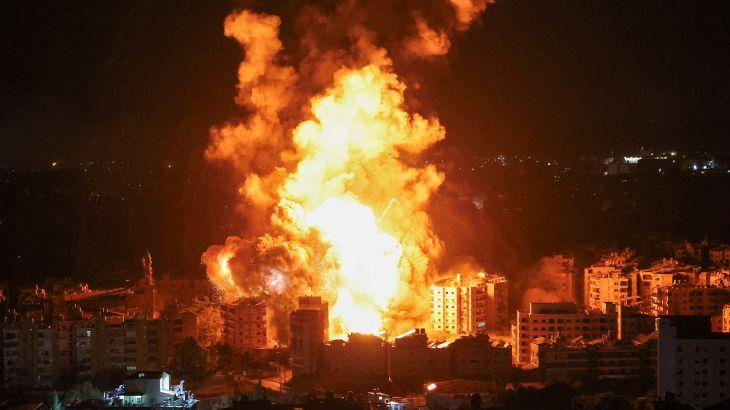
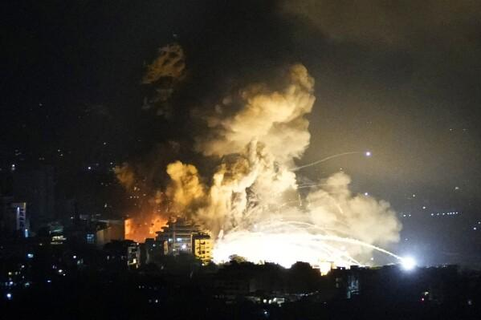
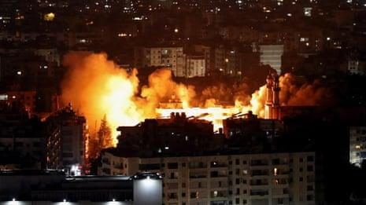
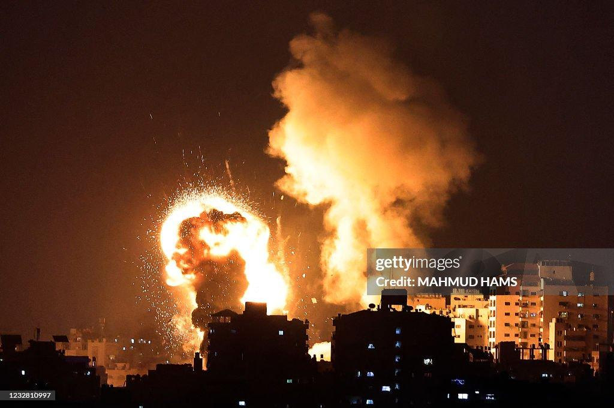
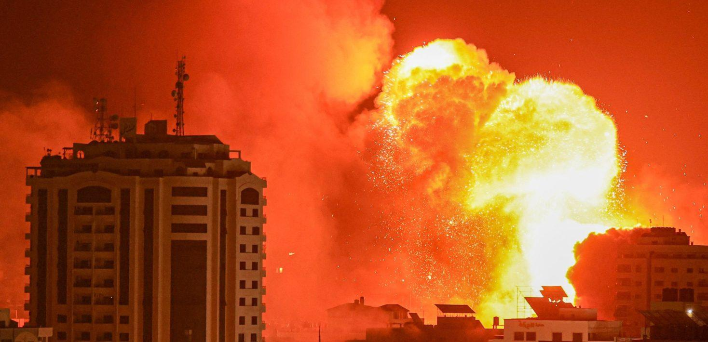
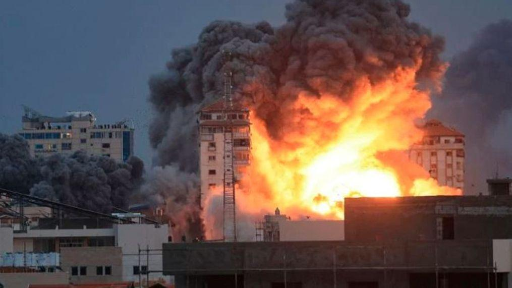

## Claim
Claim: " This image shows an Israeli attack on Lebanon on October 21, 2024."

## Actions
```
web_search("Israeli attack Lebanon October 21 2024")
```

## Evidence
### Evidence from `web_search`
The CNN article ([https://www.cnn.com/world/live-news/israel-iran-lebanon-gaza-war-10-21-24-intl-hnk](https://www.cnn.com/world/live-news/israel-iran-lebanon-gaza-war-10-21-24-intl-hnk)) reports on the ongoing conflict between Israel and Hezbollah, including an Israeli strike near Rafik Hariri University Hospital in Beirut on October 21, 2024, which resulted in casualties. The Wikipedia article ([https://en.wikipedia.org/wiki/2024_Israeli_invasion_of_Lebanon](https://en.wikipedia.org/wiki/2024_Israeli_invasion_of_Lebanon)) discusses the 2024 Israeli invasion of Lebanon, which began on October 1, 2024, and resulted in an Israeli victory and a ceasefire agreement.

The Guardian article ([https://www.theguardian.com/world/2024/oct/21/israeli-airstrikes-on-lebanon-hit-branches-of-hezbollah-linked-bank-al-qard-al-hassan](https://www.theguardian.com/world/2024/oct/21/israeli-airstrikes-on-lebanon-hit-branches-of-hezbollah-linked-bank-al-qard-al-hassan)) reports on Israeli airstrikes on Lebanon on October 21, 2024, that hit branches of the Hezbollah-linked bank Al-Qard Al-Hassan. 

## Elaboration
The evidence confirms that there were Israeli attacks on Lebanon on October 21, 2024. The Guardian article ([https://www.theguardian.com/world/2024/oct/21/israeli-airstrikes-on-lebanon-hit-branches-of-hezbollah-linked-bank-al-qard-al-hassan](https://www.theguardian.com/world/2024/oct/21/israeli-airstrikes-on-lebanon-hit-branches-of-hezbollah-linked-bank-al-qard-al-hassan)) specifically mentions airstrikes on that date.

The CNN article ([https://www.cnn.com/world/live-news/israel-iran-lebanon-gaza-war-10-21-24-intl-hnk](https://www.cnn.com/world/live-news/israel-iran-lebanon-gaza-war-10-21-24-intl-hnk)) also supports this, reporting on the ongoing conflict and an Israeli strike near a hospital in Beirut on the same date.

However, the evidence does not explicitly link the provided image to the attacks. Therefore, while the claim about the date and location is supported, the image's specific context remains unverified.


## Actions
```
image_search("explosion building night lebanon")
```

## Evidence
### Evidence from `image_search`
Al Jazeera published an image of an explosion over buildings at night in Lebanon (). The Associated Press also published an image of an explosion over a building at night in Lebanon (). The Guardian published a video on June 5, 2025, showing explosions in Beirut as Israel carried out airstrikes ().


## Elaboration
The image search results provide additional context. While the search confirms that explosions over buildings at night in Lebanon occurred, it does not directly confirm that the image in the claim depicts an Israeli attack on October 21, 2024. The evidence includes images of explosions in Lebanon, but none of them are the same as the image in the claim. The Guardian published a video of explosions in Beirut, but it was from June 5, 2025, which is not the date in the claim.

Therefore, the claim's veracity remains unconfirmed because the image's specific context is not verified.


## Actions
```
image_search("GettyImages MAHMOD HAMS explosion building")
```

## Evidence
### Evidence from `image_search`
GettyImages published an image of Israeli air strikes in the Gaza Strip ([https://www.gettyimages.com/detail/news-photo/picture-shows-israeli-air-strikes-in-the-gaza-strip-news-photo/1232810997](https://www.gettyimages.com/detail/news-photo/picture-shows-israeli-air-strikes-in-the-gaza-strip-news-photo/1232810997)). Amnesty International published an image of an explosion over buildings at night. fox47.com includes an image of an explosion over a building, credited to MAHMOD HAMS.   


## Elaboration
The image search reveals that the image in the claim was taken by MAHMOD HAMS and is associated with explosions over buildings. However, the search results also show that the image is related to Israeli air strikes in the Gaza Strip, not Lebanon. Therefore, the claim is likely false.


## Final Judgement
The evidence confirms that there were Israeli attacks on Lebanon on October 21, 2024. However, the image search results indicate that the image in the claim is associated with Israeli air strikes in the Gaza Strip, not Lebanon. Therefore, the claim is not factually accurate. `false`

### Verdict: FALSE

### Justification
The claim that the image depicts an Israeli attack on Lebanon on October 21, 2024, is not supported by the evidence. While there were indeed Israeli attacks on Lebanon on that date, as reported by sources like [CNN](https://www.cnn.com/world/live-news/israel-iran-lebanon-gaza-war-10-21-24-intl-hnk) and [The Guardian](https://www.theguardian.com/world/2024/oct/21/israeli-airstrikes-on-lebanon-hit-branches-of-hezbollah-linked-bank-al-qard-al-hassan), the image itself, credited to MAHMOD HAMS, is associated with Israeli air strikes in the Gaza Strip, according to image search results.
