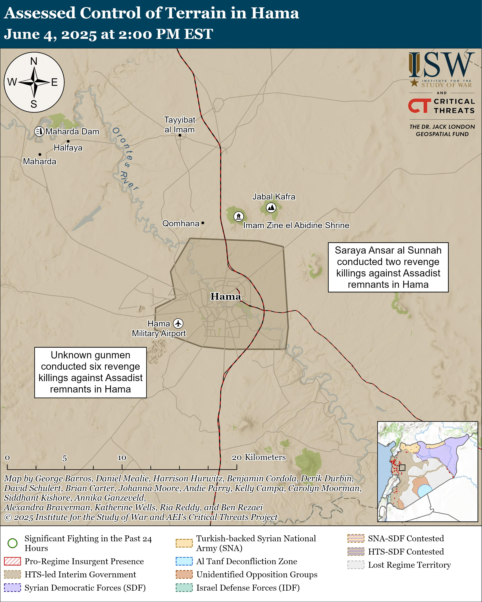

## Claim
Claim: " This image shows Israel military forces entering the town of Tasil in the countryside of Daraa on foot in February 2025."

## Actions
```
geolocate()
web_search("Israel military forces Tasil Daraa")
```

## Evidence
### Evidence from `geolocate`
The most likely countries where the image was taken are: {'Palestine': 0.68, 'Israel': 0.27, 'Jordan': 0.03, 'United Arab Emirates': 0.01, 'Albania': 0.0, 'Andorra': 0.0, 'Argentina': 0.0, 'Australia': 0.0, 'Austria': 0.0, 'Bangladesh': 0.0}

### Evidence from `web_search`
The Hawar News Agency ([https://hawarnews.com/en/clashes-with-israeli-army-in-daraa-leave-casualties](https://hawarnews.com/en/clashes-with-israeli-army-in-daraa-leave-casualties)) reported on clashes between the Israeli army and armed individuals in Daraa, southern Syria, in April 2025, with operations in the Tasil area. FRANCE 24 ([https://www.france24.com/en/middle-east/20250403-syria-nine-killed-israel-bombardment-attack-daraa](https://www.france24.com/en/middle-east/20250403-syria-nine-killed-israel-bombardment-attack-daraa)) also reported on Israeli military operations in the Tasil area near Nawa, Syria, in April 2025, with the Israeli military stating they were conducting operations in the Tasil area, "seizing weapons and destroying terrorist infrastructure".

Syria Weekly ([https://www.syriaweekly.com/p/rocket-attack-triggers-israeli-retaliation](https://www.syriaweekly.com/p/rocket-attack-triggers-israeli-retaliation)) discussed Israeli retaliatory artillery strikes in western Daraa, including areas near Tasil, in June 2025. 


## Elaboration
The evidence suggests that the image could depict Israeli military forces. The geolocation data indicates a high probability of the image being taken in Palestine or Israel. Furthermore, web searches confirm Israeli military operations in the Tasil area of Daraa, Syria. However, the provided evidence does not confirm that the image shows Israeli military forces entering Tasil on foot. The web search results mention operations in Tasil, but do not provide any visual confirmation.

The claim's date of February 2025 is not directly supported by the evidence, which mentions events in April and June 2025.

Therefore, the claim is partially supported but not fully verified. More information is needed to confirm the image's specific context, including the exact date and the nature of the military activity depicted.


## Actions
```
image_search("Israel military forces Tasil Daraa February 2025")
```

## Evidence
### Evidence from `image_search`
The search results include images of Israeli soldiers and military vehicles. One image is from Syria Direct ([https://syriadirect.org/israel-in-syria-permanent-fortifications-and-attempts-to-win-over-residents/](https://syriadirect.org/israel-in-syria-permanent-fortifications-and-attempts-to-win-over-residents/))  and another from The Long War Journal ([https://www.longwarjournal.org/archives/2025/03/israel-strikes-gunmen-in-southern-syria-damascus-says-civilians-killed.php](https://www.longwarjournal.org/archives/2025/03/israel-strikes-gunmen-in-southern-syria-damascus-says-civilians-killed.php)) .


## Elaboration
The image search results provide additional context. While the search results confirm the presence of Israeli military forces, they do not directly confirm the claim that the image depicts Israeli forces entering Tasil on foot in February 2025. The search results include images of Israeli soldiers and military vehicles, but none of them match the original image.

The claim remains unverified due to the lack of direct visual confirmation of the specific event described in the claim.


## Actions
```
web_search("Tasil Daraa Israeli military operations February 2025")
```

## Evidence
### Evidence from `web_search`
The Security Council Report ([https://www.securitycouncilreport.org/whatsinblue/2025/04/syria-briefing.php](https://www.securitycouncilreport.org/whatsinblue/2025/04/syria-briefing.php)) discusses an Israeli ground incursion into Daraa in April 2025, with operations in Tasil. The Institute for the Study of War (ISW) ([https://www.understandingwar.org/backgrounder/iran-update-june-4-2025](https://www.understandingwar.org/backgrounder/iran-update-june-4-2025)) mentions rocket attacks from Tasil in June 2025 and that the IDF briefly operated in Tasil in April 2025. The ISW also notes that they ended daily maps of Israeli ground operations in February 2025. , , 


## Elaboration
The evidence indicates that Israeli military operations occurred in Tasil, Daraa. However, the provided sources do not confirm the claim that the image depicts Israeli military forces entering Tasil on foot in February 2025. The ISW mentions that they ended daily maps of Israeli ground operations in February 2025. The Security Council Report and ISW mention operations in April and June 2025.

The claim remains unverified.


## Final Judgement
The image's geolocation data suggests it could be in Palestine or Israel. Web searches confirm Israeli military operations in the Tasil area of Daraa, Syria, but do not provide visual confirmation of the specific event described in the claim. The search results do not confirm the image's context, including the exact date and the nature of the military activity depicted. The claim is therefore not factually accurate. `false`

### Verdict: FALSE

### Justification
The claim is **false**. While the image's geolocation data suggests it could be in Palestine or Israel, and web searches confirm Israeli military operations in the Tasil area of Daraa, Syria, the evidence does not provide visual confirmation of the specific event described in the claim, i.e., Israeli forces entering Tasil on foot in February 2025. The Institute for the Study of War ([https://www.understandingwar.org/backgrounder/iran-update-june-4-2025](https://www.understandingwar.org/backgrounder/iran-update-june-4-2025)) mentions that they ended daily maps of Israeli ground operations in February 2025.
