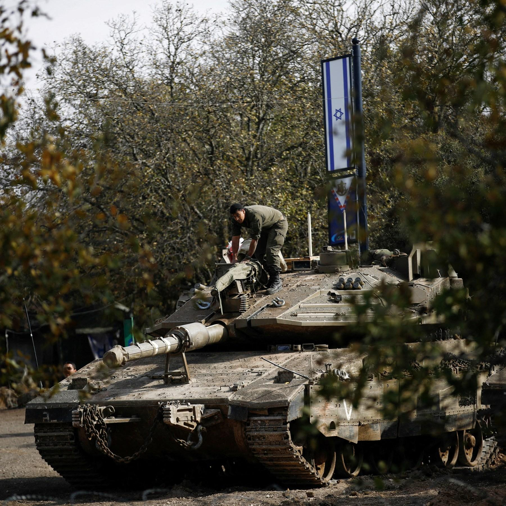

## Claim
Claim: " This image shows the Israeli army reaching Damascus in Syria in December 2024."

## Actions
```
geolocate()
web_search("Israeli army Damascus Syria")
image_search("Israeli tanks Damascus")
```

## Evidence
### Evidence from `geolocate`
The most likely countries where the image was taken are: {'Israel': 0.78, 'Palestine': 0.2, 'Jordan': 0.01, 'Albania': 0.0, 'Andorra': 0.0, 'Argentina': 0.0, 'Australia': 0.0, 'Austria': 0.0, 'Bangladesh': 0.0, 'Belgium': 0.0}

### Evidence from `web_search`
Al Jazeera ([https://www.aljazeera.com/news/2025/7/16/israel-bombards-syrias-damascus-as-us-says-steps-agreed-to-end-violence](https://www.aljazeera.com/news/2025/7/16/israel-bombards-syrias-damascus-as-us-says-steps-agreed-to-end-violence)) reported on July 16, 2025, about Israeli air strikes near Syria’s presidential palace and military headquarters in Damascus. The article mentions attacks on Damascus and Suwayda. CNN ([https://www.cnn.com/2025/07/16/middleeast/damascus-syria-airstrikes-intl](https://www.cnn.com/2025/07/16/middleeast/damascus-syria-airstrikes-intl)) reported on July 17, 2025, about Israeli airstrikes on Damascus.

The BBC News ([https://www.bbc.com/news/articles/cp90l77187zo](https://www.bbc.com/news/articles/cp90l77187zo)) reported on Israeli strikes in Syria, including the Syrian defense ministry in Damascus. The article mentions that Israel's military has been striking Syrian security forces and their weapons. 

### Evidence from `image_search`
The Times of Israel published an image of an Israeli tank, and NDTV published a fact-check on December 10, 2024, determining a claim that Israeli tanks were near Damascus to be false (). Al Jazeera published an article on December 8, 2024, about Israel seizing a buffer zone in Syria's Golan Heights, which included an image of an Israeli tank ().

The sources include images of Israeli tanks, but the claim that the Israeli army reached Damascus in Syria in December 2024 is false.
*   [https://www.timesofisrael.com/liveblog\_entry/report-israeli-tanks-reach-point-25km-from-damascus/](https://www.timesofisrael.com/liveblog_entry/report-israeli-tanks-reach-point-25km-from-damascus/)
*   [https://www.ndtv.com/world-news/were-israeli-tanks-spotted-outside-damascus-a-fact-check-7224391](https://www.ndtv.com/world-news/were-israeli-tanks-spotted-outside-damascus-a-fact-check-7224391)
*   [https://www.aljazeera.com/news/2024/12/8/israel-seizes-buffer-zone-in-syrias-golan-heights-after-al-assad-falls](https://www.aljazeera.com/news/2024/12/8/israel-seizes-buffer-zone-in-syrias-golan-heights-after-al-assad-falls)


## Elaboration
The claim is false. The image search results show that a claim about Israeli tanks near Damascus in December 2024 was determined to be false by NDTV. Additionally, the evidence indicates that while there were Israeli military actions in Syria, including airstrikes on Damascus, there is no evidence to support the claim that the Israeli army reached Damascus in December 2024.


## Final Judgement
The evidence indicates that the claim is false. While there were Israeli military actions in Syria, including airstrikes on Damascus, there is no evidence to support the claim that the Israeli army reached Damascus in December 2024. A fact-check by NDTV determined a similar claim to be false.

`false`

### Verdict: FALSE

### Justification
The claim is false. While the image shows Israeli tanks, and there were reports of Israeli military actions in Syria, including airstrikes on Damascus, there is no evidence to support the claim that the Israeli army reached Damascus in December 2024. A fact-check by NDTV ([https://www.ndtv.com/world-news/were-israeli-tanks-spotted-outside-damascus-a-fact-check-7224391](https://www.ndtv.com/world-news/were-israeli-tanks-spotted-outside-damascus-a-fact-check-7224391)) determined a similar claim to be false.
