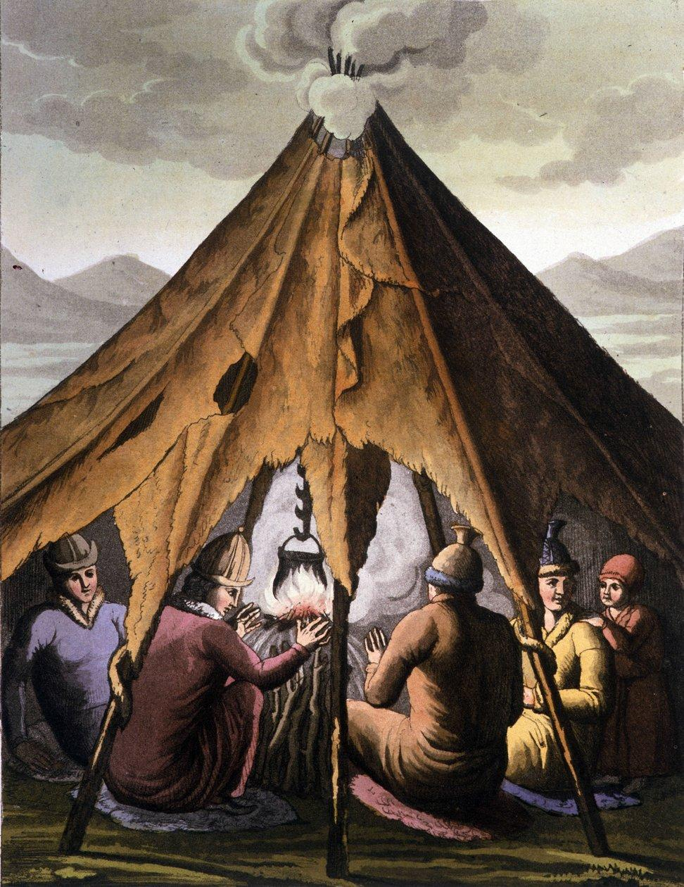
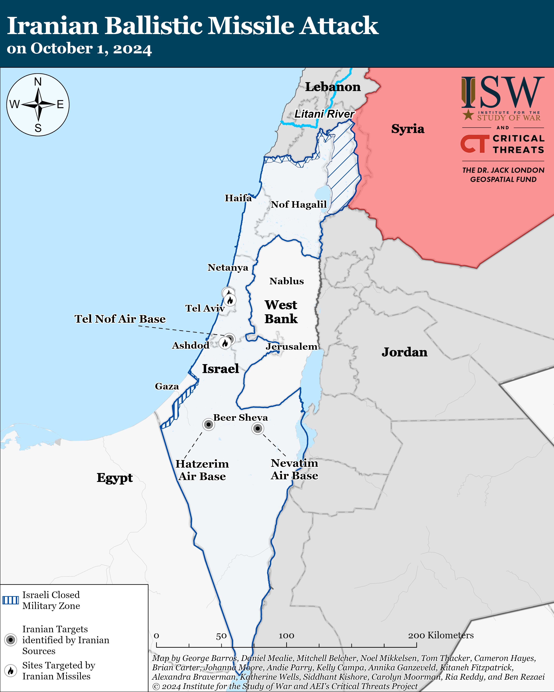
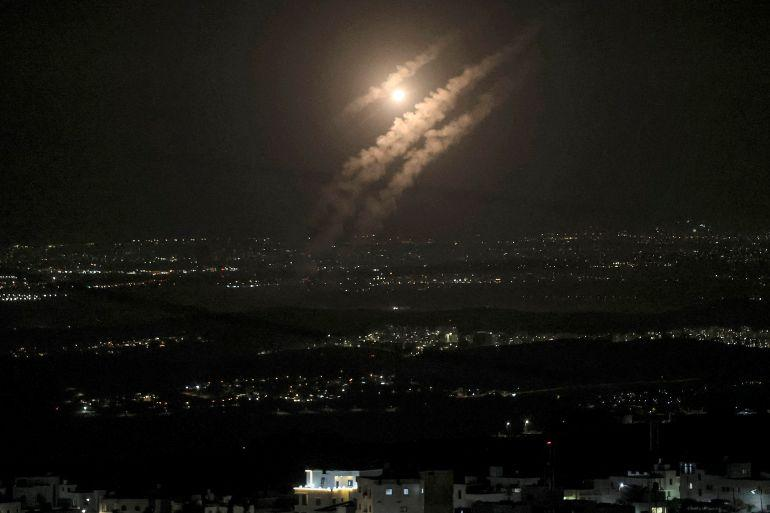
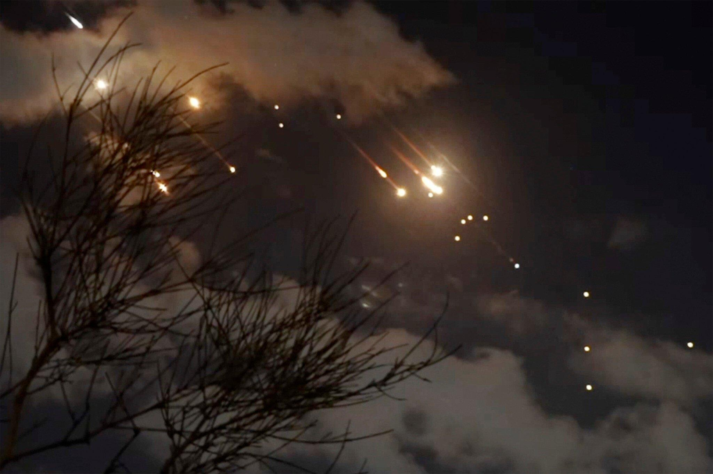

## Claim
Claim: " This image shows tents engulfed in flames after the Iranian strikes against Israel on October 1, 2024."

## Actions
```
image_search("fire tents people")
```

## Evidence
### Evidence from `image_search`
The search results include an image of Sami people around a fire under a tent (), an article from CNN about tent cities (), and an image of tents outside a Walmart store from CapRadio.org ().

The provided sources do not contain information about the Iranian strikes against Israel on October 1, 2024, or images of tents engulfed in flames.


## Elaboration
The evidence does not support the claim. The image search results do not contain any information about the Iranian strikes against Israel or images of tents on fire.


## Actions
```
web_search("Iranian strikes Israel October 1 2024")
image_search("Iranian strikes Israel October 1 2024")
```

## Evidence
### Evidence from `web_search`
The web search results discuss the October 1, 2024, Iranian strikes on Israel, codenamed Operation True Promise II, involving ballistic missiles launched from Iran. The attacks were in retaliation for the assassination of Hamas leader Ismail Haniyeh and caused minor damage to Israeli airbases and some collateral damage. NPR published an article about the missile attack, including images of Israelis taking shelter and a destroyed building. The Institute for the Study of War (ISW) and Critical Threats Project also published an "Iran Update" detailing the attack, stating that Iran launched approximately 180 ballistic missiles targeting Israel. The IDF reported that the majority of the missiles were intercepted. The sources include images of missile interceptions, Israelis taking shelter, and a map of the attack. (, , , , , )


### Evidence from `image_search`
Al Jazeera published an article about the Iranian missile attacks on Israel, including an image of missiles in the sky over a city (). The Times of Israel published an article about Iran's plans for a counterattack if Israel strikes nuclear facilities, including an image of projectiles in the night sky ().


## Elaboration
The evidence confirms that Iran launched ballistic missiles at Israel on October 1, 2024. However, the provided search results do not include an image of tents engulfed in flames. Therefore, the claim cannot be verified.


## Final Judgement
The search results confirm the Iranian strikes against Israel on October 1, 2024, but do not contain the image of tents engulfed in flames. Therefore, the claim is not supported by the evidence.

`false`

### Verdict: FALSE

### Justification
The claim is not supported by the evidence. While the search results confirm the Iranian strikes against Israel on October 1, 2024, as reported by sources like NPR and Al Jazeera, they do not contain the image of tents engulfed in flames.
