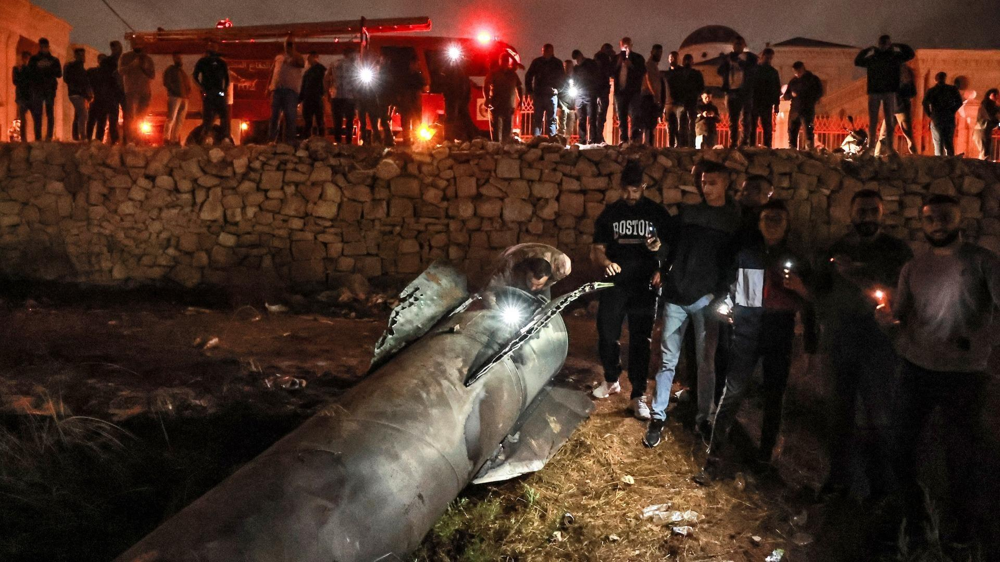
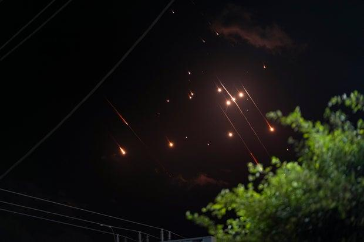
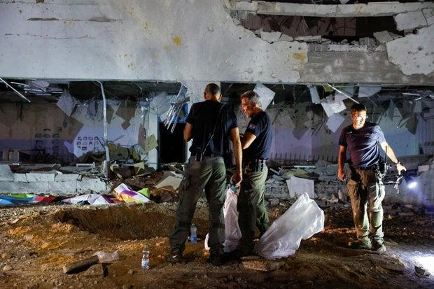
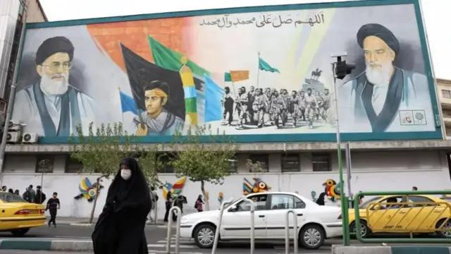

## Claim
Claim: "Netanyahu left Israel and fled to Poland amid Iran's missile attack on Israel on October 1, 2024."

## Actions
```
web_search("Netanyahu Poland October 1 2024")
```

## Evidence
### Evidence from `web_search`
Al Jazeera ([https://www.aljazeera.com/news/2025/1/9/poland-says-it-will-protect-benjamin-netanyahu-from-potential-arrest](https://www.aljazeera.com/news/2025/1/9/poland-says-it-will-protect-benjamin-netanyahu-from-potential-arrest)) and the Los Angeles Times ([https://www.latimes.com/world-nation/story/2025-01-09/polish-president-seeks-protection-for-netanyahu-if-he-attends-auschwitz-anniversary-event](https://www.latimes.com/world-nation/story/2025-01-09/polish-president-seeks-protection-for-netanyahu-if-he-attends-auschwitz-anniversary-event)) reported on January 9, 2025, that Poland is offering protection to Benjamin Netanyahu, potentially due to an arrest warrant from the International Criminal Court (ICC) <image:k>.

DW.COM ([https://www.dw.com/en/auschwitz-poland-netanyahu-arrest-pledge/a-71377468](https://www.dw.com/en/auschwitz-poland-netanyahu-arrest-pledge/a-71377468)) reported on January 22, 2025, that Poland guaranteed safe passage to Netanyahu, should he attend an event in Poland, also mentioning the ICC arrest warrant <image:k>. The article also stated that Netanyahu was not planning to attend the event <image:k>.


## Elaboration
1.  The provided evidence indicates that Poland offered protection to Netanyahu and guaranteed his safe passage, potentially due to an ICC arrest warrant.
2.  The reports are from January 2025, and the events are related to an event in Poland.
3.  The evidence does not mention anything about Netanyahu fleeing Israel amid an Iranian missile attack on October 1, 2024.

Insufficient information to verify the claim.


## Actions
```
web_search("Iran missile attack Israel October 1 2024")
web_search("Netanyahu Israel October 1 2024")
```

## Evidence
### Evidence from `web_search`
On October 1, 2024, Iran launched a missile attack on Israel, referred to as "Operation True Promise II" according to Wikipedia ([https://en.wikipedia.org/wiki/October_2024_Iranian_strikes_on_Israel](https://en.wikipedia.org/wiki/October_2024_Iranian_strikes_on_Israel)) <image:k>. NPR ([https://www.npr.org/2024/10/01/g-s1-25707/iran-israel-hezbollah-lebanon-attack](https://www.npr.org/2024/10/01/g-s1-25707/iran-israel-hezbollah-lebanon-attack)) ,  and Al Jazeera ([https://www.aljazeera.com/news/2024/10/1/irans-missile-attack-against-israel-what-we-know-and-what-comes-next](https://www.aljazeera.com/news/2024/10/1/irans-missile-attack-against-israel-what-we-know-and-what-comes-next)) <image:k> also reported on the attack. Benjamin Netanyahu responded to the attack, stating that Iran had "made a big mistake" and "will pay for it."


### Evidence from `web_search`
CBS News reported on an Iranian missile attack on Israel on October 1, 2024, and that Prime Minister Benjamin Netanyahu vowed retaliation. The attack prompted alerts for people to take shelter across the country (, , ). The BBC reported live updates on October 21, 2024, including an Iranian woman walking past a wall painting in Tehran ().

The BBC report also mentioned that on October 7, 2024, Israeli Prime Minister Benjamin Netanyahu was heckled at a memorial ceremony (, ). The report also mentions an Israeli strike in Sidon, Lebanon, and an incident where a truck hit a bus stop near an Israeli military base. The report also mentions that on October 1, 2024, Iran fired missiles at Israel.


## Elaboration
1.  Evidence confirms that Iran launched a missile attack on Israel on October 1, 2024, and that Benjamin Netanyahu responded to the attack.
2.  The evidence shows that Netanyahu was present in Israel during and after the attack, as he vowed retaliation and was heckled at a memorial ceremony on October 7, 2024.
3.  There is no evidence to support the claim that Netanyahu left Israel and fled to Poland.

The claim is false.


## Final Judgement
The evidence confirms that Iran launched a missile attack on Israel on October 1, 2024, and that Benjamin Netanyahu responded to the attack. However, there is no evidence to support the claim that Netanyahu left Israel and fled to Poland.

`false`

### Verdict: FALSE

### Justification
The claim is false. While Iran did launch a missile attack on Israel on October 1, 2024, and Netanyahu responded, there is no evidence to support the assertion that he fled to Poland. In fact, reports indicate that Netanyahu remained in Israel and was present at events following the attack, such as a memorial ceremony on October 7, 2024, as reported by the [BBC](https://www.bbc.com/).
