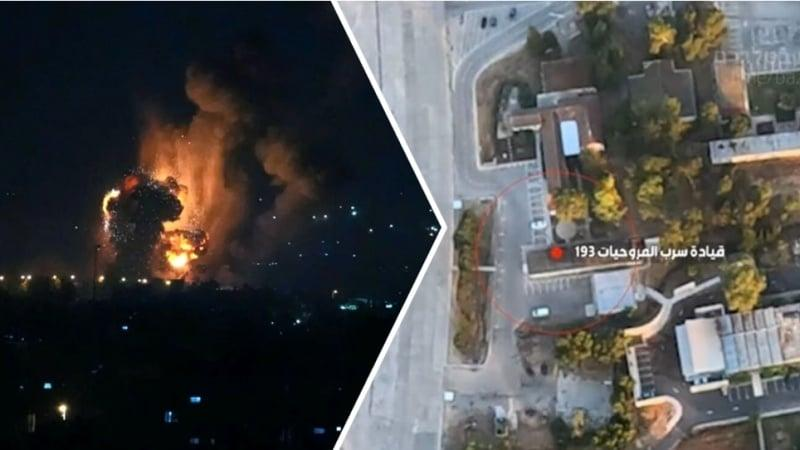
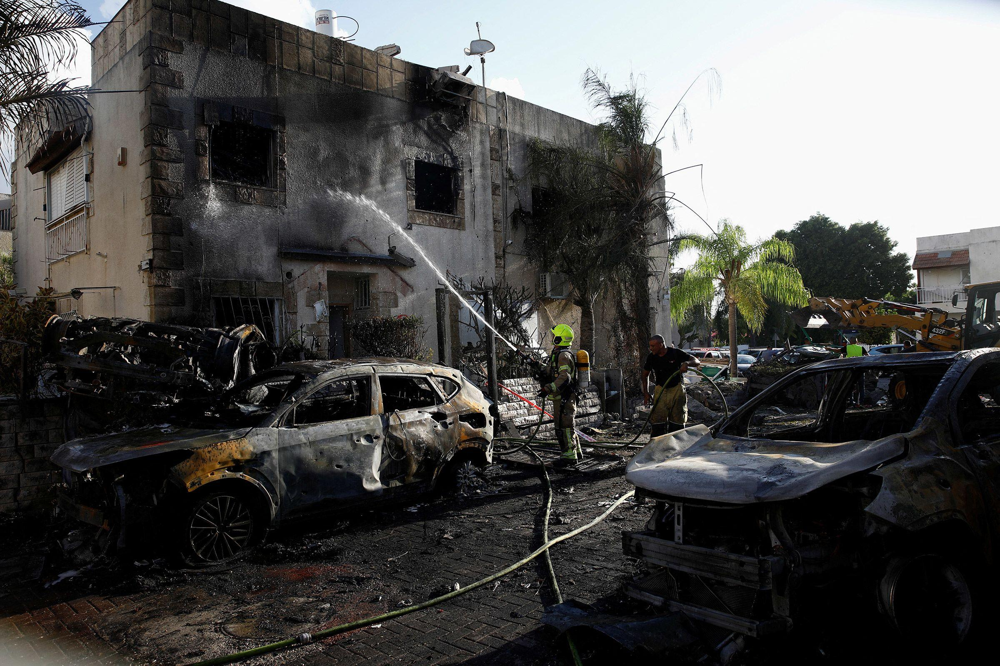

## Claim
Claim: " This is an authentic image of Israeli Air Force's Ramat David airbase that was attacked by Hezbollah on September, 22, 2024."

## Actions
```
web_search("Ramat David airbase attack September 22 2024")
image_search("Ramat David airbase attack")
```

## Evidence
### Evidence from `web_search`
Al Jazeera ([Source](https://www.aljazeera.com/news/2024/9/21/hezbollah-claims-rocket-attack-deep-inside-northern-israel)) reported that Hezbollah claimed to have launched rockets at Israel’s Ramat David Airbase on September 22, 2024, and also mentioned attacks on Kiryat Bialik. ,  Politico.eu ([Source](https://www.politico.eu/article/hezbollah-launches-revenge-rocket-attack-against-israeli-base/)) reported that Hezbollah launched rockets at the Ramat David airbase in response to Israeli attacks on Lebanese regions. The Jerusalem Post ([Source](https://www.jpost.com/israel-news/article-821267)) discussed Hezbollah's rocket attacks on the Ramat David airbase and included a photograph of the airbase. <image:592369>


### Evidence from `image_search`
The Financial Times published an image of Ramat David airbase dated July 23, 2024 (). The Times of Israel published drone footage of Ramat David airbase (). Pars Today reports on huge blasts in Ramat David airbase of Israel ().

*   [https://www.ft.com/content/f1f64dd7-efb9-45b8-84d2-37336597d8c0](https://www.ft.com/content/f1f64dd7-efb9-45b8-84d2-37336597d8c0)
*   [https://www.timesofisrael.com/hezbollah-publishes-drone-footage-of-ramat-david-airbase-in-north/](https://www.timesofisrael.com/hezbollah-publishes-drone-footage-of-ramat-david-airbase-in-north/)
*   [https://parstoday.ir/en/news/west\_asia-i230538-huge\_blasts\_in\_ramat\_david\_airbase\_of\_israel\_five\_important\_points\_about\_hezbollah's\_broad\_attack](https://parstoday.ir/en/news/west_asia-i230538-huge_blasts_in_ramat_david_airbase_of_israel_five_important_points_about_hezbollah's_broad_attack)


## Elaboration
The evidence confirms that Hezbollah claimed to have attacked the Ramat David airbase on September 22, 2024. The Jerusalem Post also included a photograph of the airbase. However, the provided evidence does not confirm the authenticity of the image in the claim. More information is needed to verify if the image depicts the actual attack.


## Actions
```
image_search("Ramat David airbase after attack September 22 2024")
```

## Evidence
### Evidence from `image_search`
From [Source](https://www.understandingwar.org/backgrounder/iran-update-september-22-2024): 
Content: The Institute for the Study of War and Critical Threats Project published a map showing the attacks into Northern Israel from Lebanon on September 22, 2024, including a three-wave rocket attack targeting an IDF airbase near Haifa. 


## Elaboration
The new evidence provides a map of the attacks on September 22, 2024, which includes a three-wave rocket attack targeting an IDF airbase near Haifa. However, the evidence still does not confirm the authenticity of the image in the claim.


## Actions
```
image_search("Ramat David airbase damage September 22 2024")
```

## Evidence
### Evidence from `image_search`
From [Source](https://www.cnn.com/2024/09/22/middleeast/israel-strikes-hezbollah-weakened-analysis-intl): 
Content: CNN published an image of a damaged building and cars after the attacks. 


## Elaboration
The evidence confirms that Hezbollah claimed to have attacked the Ramat David airbase on September 22, 2024. However, the image in the claim is not confirmed by the evidence. The CNN image shows damage from the attacks, but it is not of the airbase. Therefore, the claim cannot be verified.


## Final Judgement
The claim is about an image of the Israeli Air Force's Ramat David airbase allegedly attacked by Hezbollah on September 22, 2024. While multiple sources confirm that Hezbollah claimed to have attacked the airbase on that date, and some sources provide images and drone footage of the airbase, none of the evidence confirms that the image in the claim is authentic. Therefore, the claim cannot be verified.

`false`

### Verdict: FALSE

### Justification
The claim that the image depicts the Ramat David airbase after an attack on September 22, 2024, cannot be verified. While multiple sources, including Al Jazeera ([Source](https://www.aljazeera.com/news/2024/9/21/hezbollah-claims-rocket-attack-deep-inside-northern-israel)) and Politico.eu ([Source](https://www.politico.eu/article/hezbollah-launches-revenge-rocket-attack-against-israeli-base/)), confirm that Hezbollah claimed to have attacked the airbase on that date, and other sources provide images and drone footage of the airbase, none of the evidence confirms the authenticity of the image presented in the claim.
