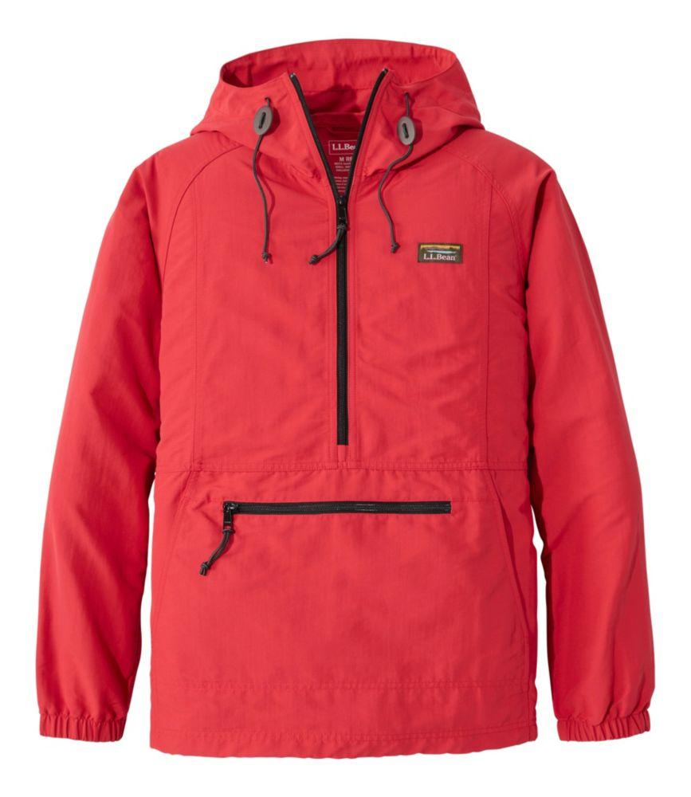
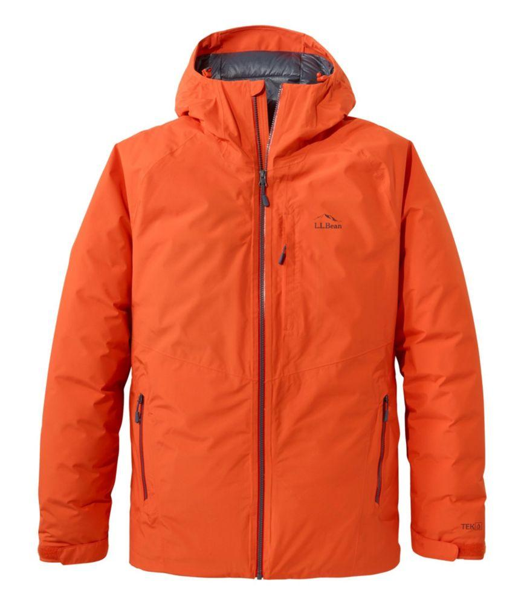
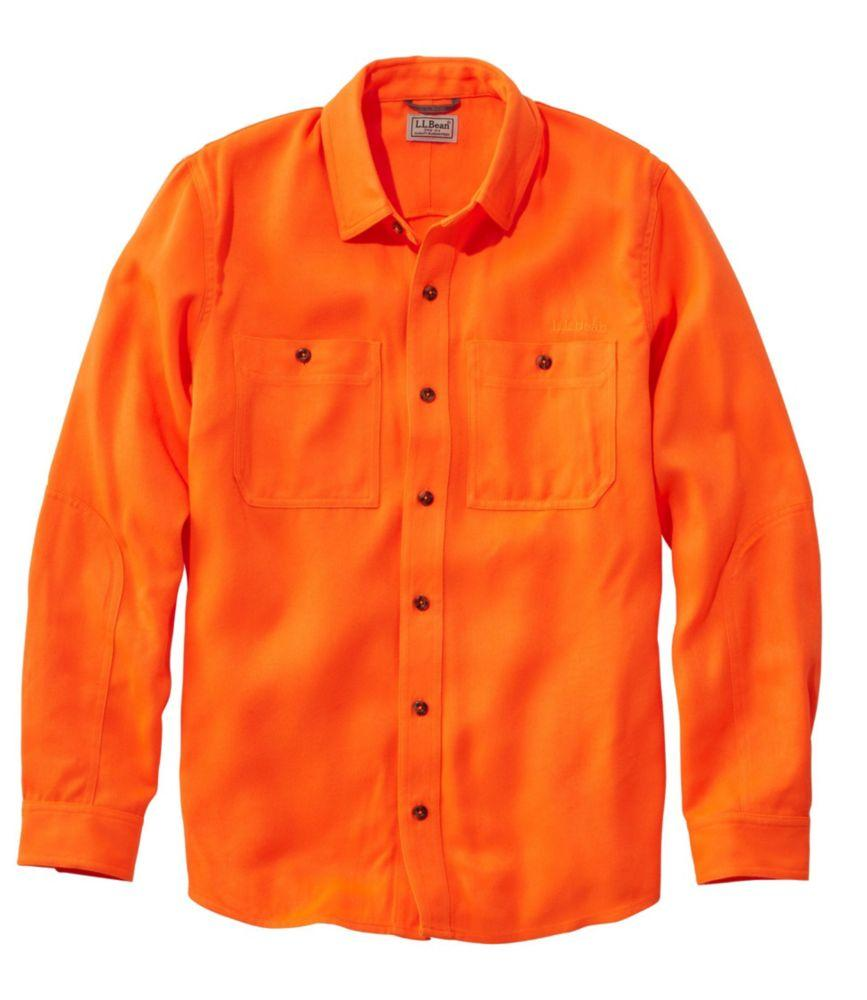
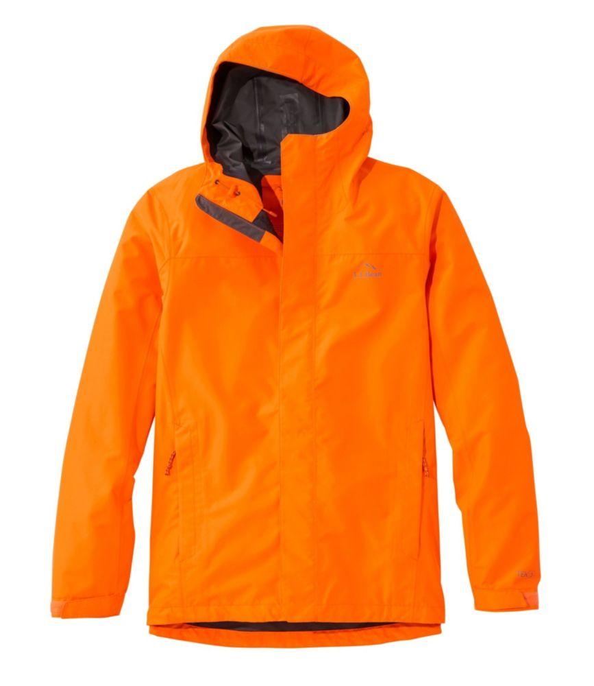
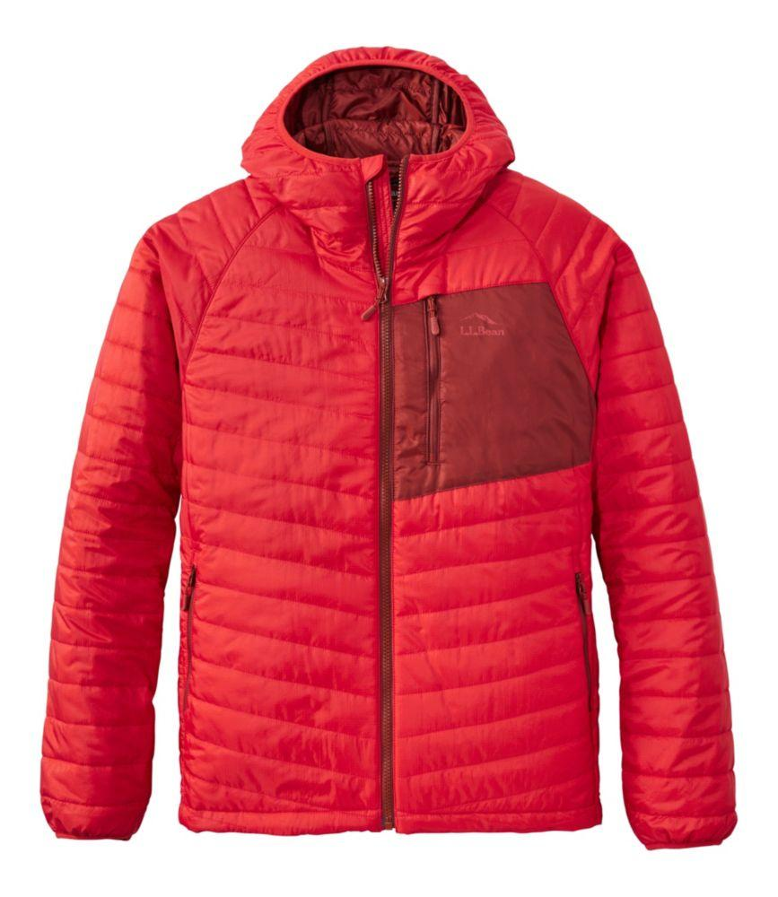
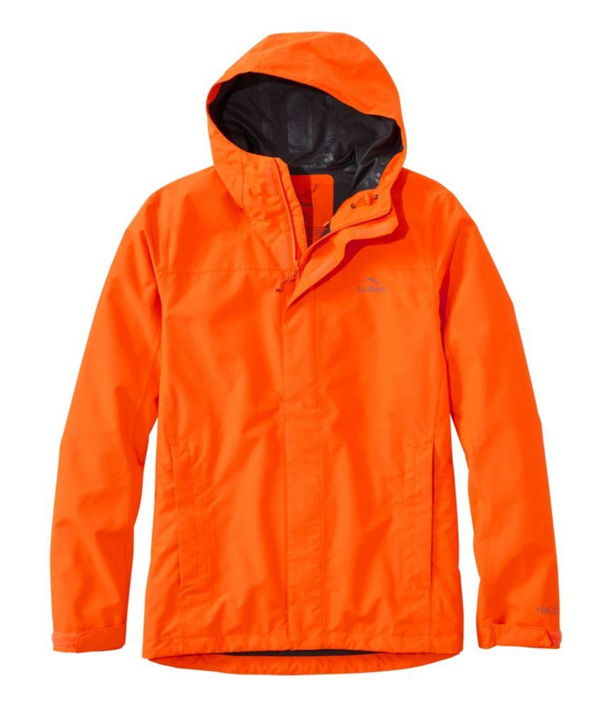
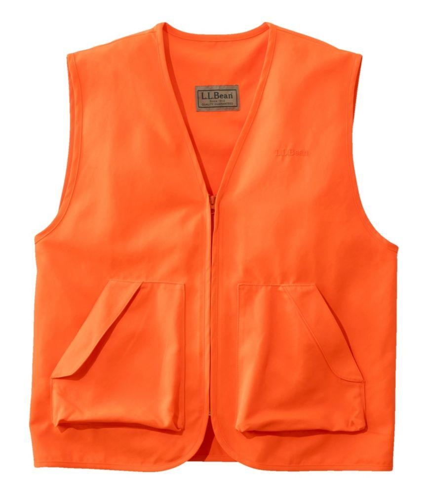
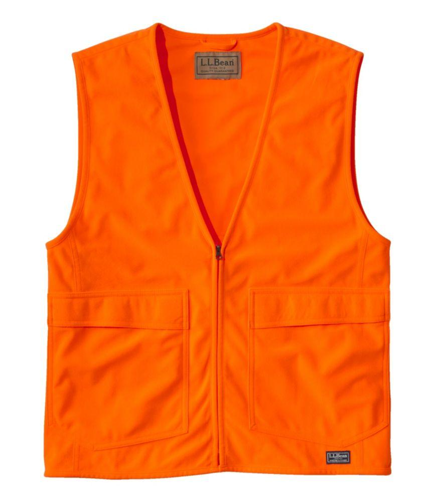
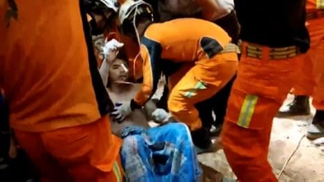
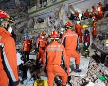

## Claim
Claim: " This image shows a man from Gaza holding the hand of his son killed in an Israeli bombing in July, 2024."

## Actions
```
geolocate()
web_search("man orange jacket rubble")
web_search("earthquake rubble man")
```

## Evidence
### Evidence from `geolocate`
The most likely countries where the image was taken are: {'Turkey': 0.8, 'Italy': 0.09, 'Albania': 0.01, 'Bulgaria': 0.01, 'France': 0.01, 'Netherlands': 0.01, 'Ukraine': 0.01, 'Andorra': 0.0, 'Argentina': 0.0, 'Australia': 0.0}

### Evidence from `web_search`
The search results include images of a man in an orange jacket walking through rubble, available on [Vecteezy](https://www.vecteezy.com/photo/59962955-a-man-in-an-orange-jacket-and-hard-hat-is-walking-through-rubble)  and an AI-generated image from [Freepik](https://www.freepik.com/premium-ai-image/arafed-man-orange-black-jacket-walking-through-rubble-generative-ai_47607490.htm) . Additionally, there are various orange jackets and vests for men available on [LLBean.com](https://www.llbean.com/buy/mens-orange-jackets) , , , , , , , , , , , , , , , , , , , .


### Evidence from `web_search`
The Guardian published an article on April 2, 2025, about an earthquake in Myanmar, mentioning a 26-year-old man pulled alive from the rubble of a hotel in Naypyidaw . The article also includes images of rescuers in orange jackets  and states that the earthquake has killed more than 2,700 people. The Hindu also published an article on April 2, 2025, about a 7.7 magnitude earthquake in Myanmar, including a photograph of an earthquake survivor being treated by medical personnel . The article mentions a man rescued from the rubble five days after the earthquake and the collapse of a high-rise building under construction in Bangkok.

The articles can be found here: [https://www.theguardian.com/world/2025/apr/02/myanmar-earthquake-death-toll-monsoon-rain-forecast-mandalay-sagaing](https://www.theguardian.com/world/2025/apr/02/myanmar-earthquake-death-toll-monsoon-rain-forecast-mandalay-sagaing) and [https://www.thehindu.com/news/international/man-rescued-from-rubble-five-days-after-myanmar-earthquake/article69404754.ece](https://www.thehindu.com/news/international/man-rescued-from-rubble-five-days-after-myanmar-earthquake/article69404754.ece).


## Elaboration
The claim is not supported by the evidence. The image's geolocation data suggests it was taken in Turkey. The search results show that the image could be related to an earthquake. The Guardian and The Hindu published articles about an earthquake in Myanmar in April 2025. The articles do not mention the image in the claim. Therefore, the claim is not supported by the evidence.

The claim is also contradicted by the evidence, as the image is likely from Turkey, not Gaza. The evidence does not mention any Israeli bombing in July 2024.


## Final Judgement
The image is likely from Turkey, and the claim misrepresents the context. The image is not related to Gaza or an Israeli bombing. `false`

### Verdict: FALSE

### Justification
The image likely depicts a scene in Turkey, not Gaza, and is unrelated to an Israeli bombing, as suggested by the geolocation data and search results. The claim is further contradicted by the fact that the image is not related to the events described in the claim. Therefore, the claim is false.
