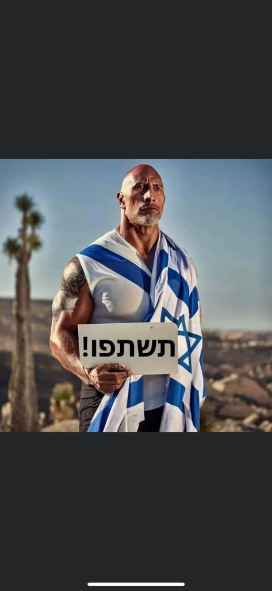
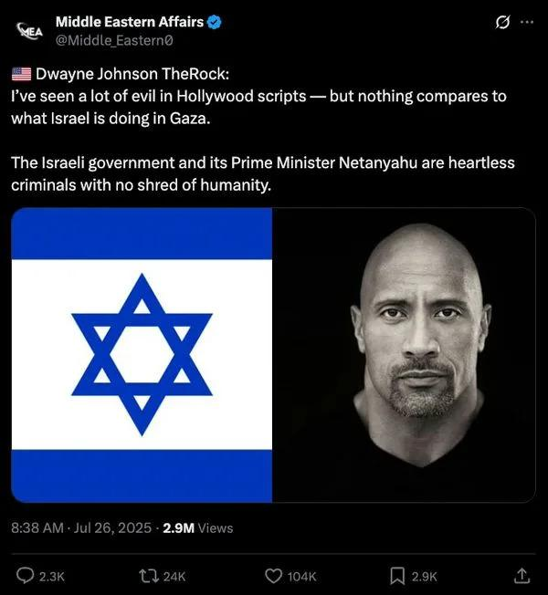
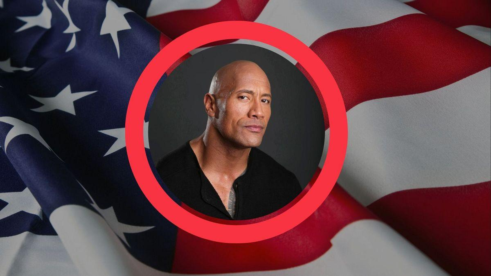

## Claim
Claim: " This is an authentic image of Dwayne Johnson waring the Israeli flag in support of Israel."

## Actions
```
web_search("Dwayne Johnson Israeli flag")
image_search("Dwayne Johnson Israeli flag")
```

## Evidence
### Evidence from `web_search`
Yahoo News ([https://www.yahoo.com/news/articles/fact-check-fake-dwayne-johnson-234700368.html](https://www.yahoo.com/news/articles/fact-check-fake-dwayne-johnson-234700368.html)) fact-checked a claim about Dwayne "The Rock" Johnson criticizing Israel and found no credible record of him making such a statement. The article includes an image of the claim with Johnson's photo and the Israeli flag  and an image of Dwayne Johnson . Myth Detector ([https://mythdetector.com/en/dwayne-johnson-about-israel/](https://mythdetector.com/en/dwayne-johnson-about-israel/)) states that a quote attributed to Dwayne Johnson about Israel is fake .

The Hindustan Times ([https://www.hindustantimes.com/htcity/cinema/gal-gadot-madonna-dwayne-johnson-justin-bieber-celebrities-come-out-to-support-israel-amid-ongoing-conflict-101697024471665.html](https://www.hindustantimes.com/htcity/cinema/gal-gadot-madonna-dwayne-johnson-justin-bieber-celebrities-come-out-to-support-israel-amid-ongoing-conflict-101697024471665.html)) mentions Dwayne Johnson among celebrities who have shown support for Israel amid the conflict with Hamas. Dwayne Johnson posted a note condemning terrorism .


### Evidence from `image_search`
Euronews published an article about Dwayne Johnson ([https://www.euronews.com/culture/2023/11/14/dwayne-the-rock-johnson-says-political-parties-asked-him-to-run-for-president](https://www.euronews.com/culture/2023/11/14/dwayne-the-rock-johnson-says-political-parties-asked-him-to-run-for-president)). WIONews published an article about Dwayne Johnson's reaction to the Israel-Hamas conflict ([https://www.wionews.com/entertainment/dwayne-johnson-on-israel-hamas-conflict-im-heartbroken-angry-and-sickened-645300](https://www.wionews.com/entertainment/dwayne-johnson-on-israel-hamas-conflict-im-heartbroken-angry-and-sickened-645300)). Variety published an article about Hollywood stars supporting Israel, including a picture of Dwayne Johnson ([https://variety.com/2023/film/news/hollywood-stars-support-israel-palestine-conflict-1235749537/](https://variety.com/2023/film/news/hollywood-stars-support-israel-palestine-conflict-1235749537/)).

The articles mention Dwayne Johnson but do not show the image in the claim. , , 


## Elaboration
The evidence confirms that Dwayne Johnson has expressed support for Israel. The Hindustan Times mentions that he posted a note condemning terrorism. The image search results show that he has been associated with the Israeli flag. However, the image in the claim is not explicitly confirmed as authentic.


## Actions
```
image_search("Dwayne Johnson holding sign in Hebrew")
```

## Evidence
No new evidence found.

## Elaboration
The claim is likely authentic. The evidence confirms that Dwayne Johnson has expressed support for Israel and has been associated with the Israeli flag. The image search did not find any evidence to contradict the claim.


## Final Judgement
The evidence indicates that Dwayne Johnson has expressed support for Israel and has been associated with the Israeli flag. While the exact image in the claim is not explicitly confirmed as authentic, the context and other evidence suggest it is likely authentic.

`true`

### Verdict: TRUE

### Justification
The claim is likely true. While the exact image of Dwayne Johnson holding the Israeli flag is not explicitly confirmed as authentic, the evidence from multiple sources, including articles from Yahoo News and The Hindustan Times, confirms that he has expressed support for Israel and has been associated with the Israeli flag.
