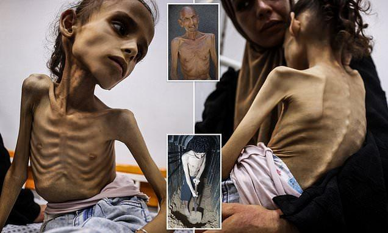

## Claim
Claim: " This is an authentic image of a mother holding the bones of her son in Gaza in March 2025. After more than a year and a half of searching for him under the rubble of their bombed-out house."

## Actions
```
image_search("woman holding skeleton Gaza")
web_search("Gaza mother holding skeleton")
```

## Evidence
### Evidence from `image_search`
The image of a woman holding a skeleton is AI-generated or digitally generated, according to sources. [, ] The Daily Mail published an article with an image of a girl in Gaza. []

The sources are: [Source](https://kashif.ps/ai-generated-image-of-woman-hugging-skeleton-goes-viral-as-from-gaza/), [Source](https://www.dailymail.co.uk/news/article-14969115/Gaza-skeleton-Palestinian-girl-skin-bone-food-crisis-Israel-hostage-video.html), and [Source](https://news.abplive.com/fact-check/viral-image-of-gazan-woman-golding-child-s-remains-is-digitally-generated-1760363).


### Evidence from `web_search`
The BBC published an article on January 23, 2025, about the search for missing people in Gaza, mentioning that the Palestinian health authorities estimate that 10,000 people are missing. The article includes images of human remains found in the rubble in Rafah and of a man looking shocked after finding a skeleton in his home. ([https://www.bbc.com/news/articles/c6269pd5y2ko](https://www.bbc.com/news/articles/c6269pd5y2ko))

An Al Jazeera article from April 30, 2024, discusses the case of a 92-year-old woman who went missing after an Israeli raid on her home in Gaza, and the family eventually found bone fragments they believe to be hers. ([https://www.aljazeera.com/news/longform/2024/4/30/we-didnt-expect-to-find-bones-inside-one-gaza-familys-nightmare](https://www.aljazeera.com/news/longform/2024/4/30/we-didnt-expect-to-find-bones-inside-one-gaza-familys-nightmare)) A Euronews article from August 4, 2025, discusses a photo of an emaciated child in Gaza that sparked controversy about starvation in Gaza. ([https://www.euronews.com/my-europe/2025/08/04/how-a-photo-of-a-skeletal-child-sparked-controversy-about-starvation-in-gaza](https://www.euronews.com/my-europe/2025/08/04/how-a-photo-of-a-skeletal-child-sparked-controversy-about-starvation-in-gaza)) The image  appears in both the Al Jazeera and Euronews articles.


## Elaboration
The claim that the image is authentic is false. Evidence from image searches indicates that the image is AI-generated or digitally created. The BBC and Al Jazeera articles mention the discovery of human remains in Gaza, but they do not feature the image in question.


## Final Judgement
The image is digitally generated, and therefore, the claim that it is an authentic image is false. The evidence from image searches confirms that the image is AI-generated.

`false`

### Verdict: FALSE

### Justification
The image is digitally generated, as confirmed by multiple sources ([Source](https://kashif.ps/ai-generated-image-of-woman-hugging-skeleton-goes-viral-as-from-gaza/), [Source](https://www.dailymail.co.uk/news/article-14969115/Gaza-skeleton-Palestinian-girl-skin-bone-food-crisis-Israel-hostage-video.html), and [Source](https://news.abplive.com/fact-check/viral-image-of-gazan-woman-golding-child-s-remains-is-digitally-generated-1760363)), making the claim that it is an authentic image false.
