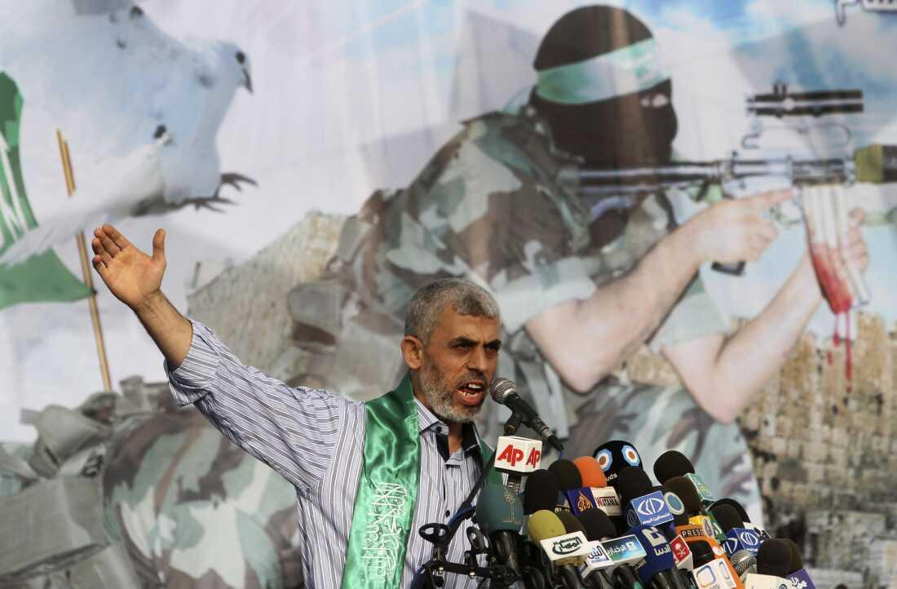
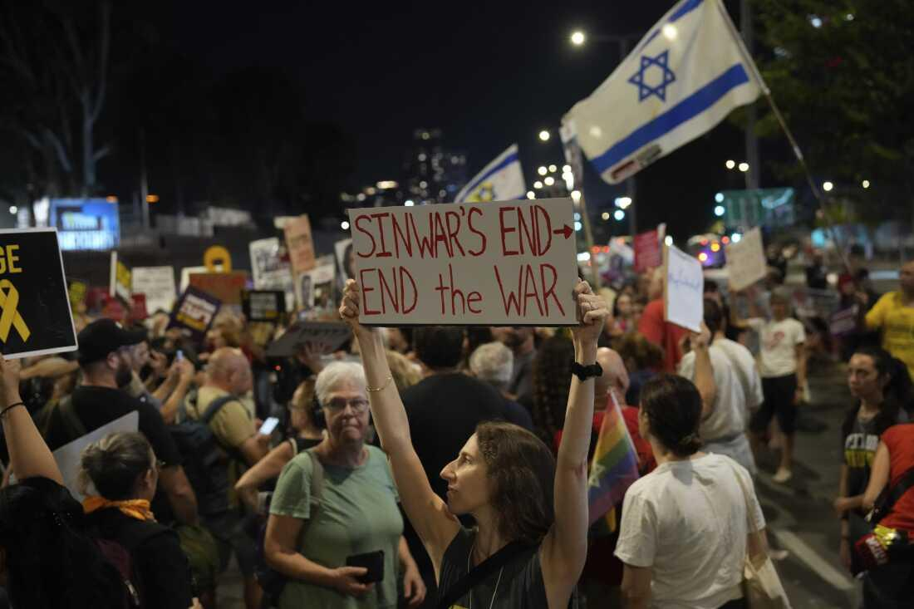
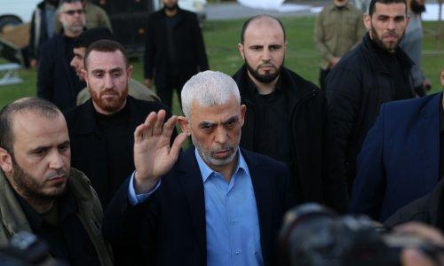
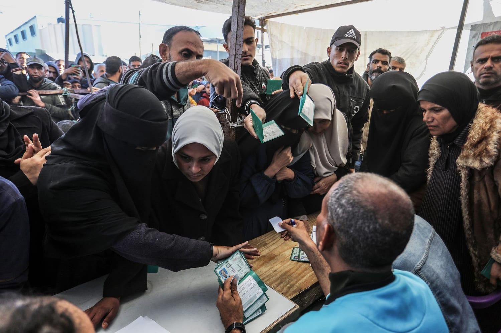
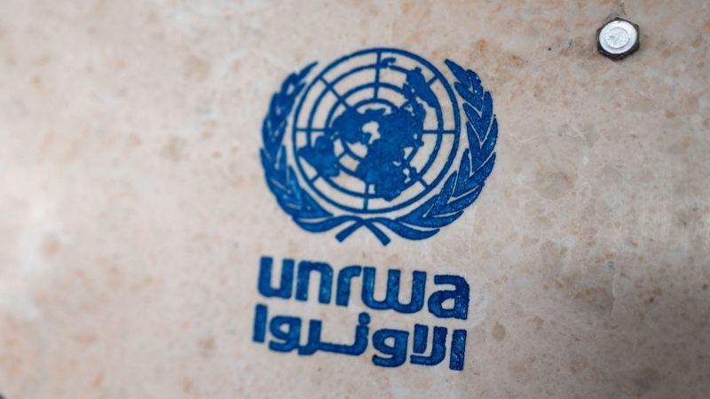
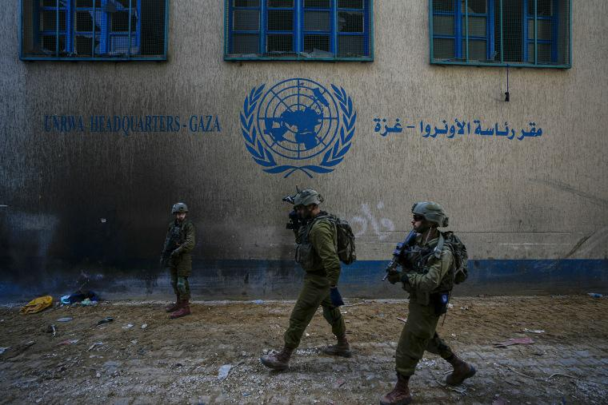

## Claim
Claim: " This image shows a screenshot of the X profile of UNRWA which has placed a black band over its profile photo in mourning for the death of Yahya Sinwar, Hamas leader in the Gaza Strip, in October 2024."

## Actions
```
web_search("UNRWA Yahya Sinwar death")
image_search("UNRWA profile picture mourning")
```

## Evidence
### Evidence from `web_search`
The Wikipedia article ([Source](https://en.wikipedia.org/wiki/Killing_of_Yahya_Sinwar)) discusses the killing of Yahya Sinwar, the leader of Hamas, on October 16, 2024, and mentions that a UNRWA teacher's passport was found on his person. The NPR article ([Source](https://www.npr.org/2024/10/18/nx-s1-5157608/israel-hamas-sinwar-gaza-future)) discusses the death of Yahya Sinwar and reactions to it.

The CSIS article ([Source](https://www.csis.org/analysis/what-does-yahya-sinwars-death-mean)) discusses the death of Yahya Sinwar, stating that the Israeli government announced that its soldiers had killed Hamas leader Yahya Sinwar. , , , 


### Evidence from `image_search`
From [Source](https://www.nbcnews.com/news/world/israel-banning-unrwa-palestinian-territories-gaza-hamas-west-bank-rcna189554): 
Content: The NBC News article discusses Israel's ban on UNRWA in Palestinian territories. 


## Elaboration
The evidence confirms that Yahya Sinwar, the Hamas leader, died in October 2024. However, the provided evidence does not contain any information about UNRWA placing a black band over its profile photo in mourning for Sinwar. Therefore, the claim cannot be verified with the available information.


## Actions
```
web_search("UNRWA profile picture mourning Yahya Sinwar")
image_search("UNRWA profile picture")
```

## Evidence
### Evidence from `web_search`
The DW article ([https://www.dw.com/en/fact-check-black-ribbon-on-unrwa-logo-does-not-show-mourning-for-sinwar/a-70532996](https://www.dw.com/en/fact-check-black-ribbon-on-unrwa-logo-does-not-show-mourning-for-sinwar/a-70532996)) fact-checks the claim that UNRWA is mourning Yahya Sinwar's death, stating that the black ribbon was added to the profile picture before Sinwar's death, as early as October 22, 2023, to show solidarity with the victims of war. The Canadian Press News ([https://www.thecanadianpressnews.ca/fact_checking/black-band-on-unrwas-social-media-profiles-appeared-before-yahya-sinwars-death/article_33032eb2-f64b-55c6-8a57-3289e6a014cf.html](https://www.thecanadianpressnews.ca/fact_checking/black-band-on-unrwas-social-media-profiles-appeared-before-yahya-sinwars-death/article_33032eb2-f64b-55c6-8a57-3289e6a014cf.html)) also fact-checked the claim and found it to be false, as the black band was present before Sinwar's death. PesaCheck ([https://pesacheck.org/false-unrwa-didnt-update-its-profile-photo-to-mourn-the-death-of-hamas-leader-yahya-sinwar-f8219db942b5](https://pesacheck.org/false-unrwa-didnt-update-its-profile-photo-to-mourn-the-death-of-hamas-leader-yahya-sinwar-f8219db942b5)) states that the claim is false, and the black ribbon is a tribute to UNRWA team members killed in Gaza. , 


### Evidence from `image_search`
The CNN article ([Source](https://www.cnn.com/2024/08/05/middleeast/un-probe-unwra-gaza-israel-intl-latam)) discusses an UN probe into UNRWA. The NBC News article ([Source](https://www.nbcnews.com/news/world/israel-unwra-ban-devastating-palestinians-rcna177766)) discusses Israel's ban on UNRWA in Palestinian territories. , 


## Elaboration
The claim is false. Multiple fact-checking sources ([https://www.dw.com/en/fact-check-black-ribbon-on-unrwa-logo-does-not-show-mourning-for-sinwar/a-70532996](https://www.dw.com/en/fact-check-black-ribbon-on-unrwa-logo-does-not-show-mourning-for-sinwar/a-70532996), [https://www.thecanadianpressnews.ca/fact_checking/black-band-on-unrwas-social-media-profiles-appeared-before-yahya-sinwars-death/article_33032eb2-f64b-55c6-8a57-3289e6a014cf.html](https://www.thecanadianpressnews.ca/fact_checking/black-band-on-unrwas-social-media-profiles-appeared-before-yahya-sinwars-death/article_33032eb2-f64b-55c6-8a57-3289e6a014cf.html), and [https://pesacheck.org/false-unrwa-didnt-update-its-profile-photo-to-mourn-the-death-of-hamas-leader-yahya-sinwar-f8219db942b5](https://pesacheck.org/false-unrwa-didnt-update-its-profile-photo-to-mourn-the-death-of-hamas-leader-yahya-sinwar-f8219db942b5)) confirm that the black ribbon on UNRWA's profile picture predates Yahya Sinwar's death and was added to show solidarity with victims of the war or to honor UNRWA team members killed in Gaza.


## Final Judgement
The claim that UNRWA placed a black band over its profile photo in mourning for the death of Yahya Sinwar is false. Fact-check articles show that the black band was added to the profile picture before Sinwar's death, and it was not related to his death.

`false`

### Verdict: FALSE

### Justification
The claim is false. Multiple fact-checking sources, including [DW](https://www.dw.com/en/fact-check-black-ribbon-on-unrwa-logo-does-not-show-mourning-for-sinwar/a-70532996), [The Canadian Press News](https://www.thecanadianpressnews.ca/fact_checking/black-band-on-unrwas-social-media-profiles-appeared-before-yahya-sinwars-death/article_33032eb2-f64b-55c6-8a57-3289e6a014cf.html), and PesaCheck ([https://pesacheck.org/false-unrwa-didnt-update-its-profile-photo-to-mourn-the-death-of-hamas-leader-yahya-sinwar-f8219db942b5](https://pesacheck.org/false-unrwa-didnt-update-its-profile-photo-to-mourn-the-death-of-hamas-leader-yahya-sinwar-f8219db942b5)), confirm that the black ribbon on UNRWA's profile picture predates Yahya Sinwar's death and was not related to his death.
