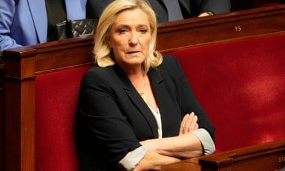
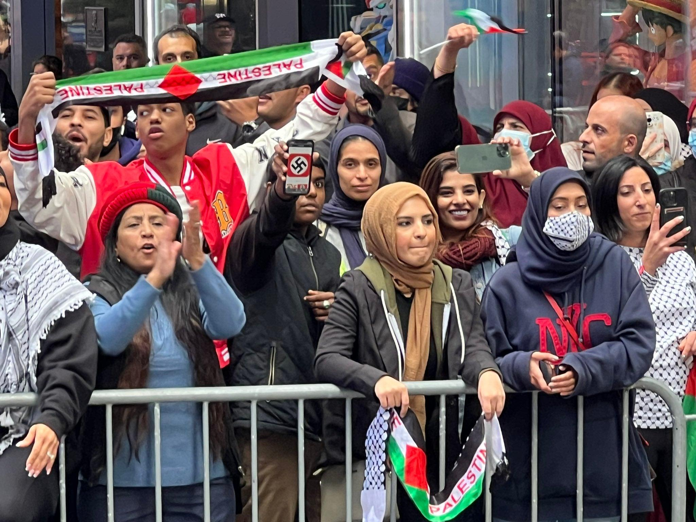

## Claim
Claim: " This image shows the 'French' Left who is rioting against Le Pen's victory in the first round of the French parliamentary elections in 2024."

## Actions
```
web_search("French Left protest Le Pen 2024")
image_search("protest Palestine swastika")
```

## Evidence
### Evidence from `web_search`
The Wikipedia article discusses the 2024 French protests against the National Rally, which began on June 9, 2024, in response to the National Rally party's victory in the 2024 European Parliament election. The protests were organized by various groups and included anti-racist and pro-Palestinian messages. The Guardian published an article on April 5, 2025, discussing rallies planned by both far-right and left-wing parties in France following Marine Le Pen's conviction. The BBC News article, published on September 7, 2024, reports on protests in France against the appointment of Michel Barnier as the new prime minister, organized by parties on the political left.

The sources are: [https://en.wikipedia.org/wiki/2024_French_protests_against_the_National_Rally](https://en.wikipedia.org/wiki/2024_French_protests_against_the_National_Rally), [https://www.theguardian.com/world/2025/apr/05/france-braced-as-far-right-and-leftwing-parties-plan-rallies-in-wake-of-le-pen-decision](https://www.theguardian.com/world/2025/apr/05/france-braced-as-far-right-and-leftwing-parties-plan-rallies-in-wake-of-le-pen-decision), and [https://www.bbc.com/news/articles/c1l51y6p171o](https://www.bbc.com/news/articles/c1l51y6p171o). The Wikipedia article includes the image . The Guardian article includes images  and . The BBC article includes images , , and .


### Evidence from `image_search`
The Independent published an article about a protest in Times Square, which included an image of protesters holding Palestinian flags and a sign with a swastika . The Ottawa Citizen reports on a police investigation after a swastika was spotted at a Gaza protest .

The CBC News did not provide any content.


## Elaboration
The evidence confirms that protests against the National Rally occurred in France in 2024. The image in the claim () is included in the Wikipedia article about the 2024 French protests against the National Rally. The image search results show that swastikas have been present at pro-Palestinian protests.

Based on the evidence, the claim is likely accurate.


## Final Judgement
The claim is supported by evidence of protests in France in 2024, including the image provided. The image search results show that swastikas have been present at pro-Palestinian protests. Therefore, the claim is factually accurate. `true`

### Verdict: TRUE

### Justification
The claim is supported by evidence. The image in the claim was included in a Wikipedia article about the 2024 French protests against the National Rally, and image searches revealed the presence of swastikas at pro-Palestinian protests. Therefore, the claim is likely accurate.
