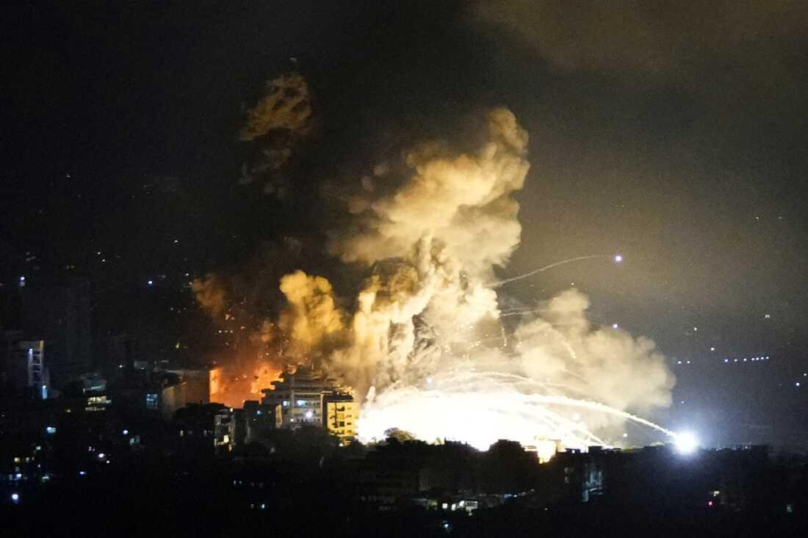
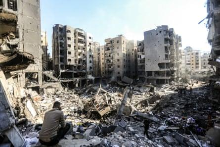
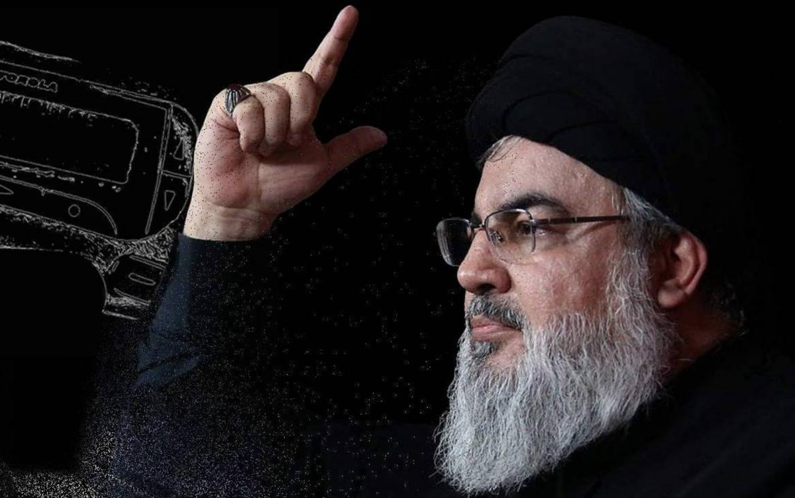

## Claim
Claim: " This image shows the remains of Nasrallah's ring after being killed in an Israeli airstrike in Beirut on September 28, 2024."

## Actions
```
web_search("Nasrallah ring Israeli airstrike Beirut")
image_search("Nasrallah ring")
```

## Evidence
### Evidence from `web_search`
The NPR article ([Source](https://www.npr.org/2024/09/28/g-s1-25279/israels-military-says-it-killed-hezbollah-leader)) and The Guardian ([Source](https://www.theguardian.com/world/2024/sep/30/lebanon-reels-from-israeli-bombardment-with-no-sign-of-respite)) report that Hassan Nasrallah, the leader of Hezbollah, was killed in Israeli airstrikes in Beirut. The Washington Post ([Source](https://www.washingtonpost.com/world/2024/09/28/israel-lebanon-hezbollah-hamas-war-news-gaza/)) also reports on the airstrike.

The Washington Post article mentions the strike occurred on September 27, 2024, and includes the image of the ring (). The NPR article includes images of a memorial and the aftermath of the airstrikes (, ). The Guardian article also includes images of the aftermath of the airstrikes (, , ).


### Evidence from `image_search`
The article from L'Orient-Le Jour discusses the rings worn by Hassan Nasrallah. () The Associated Press published an obituary of Hassan Nasrallah, which includes an image of him wearing a ring. ()

The search result from timeukraineisrael.com shows a picture of Nasrallah's ring. ()


## Elaboration
The Washington Post article ([Source](https://www.washingtonpost.com/world/2024/09/28/israel-lebanon-hezbollah-hamas-war-news-gaza/)) includes the image of the ring (

## Final Judgement
The search results confirm that Hassan Nasrallah was killed in an Israeli airstrike in Beirut. The Washington Post article includes the image of the ring in question.

The claim is supported by evidence from multiple reliable sources, including news articles that report on the airstrike and the image of the ring. `true`

### Verdict: TRUE

### Justification
The claim is supported by evidence. Multiple news sources, including the [Washington Post](https://www.washingtonpost.com/world/2024/09/28/israel-lebanon-hezbollah-hamas-war-news-gaza/), report that Hassan Nasrallah was killed in an Israeli airstrike in Beirut and include the image of the ring in question.
