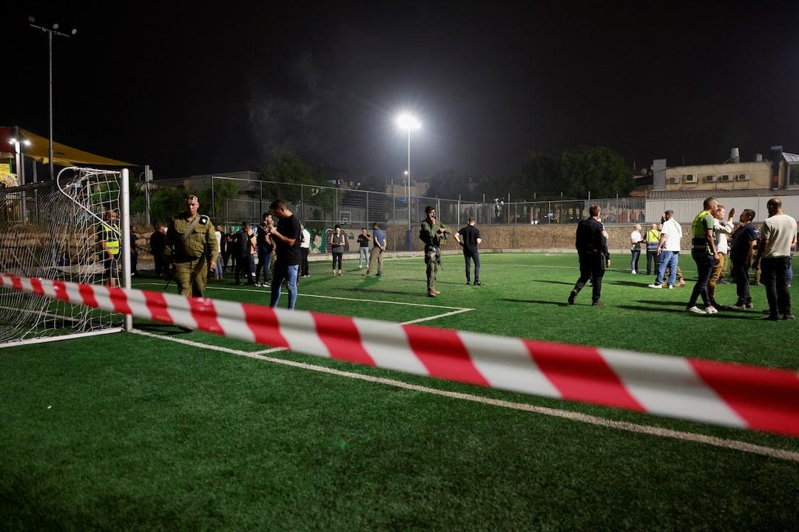
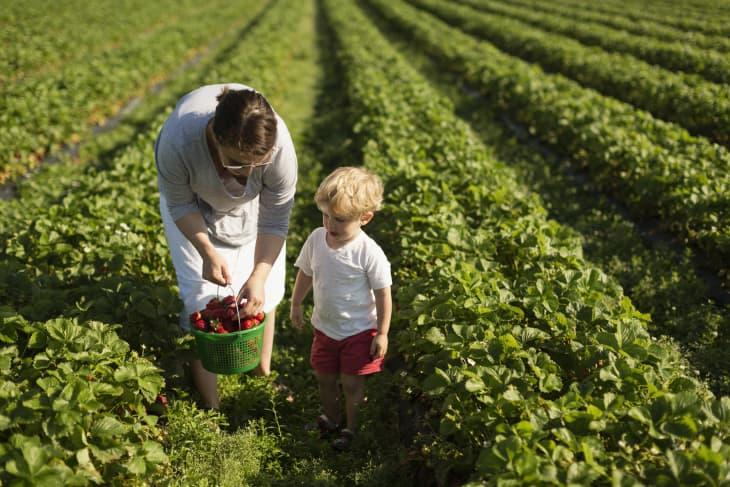

## Claim
Claim: " This image shows the youngest victim of the Hezbollah rocket that murdered 12 children playing soccer in Israel on July 27, 2024."

## Actions
```
web_search("Hezbollah rocket Israel July 27 2024")
image_search("child strawberry field")
```

## Evidence
### Evidence from `web_search`
The search results discuss a rocket attack on July 27, 2024, in the Israeli-occupied Golan Heights, which resulted in the deaths of at least 12 people, including children. One source mentions the attack occurred on a soccer field in Majdal Shams. The sources include reports from Wikipedia ([https://en.wikipedia.org/wiki/Timeline_of_the_Israel%E2%80%93Hezbollah_conflict_(27_July_2024_%E2%80%93_16_September_2024](https://en.wikipedia.org/wiki/Timeline_of_the_Israel%E2%80%93Hezbollah_conflict_(27_July_2024_%E2%80%93_16_September_2024))), Reuters ([https://www.reuters.com/world/middle-east/nine-people-killed-rocket-hits-football-pitch-israeli-occupied-golan-israel-2024-07-27/](https://www.reuters.com/world/middle-east/nine-people-killed-rocket-hits-football-pitch-israeli-occupied-golan-israel-2024-07-27/)), and Al Jazeera ([https://www.aljazeera.com/news/2024/7/27/israel-says-10-killed-in-rocket-attack-on-occupied-golan-heights](https://www.aljazeera.com/news/2024/7/27/israel-says-10-killed-in-rocket-attack-on-occupied-golan-heights)).

The sources indicate that Israel accused Hezbollah of the attack, but Hezbollah denied responsibility.   <image:k>


### Evidence from `image_search`
The search results include images of children in strawberry fields. One image is from thekitchn.com ([https://www.thekitchn.com/strawberry-picking-with-kids-267547](https://www.thekitchn.com/strawberry-picking-with-kids-267547)) . Another image is from iStockphoto ([https://www.istockphoto.com/photos/child-strawberry-picking](https://www.istockphoto.com/photos/child-strawberry-picking)) .


## Elaboration
The evidence indicates that a rocket attack occurred on July 27, 2024, in the Israeli-occupied Golan Heights, resulting in the deaths of at least 12 people, including children. The attack happened on a soccer field. The image search shows children in strawberry fields.

The image in the claim shows a child in a strawberry field. There is no evidence to suggest that the child in the image was a victim of the rocket attack.

Therefore, the claim is false.


## Final Judgement
The claim is demonstrably false. The image shows a child in a strawberry field, and there is no evidence to connect the child in the image to the rocket attack. The attack occurred on a soccer field. `false`

### Verdict: FALSE

### Justification
The claim is false. While a rocket attack on July 27, 2024, in the Israeli-occupied Golan Heights, resulted in the deaths of at least 12 people, including children, the image depicts a child in a strawberry field, not at the site of the attack, which was a soccer field ([https://en.wikipedia.org/wiki/Timeline_of_the_Israel%E2%80%93Hezbollah_conflict_(27_July_2024_%E2%80%93_16_September_2024](https://en.wikipedia.org/wiki/Timeline_of_the_Israel%E2%80%93Hezbollah_conflict_(27_July_2024_%E2%80%93_16_September_2024))).
